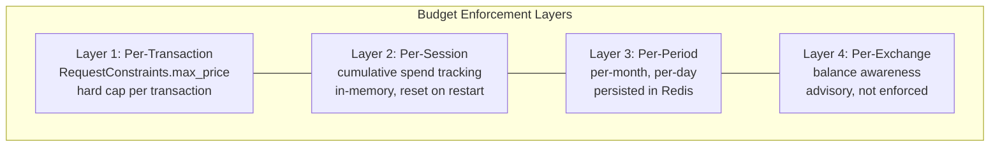

## Overview

The Broker enforces three budget layers, analogous to how DSPs manage advertiser budgets in OpenRTB. Budget enforcement is advisory -- the Exchange is the authoritative enforcement point -- but the Broker's pre-filtering prevents unnecessary Exchange round-trips for transactions that would exceed limits.

## Budget Layers



| Layer | Source of Truth | Enforcement | Crash Behavior | Storage |
|---|---|---|---|---|
| **Per-transaction** | `RequestConstraints.max_price` | Hard reject if offer exceeds | Stateless -- always enforced | None |
| **Per-session** | Broker in-memory map | Hard reject if cumulative spend exceeds session budget | Lost on crash; agent re-declares | In-memory |
| **Per-period** | Redis, keyed by the verified agent identity or sub-account ID | Hard reject if period budget exhausted | Survives restart (persisted in Redis) | Redis |
| **Per-Exchange** | Exchange's billing adapter | Advisory -- Exchange ultimately decides | Not Broker's state | External |

## Budget Scope Identifiers

`RequestConstraints` supports a `budget_scope` identifier so the agent can say "track this transaction against user X's monthly budget":

```go
type RequestConstraints struct {
    // ...existing fields...
    BudgetScope           string         // optional: "user:alice", "team:engineering", "project:q4-research"
    PreferredExchanges []string       // exchange domains with existing subscriptions/relationships
    PeriodBudget          *Cost          // per-period budget limit (proto: period_budget)
    BudgetPeriod          *time.Duration // budget period, e.g. 720h = 30 days (proto: budget_period)
}
```

Per-period budgets are keyed by `budget_scope` (or the verified agent identity if no scope is provided) and persisted in Redis with TTLs matching the period (e.g., monthly keys expire at month-end).

## Session Budget Tracker

```go
type BudgetTracker interface {
    // SetSessionBudget declares the budget for a session.
    SetSessionBudget(sessionID string, amount float64, currency string)

    // CanAfford checks whether the session can afford this transaction.
    CanAfford(amount float64, currency string) bool

    // Record logs a completed transaction against the session budget.
    Record(ctx context.Context, cost *rampv1.Cost)

    // Remaining returns the remaining budget for the session.
    Remaining(sessionID string) (float64, string)
}

type inMemoryBudget struct {
    mu       sync.Mutex
    sessions map[string]*sessionBudget
}

type sessionBudget struct {
    limit    float64
    currency string
    spent    float64
    txnCount int
    lastTxn  time.Time
}

func (b *inMemoryBudget) CanAfford(amount float64, currency string) bool {
    b.mu.Lock()
    defer b.mu.Unlock()
    // Multi-currency: convert via CurrencyConverter if currencies differ.
    return (b.current.spent + amount) <= b.current.limit
}
```

## Batch Budget Consumption

For batch (multi-URI) queries, budget is consumed atomically for the batch total. The selection engine computes the sum of costs across all selected offers before committing. If the total exceeds the remaining budget, the engine drops lower-priority URIs until the total fits (see the [Selection Engine](/components/broker/selection-engine/) batch pipeline).

Once the batch `TransactionRequest` is sent and the `TransactionResponse` received, the Broker records the `total_cost` against the session and period budgets in a single operation.

```go
func (b *inMemoryBudget) RecordBatch(ctx context.Context, totalCost *rampv1.Cost) {
    b.mu.Lock()
    defer b.mu.Unlock()
    b.current.spent += totalCost.Amount
    b.current.txnCount++
    b.current.lastTxn = time.Now()
}
```

## Overspend Prevention

The Broker checks budget BEFORE making any network call to the Exchange. A budget-exceeded condition never reaches the wire.

### Budget Exhaustion Mid-Session

When the session budget is exhausted:

1. The Broker returns a Connect error with code `RESOURCE_EXHAUSTED`.
2. The error details include the remaining budget and the cumulative spend.
3. The agent can re-declare a higher budget or proceed without the Broker (direct Exchange access).

```go
if !budget.CanAfford(winningOffer.Pricing.Rate, winningOffer.Pricing.Currency) {
    remaining, currency := budget.Remaining(sessionID)
    return nil, connect.NewError(
        connect.CodeResourceExhausted,
        fmt.Errorf("session budget exhausted: %.4f %s remaining, offer costs %.4f %s",
            remaining, currency,
            winningOffer.Pricing.Rate, winningOffer.Pricing.Currency,
        ),
    )
}
```

## Ephemeral vs. Persisted Budget State

Session budget state is ephemeral. If the Broker crashes, the agent re-declares its budget on reconnect. Per-period budgets (monthly, daily) are persisted in Redis and survive restarts.

This is a deliberate design choice: the Exchange's billing adapter is the authoritative source of truth for "can this requester afford this transaction," not the Broker.

## Currency Conversion

Multi-currency budget tracking requires exchange rates. The `CurrencyConverter` interface handles offers in EUR when the session budget is in USD.

```go
type CurrencyConverter interface {
    Convert(amount float64, from, to string) (float64, error)
    Rate(from, to string) (float64, error)
}
```

**Reference implementation**: Fixed rates from configuration file. Sufficient for v1 where most transactions are USD.

**Production implementation**: ECB daily reference rates or fixer.io API. Rates cached in Redis with 1-hour TTL. Stale rates are acceptable because budget tracking is advisory.

## Budget Consistency at Scale

Broker budget tracking is **advisory**. The Exchange is the authoritative enforcement point and rejects transactions if the requester's balance is insufficient. This means:

- If two Broker instances both think there is budget remaining and both submit `ExecuteTransaction` simultaneously, the Exchange authorizes the first and denies the second.
- No overspend occurs because the Exchange is the gatekeeper.
- The Broker's budget check is a fast pre-filter to avoid unnecessary Exchange round-trips, not a guarantee.

This model is deliberately simple. Distributed budget consensus (e.g., two-phase commit across Broker instances) adds latency and complexity without value, because the Exchange already provides the authoritative enforcement.

## Budget Reporting Metrics

```go
var (
    // Budget utilization per session
    budgetUtilization = promauto.NewHistogram(
        prometheus.HistogramOpts{
            Name:    "broker_budget_utilization_ratio",
            Help:    "Fraction of session budget spent (0.0 to 1.0+)",
            Buckets: []float64{0.0, 0.1, 0.25, 0.5, 0.75, 0.9, 1.0},
        },
    )

    // Budget exhaustion events
    budgetExhausted = promauto.NewCounter(
        prometheus.CounterOpts{
            Name: "broker_budget_exhausted_total",
            Help: "Number of requests rejected due to budget exhaustion",
        },
    )
)
```
