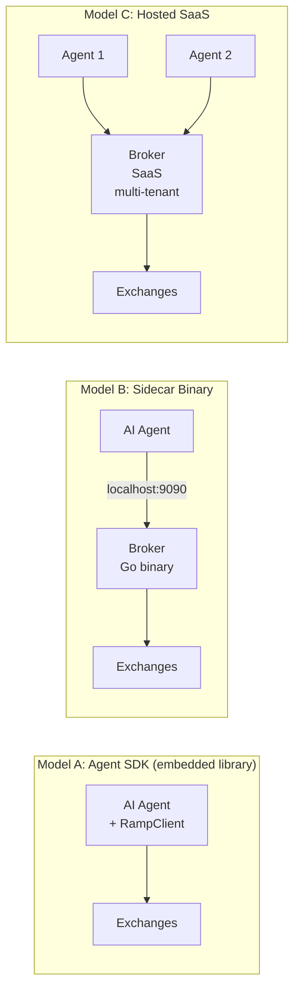
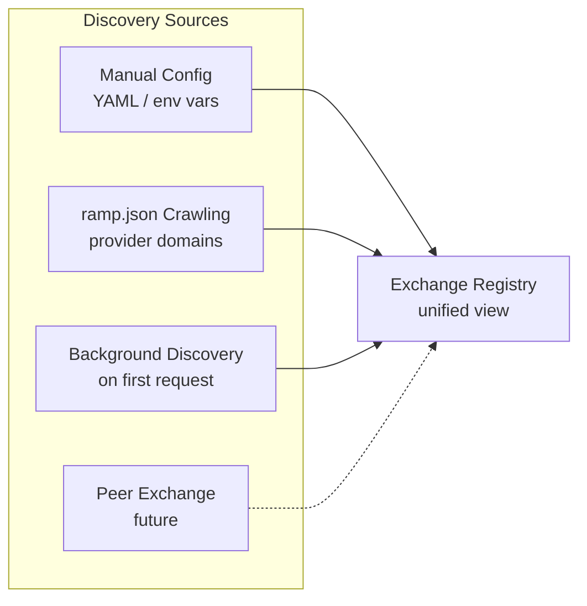
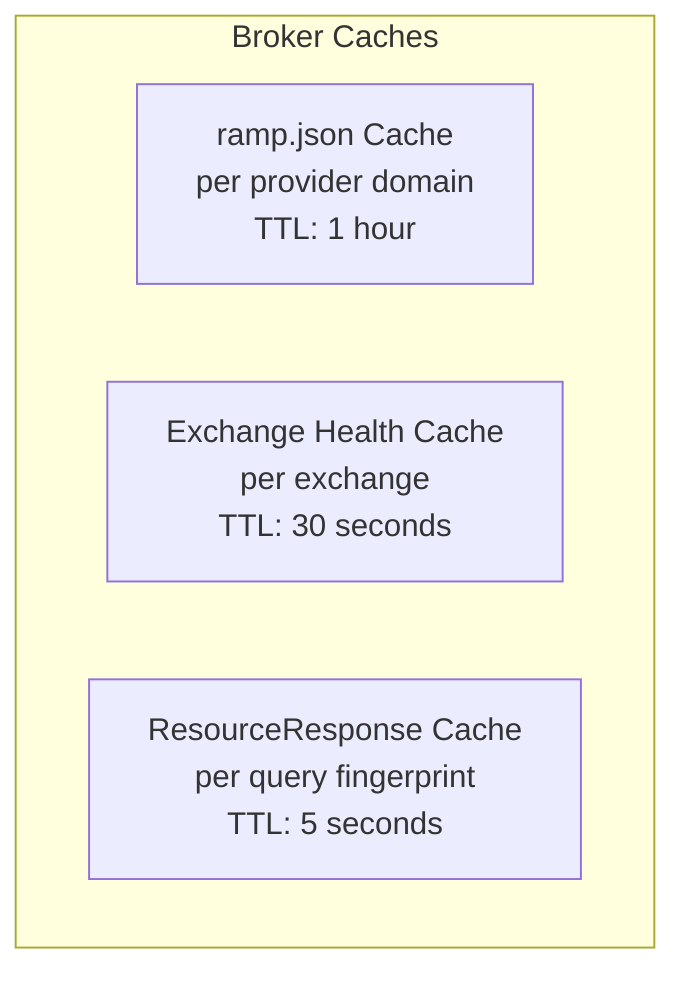
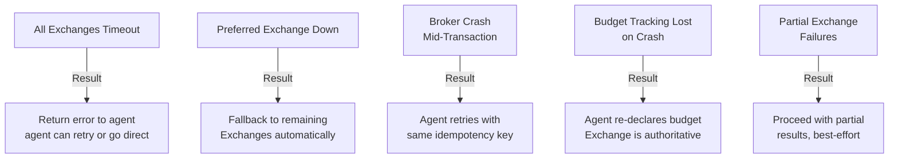

import { Aside } from '@astrojs/starlight/components';

<Aside type="caution">
The agent SDK described here is the **deferred high-tier** design, not shipped
API. What exists today is the low-tier client in `sdk/go/connect`; see the
[Agent SDK overview](/components/agent-sdk/overview/) for what that covers.
</Aside>

## Deployment Models

The Broker is designed for three deployment modes. The core logic (selection, budget, reporting) is identical across all three; what changes is the process model, configuration surface, and what the agent is responsible for.



### Model Comparison

| Aspect | Agent SDK | Sidecar Binary | Hosted SaaS |
|---|---|---|---|
| **Process model** | In-process library | Separate process, same host | Remote service, separate infra |
| **Language** | Go / TypeScript / Python | Go binary | Go service |
| **Communication** | Function calls | Connect RPC over localhost | Connect RPC over HTTPS |
| **Budget state** | In-process memory + local file | In sidecar memory | Server-side, per-tenant |
| **Configuration** | Struct literal in code | YAML file + env vars | API |
| **Multi-tenancy** | N/A (one license per instance) | N/A (one agent per sidecar) | Required -- session isolation |
| **Latency overhead** | 0ms (in-process) | ~1ms (localhost RPC) | ~5-20ms (network hop) |
| **Content fetch** | SDK fetches signed URL | Agent fetches signed URL | Agent fetches signed URL |
| **Usage reporting** | Automatic (background) | Agent submits via RPC | Agent submits via RPC |
| **Who operates** | Agent developer | Agent operator | Broker SaaS provider |

### Recommended Deployment

**For agent developers (lowest friction)**: Ship the [Agent SDK](/components/agent-sdk/overview/). Agent developers add one dependency, pass their license key and budget, and call `Fetch`. No sidecar, no YAML, no infrastructure.

**For agent operators (clear process boundary)**: Ship the sidecar binary. Operators run it alongside their agent, configure via YAML, and get multi-exchange comparison without code changes.

**At scale (managed service)**: Offer hosted SaaS for teams that don't want to operate infrastructure. Multi-tenancy enables serving multiple AI companies from a single deployment.

### Sidecar Binary

```go
func main() {
    cfg := loadConfig("broker.yaml")
    orch := broker.New(cfg)

    mux := http.NewServeMux()
    path, handler := rampv1connect.NewBrokerServiceHandler(orch)
    mux.Handle(path, handler)

    http.ListenAndServe("localhost:9090", mux)
}
```

### Hosted SaaS (Multi-Tenancy)

The hosted Broker serves multiple AI companies. Tenant isolation is by API key or the verified agent identity (domain/key). Each tenant gets isolated: Exchange registry (different trust levels per tenant), budget tracking (per-tenant Redis keyspace), selection policy (per-tenant configuration), and selection logs.

```go
func main() {
    tenantStore := loadTenantStore()

    handler := &multiTenantBroker{
        tenants: tenantStore,
    }

    mux := http.NewServeMux()
    path, h := rampv1connect.NewBrokerServiceHandler(handler)
    mux.Handle(path, authMiddleware(h))

    http.ListenAndServe(":443", mux)
}

func (m *multiTenantBroker) Resolve(
    ctx context.Context,
    req *connect.Request[rampv1.DiscoveryRequest],
) (*connect.Response[rampv1.DiscoveryResponse], error) {
    tenantID := tenantFromContext(ctx)
    orch := m.tenants.GetBroker(tenantID)
    return orch.Resolve(ctx, req)
}
```

### What Changes Between Modes

The core interfaces (`ExchangeRegistry`, `SelectionEngine`, `BudgetTracker`, `ReportingRelay`) are identical. What changes is persistence strategy, configuration surface, and process lifecycle.

## Configuration Reference

```yaml
# broker.yaml -- full configuration reference

# Protocol version
version: "1.0"

# Exchange registry
exchanges:
  - domain: exchange.ssp-alpha.com
    endpoint: https://exchange.ssp-alpha.com/ramp/v1
    trust: verified
    priority: 1
  - domain: exchange.ssp-beta.com
    endpoint: https://exchange.ssp-beta.com/ramp/v1
    trust: verified
    priority: 2

# ramp.json crawling (automated discovery)
discovery:
  enabled: true
  domains:
    - techcrunch.com
    - nytimes.com
    - apnews.com
  interval: 1h
  # Trust level for auto-discovered Exchanges
  default_trust: discovered

# Parallel fanout
fanout:
  timeout: 60ms            # Overall fanout deadline
  per_exchange_timeout: 50ms
  max_concurrency: 20      # Max concurrent DiscoverResources RPCs

# Selection engine
selection:
  policy: lowest_unit_cost  # lowest_unit_cost | preferred_exchange | freshness_weighted
  verify_signatures: true  # Verify exchange_signature on offers

# Budget defaults (overridden per-session by DiscoveryRequest)
budget:
  default_session_limit: 1.00
  default_currency: USD

# Caching
cache:
  ramp_json_ttl: 1h
  exchange_health_ttl: 30s
  supply_response_ttl: 0s  # Disabled by default

# HTTP client
http:
  tls_min_version: "1.3"
  idle_conn_timeout: 90s
  max_idle_conns_per_host: 10

# Server (sidecar mode only)
server:
  address: "localhost:9090"
  # No TLS for localhost sidecar. Add TLS config for network-exposed deployments.

# Metrics
metrics:
  enabled: true
  address: ":9091"         # Prometheus metrics endpoint
```

## Exchange Registry

The registry maintains a live list of known Exchanges, their endpoints, health status, and trust level.

### Discovery Sources



**Source 1: Manual configuration.** YAML file or environment variables listing known Exchange endpoints.

**Source 2: ramp.json crawling.** The Broker periodically crawls `/.well-known/ramp.json` from provider domains to discover authorized Exchanges.

**Source 3: Background discovery on first request.** When the agent requests a URI for an unknown domain, the Broker background-crawls that domain's ramp.json. The current request is NOT blocked.

**Source 4: Peer exchange (future).** Not designed for v1.

### Trust Model

| Trust Level | How Achieved | Allowed Operations |
|---|---|---|
| `discovered` | Found in a ramp.json | DiscoverResources only (comparison shopping) |
| `verified` | Operator has reviewed and approved | DiscoverResources + ExecuteTransaction |
| `preferred` | Operator has marked as preferred | All operations + priority in selection |
| `blocked` | Operator has explicitly blocked | No operations |

An attacker who poisons a provider's ramp.json would only gain `discovered` trust, which allows supply queries but not financial transactions. The operator must explicitly promote to `verified` before the Broker will spend money there.

### Refresh Strategy

| Data | Refresh Interval | Mechanism |
|---|---|---|
| Manual config | On startup + SIGHUP | File watch or signal handler |
| ramp.json per domain | 1 hour (configurable) | Background goroutine |
| Exchange health | Every 30 seconds | Background health check (HEAD to endpoint) |
| Trust levels | Manual only | Operator action via API or config |

### Registry Interface

```go
type ExchangeRegistry interface {
    Resolve(constraints *rampv1.RequestConstraints) []ExchangeEntry
    ResolveAll() []ExchangeEntry
    Register(entry ExchangeEntry)
    UpdateHealth(domain string, status HealthStatus)
    SetTrust(domain string, trust TrustLevel) error
}
```

## Caching Strategy

### Cache Layers



| Cache | Key | TTL | Rationale |
|---|---|---|---|
| **ramp.json** | Provider domain | 1 hour | ramp.json changes rarely. Matches `max-age` from the provider's HTTP cache headers if present. |
| **Exchange health** | Exchange domain | 30 seconds | Health can change rapidly. 30s balances freshness with probe cost. |
| **ResourceResponse** | SHA-256 of (exchange + aisystem.name + uri list) | 5 seconds max | Only useful when multiple requests for the same content arrive in a burst. Set to 0 to disable. |
| **Exchange public keys** | Exchange domain | 24 hours | Public keys for offer signature verification. Rotate slowly (90-day cycle). |

Most caches are in-memory LRU. Redis is used only for shared state (per-period budget persistence) in multi-instance deployments.

### ResourceResponse Caching

ResourceResponse caching is disabled by default. Enable it only when:

- The agent makes rapid successive requests for the same content (burst pattern)
- The Broker is in hosted SaaS mode and multiple agents request the same content

Even with caching enabled, 5 seconds is the maximum TTL. Offers can include `expires_at` timestamps; the cache respects these.

## Failure Modes

### Failure Taxonomy



### Detailed Failure Handling

**All Exchanges timeout.** The Broker returns a Connect error with code `UNAVAILABLE`. The agent can retry, query Exchanges directly, or fall back to non-RAMP content access.

**Preferred Exchange down.** The registry marks it as unhealthy. The selection engine picks from whatever responded. No special handling needed.

**Broker crash mid-transaction.**

| Crash Point | Impact | Recovery |
|---|---|---|
| Before ExecuteTransaction sent | No financial impact | Agent retries the full request |
| After ExecuteTransaction sent, before response | Exchange has charged but agent doesn't know | Agent retries with same `TransactionRequest.idempotency_key` -- Exchange returns same response (idempotency) |
| After TransactionResponse returned | Agent has the signed URL | Agent tracks reporting obligations independently |

**Budget tracking lost on crash.** Session budget is ephemeral. The agent re-declares on reconnect. The Exchange's billing adapter is the authoritative source.

**Partial Exchange failures.** This is the normal case. Metrics record which Exchanges failed.

### Idempotency

The Broker generates deterministic idempotency keys for `TransactionRequest.idempotency_key`:

```go
func transactionRequestID(requestID string, offerID string) string {
    h := sha256.New()
    h.Write([]byte(requestID))
    h.Write([]byte(":"))
    h.Write([]byte(offerID))
    return "txreq-" + hex.EncodeToString(h.Sum(nil))[:16]
}
```

If the agent retries the same request (same `X-Request-ID` and offer), the Broker regenerates the same `TransactionRequest.idempotency_key`, which the Exchange recognizes as a duplicate.

## Scaling Considerations

### Reporting Relay

The Broker tracks reporting obligations for every transaction and forwards `UsageReport` messages to the correct Exchange.

```go
type ReportingRelay interface {
    Track(txn *rampv1.TransactionResponse, exchange string)
    Forward(ctx context.Context, report *rampv1.UsageReport) (*rampv1.UsageReportResponse, error)
    PendingObligations() []ReportingObligation
    OverdueObligations() []ReportingObligation
}
```

A background goroutine checks for approaching deadlines and exposes them via the metrics interface. The agent files the UsageReport because only the agent knows how the content was actually used (token count, function, citation). The Broker is a relay, not a reporter.

### Security Considerations

| Threat | Attack | Countermeasure |
|---|---|---|
| **T19**: Hidden orchestration fee | Broker adds markup to relayed offers | Signed offers passed through. Agent verifies signature. Any fee is disclosed separately. |
| **T20**: Kickback-driven selection | Broker has side deal with an Exchange | Selection rationale logged. Agent can spot-check by querying directly. |
| **T21**: Query intelligence harvesting | Broker logs queries and sells data | Data processing agreements. In sidecar mode, agent operator controls the Broker. |

### TLS Requirements

All Exchange communication uses TLS 1.3 minimum. The Broker's HTTP clients are configured with `tls.Config{MinVersion: tls.VersionTLS13}`.

### Exchange Public Keys

The Broker fetches the Exchange's offer-signing keys from its WBA directory (the JWK Set at `/.well-known/http-message-signatures-directory`). Public keys are cached in Redis with a 24-hour TTL. On signature verification failure, the cache is refreshed before retrying.

Key rotation: Exchanges SHOULD publish both current and previous keys during a rotation window (recommended: 7 days).

### Metrics

The Broker exposes Prometheus-compatible metrics at `/metrics`:

| Metric | Type | Description |
|---|---|---|
| `broker_exchange_latency_seconds` | Histogram | DiscoverResources response time per Exchange |
| `broker_exchange_health` | Gauge | Health status (0=down, 1=degraded, 2=healthy) |
| `broker_exchange_offer_count` | Histogram | Offers per DiscoverResources response |
| `broker_selection_offers_total` | Counter | Offers at each pipeline stage |
| `broker_dedup_sets` | Histogram | Content groups with multiple offers |
| `broker_winning_unit_cost` | Histogram | unit_cost of the selected offer |
| `broker_unit_cost_savings_ratio` | Histogram | Runner-up vs winning unit_cost |
| `broker_budget_utilization_ratio` | Histogram | Session budget utilization |
| `broker_budget_exhausted_total` | Counter | Budget exhaustion rejections |
| `broker_reporting_obligations_total` | Counter | Reporting obligations by status |
| `broker_request_latency_seconds` | Histogram | Total DiscoveryRequest handling time |
| `broker_requests_total` | Counter | Total DiscoveryRequests handled |
