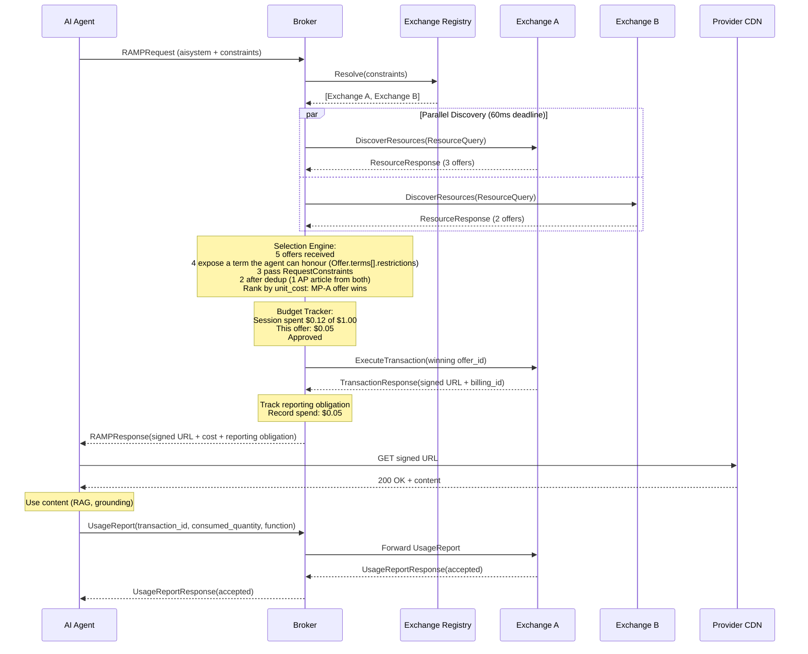

## What the Broker Does

The RAMP Broker is the optional demand-side router in the RAMP protocol. It sits with or near the AI agent, queries multiple Exchanges in parallel, compares offers, enforces budget, and selects the best deal. It is the "DSP" of metered resource access.

**The Broker is optional.** Agents can talk directly to Exchanges using the same `DiscoverResources`/`ExecuteTransaction`/`UsageReport` RPCs. The Broker adds value through:

- **Multi-exchange comparison** -- fan out DiscoverResources to N Exchanges, pick cheapest
- **Budget enforcement** -- per-request, per-session, per-Exchange cumulative tracking
- **Resource deduplication** -- same article from two Exchanges, compare price
- **Attestation-aware selection (v1.0)** -- prefer offers with higher attestation levels (Level 2 > Level 1 > Level 0)
- **Reporting relay** -- forward UsageReports to the correct Exchange, track `report_id` for dispute chain
- **Dispute relay (v1.0)** -- forward `DisputeRequest` messages to the correct Exchange
- **Selection transparency** -- logged rationale for every selection decision

The Exchange does not know or care whether the request came from a Broker or directly from an agent. The protocol is identical.

## Component Architecture

The Broker is composed of five internal components. Each is a Go interface with a concrete implementation. No inter-component communication uses the network; everything is in-process function calls.

```mermaid
graph TB
    subgraph "RAMP Broker"
        MR[Exchange Registry]
        SD[Supply Discovery<br/>parallel fanout]
        SE[Selection Engine]
        BT[Budget Tracker]
        RR[Reporting Relay]
    end

    Agent[AI Agent] -->|RAMPRequest| SD
    SD -->|DiscoverResources| MPA[Exchange A]
    SD -->|DiscoverResources| MPB[Exchange B]
    SD -->|DiscoverResources| MPC[Exchange C]

    MR -.->|endpoint list| SD
    SD -->|[]ResourceResponse| SE
    BT -.->|budget check| SE
    SE -->|winning Offer| SD
    SD -->|ExecuteTransaction| MPA
    SD -->|RAMPResponse| Agent

    Agent -->|UsageReport| RR
    RR -->|forward| MPA
```

### Component Responsibilities

| Component | Responsibility | State |
|---|---|---|
| **Exchange Registry** | Knows which Exchanges exist and their health status. Bootstraps from [Exchange Manifest](/protocol/exchange-manifest/) (`/.well-known/ramp.json`) instead of HEAD probes -- extracting endpoints, capabilities, and accepted verifiers in a single fetch | Long-lived, refreshed periodically |
| **Supply Discovery** | Fans out DiscoverResources RPCs to N Exchanges concurrently | Per-request, stateless |
| **Selection Engine** | Deduplicates, ranks, filters, and selects the best offer | Per-request, stateless |
| **Budget Tracker** | Tracks cumulative spend per session/period and enforces limits | Per-session in-memory, per-period in Redis |
| **Reporting Relay** | Forwards UsageReports to the winning Exchange, tracks obligations | Per-transaction, short-lived |

## Internal Call Flow

```go
func (o *Broker) HandleRequest(ctx context.Context, req *rampv1.RAMPRequest) (*rampv1.RAMPResponse, error) {
    // 1. Resolve which Exchanges to query
    exchanges := o.registry.Resolve(req.Constraints)

    // 2. Fan out DiscoverResources to all Exchanges (multi-URI: all URIs in one query per MP)
    responses := o.discovery.FanOut(ctx, exchanges, req)

    // 3. Select best offer(s).
    //    Single-URI: select one winning offer.
    //    Multi-URI (batch): select best offer per URI, check total against budget.
    uris := req.Aisystem.Aisysuse.Uri
    if len(uris) > 1 {
        return o.handleBatchRequest(ctx, req, responses)
    }

    selection, err := o.selector.Select(ctx, responses, req.Constraints, o.budget)
    if err != nil {
        return nil, err // no viable offer
    }

    // 4. Execute transaction with winning Exchange
    txn, err := o.discovery.Execute(ctx, selection.Exchange, selection.Offer, req)
    if err != nil {
        return nil, err
    }

    // 5. Track budget and reporting obligation
    o.budget.Record(ctx, req.SessionID(), txn.Cost)
    o.reporter.Track(txn)

    // 6. Return RAMPResponse to agent
    return toRAMPResponse(req, txn, selection), nil
}
```

## Request Signing and the Forwarding Signature Stack

RAMP uses a two-layer signing model: the **agent's request signature** proves who originated the request, and the **forwarding signature stack** proves which intermediaries forwarded it.

### Request Authentication

The `Requester` message carries identity and entitlements only (`id`, `domain`, `type`, `scopes`, optional `delegation`) — it has **no** signature field. The request is authenticated by an RFC 9421 HTTP Message Signature (alg=EdDSA) computed over the whole HTTP request and carried in the headers. The Exchange verifies it against the public key published at `{requester.domain}/.well-known/ramp.json`.

The Broker passes `Requester` through unchanged -- it never modifies the requester's identity, scopes, or delegation -- and adds its own forwarding signature in the headers (see below).

### Forwarding Signature Stack (RFC 9421)

Multi-hop forwarding is carried entirely in the HTTP headers, not in the message body. Each forwarding party adds one labeled RFC 9421 HTTP Message Signature covering the request **and the prior hop's signature**. The ordered set of these labeled signatures *is* the forwarding chain -- there is no `intermediaries` field on `ResourceQuery`.

Each labeled signature, via its RFC 9421 signature parameters, effectively records:

- **`keyid`** -- the intermediary's canonical domain / `kid` (for public key lookup)
- **`created`** -- timestamp of when the intermediary forwarded the request
- the covered components -- the request plus the preceding hop's `Signature` value, chaining the hops together

When the agent queries an Exchange directly, there are no forwarding signatures. When the request passes through a Broker, the Broker adds one labeled signature to the stack.

```go
// Broker adds one labeled RFC 9421 signature to the outgoing request headers when forwarding.
func (o *Broker) signHop(req *http.Request, priorSig string) {
    // Covers the request line/headers AND the prior hop's Signature value,
    // chaining this hop to the one before it.
    label := o.domain // e.g., "broker.example.com"
    sigInput, sig := o.rfc9421Sign(req, priorSig, label) // Ed25519, keyid=o.kid, created=now
    req.Header.Add("Signature-Input", sigInput)
    req.Header.Add("Signature", sig)
}
```

### Exchange Verification

The Exchange verifies both layers:

1. **Requester signature** -- verified against the public key at `{requester.domain}/.well-known/ramp.json`
2. **The forwarding signature stack** -- each labeled RFC 9421 signature is verified against the public key at the forwarding party's domain (`{keyid-domain}/.well-known/ramp.json`), and the chained coverage is checked hop-by-hop.

All signatures must pass. The Exchange counts the number of forwarding hops in the stack against `max_hops` / `max_intermediary_hops` and rejects requests that exceed the limit.

The Broker publishes its keys in `public_keys` (inline RFC 7517 Ed25519 JWKs, selected by `kid`) at `{domain}/.well-known/ramp.json` (same manifest format as agents, `role=ROLE_AGENT`). This allows any Exchange to verify the Broker's identity without prior registration.

## Profile-Based Routing

The Broker uses domain profiles to route queries to the right Exchanges.

### How It Works

1. **Agent declares profiles** -- `RAMPRequest.supported_profiles` lists which domain extension profiles the agent understands (e.g., `["ramp-academic-v1"]`)
2. **Broker filters Exchanges** -- the Exchange Registry checks each Exchange's `WellKnownManifest.supported_profiles` and routes queries only to Exchanges that support at least one of the requested profiles
3. **Broker forwards profiles** -- the declared profiles are forwarded in `ResourceQuery.supported_profiles`, so the Exchange knows which profile-specific `ext` fields to include in offers
4. **Exchange responds with profile data** -- the Exchange includes profile-specific metadata (e.g., retraction status, citation counts for academic content) only when the caller declares support

### Example: Academic Research Agent

An agent working on a literature review sends:

```json
{
  "supported_profiles": ["ramp-academic-v1"]
}
```

The Broker's Exchange Registry contains three Exchanges:
- **academic-mp.example.com** -- `supported_profiles: ["ramp-academic-v1", "ramp-legal-v1"]`
- **news-mp.example.com** -- `supported_profiles: ["ramp-news-v1"]`
- **general-mp.example.com** -- `supported_profiles: []` (no profiles)

The Broker queries only **academic-mp.example.com** (profile match) and **general-mp.example.com** (no profile restriction -- always included). It skips **news-mp.example.com** (no matching profile).

## Scope Forwarding, Token Attenuation, and Quota Aggregation

### Scope Forwarding

The Broker forwards `Requester.scopes` to every Exchange it queries. Scopes control what the requester can access -- the Exchange filters its catalog to resources matching these scopes. The Broker does not modify scopes; it passes them through as-is.

### Biscuit Token Attenuation

When the `Requester.delegation` carries a Biscuit authorization token, the Broker MAY attenuate it before forwarding. Biscuit tokens support append-only attenuation -- the holder can add restrictions (narrower scope, lower spend cap, fewer URIs) without going back to the issuer. This lets the Broker narrow a broad delegation for a specific Exchange:

- Original delegation: `scope: academic:*, max_spend: $500`
- Attenuated for Exchange A: `scope: academic:read, max_spend: $100, uris: doi:10.*`

The attenuated token is a new signed block appended to the Biscuit chain. The Exchange verifies the full chain back to the original principal.

### SubscriptionQuotaInfo Aggregation

When multiple Exchanges return `SubscriptionQuotaInfo` on their offers or transaction responses, the Broker MAY aggregate this quota information before returning it to the agent. This gives the agent a consolidated view of remaining quota across Exchanges, enabling proactive throttling without the agent needing to track per-Exchange quota independently.

## Three Discovery Modes

Agents can discover content through the Broker in three ways, depending on how much they know about what they need. All three modes feed into the same Selection Engine -- the Broker compares offers identically regardless of how they were discovered.

### 1. Specific URIs

The agent already knows which resources it wants. It sends `RAMPRequest.uris` with one or more specific content identifiers (DOIs, URLs, etc.). The Broker forwards these as a `ResourceQuery` to each Exchange and collects offers.

```json
{
  "uris": ["doi:10.1038/s41586-024-07386-0", "doi:10.1126/science.adq3854"]
}
```

This is the simplest mode -- the agent has exact references and wants the best price across Exchanges.

### 2. Structured Search

The agent knows what kind of content it needs but not the exact URIs. It sends `RAMPRequest.search_filters` with profile-specific key-value pairs. The Broker maps these to Exchange-specific query parameters and discovers matching resources.

```json
{
  "search_filters": {
    "academic.topic": "CRISPR gene therapy",
    "academic.year_min": 2023,
    "academic.peer_reviewed": true
  }
}
```

Filter keys are profile-specific: `academic.topic`, `news.category`, `legal.jurisdiction`, `medical.specialty`, etc. The Broker translates these into the native query format of each Exchange it contacts.

### 3. Natural Language

The agent describes what it needs in free text. It sends `RAMPRequest.query` with a natural-language description. The Broker interprets the query and searches across Exchanges on the agent's behalf.

```json
{
  "query": "Recent peer-reviewed studies on mRNA vaccine efficacy in immunocompromised patients"
}
```

This mode is useful for exploratory research where the agent cannot formulate structured filters. The Broker resolves the intent into Exchange queries.

### Combining Modes

All three modes can be combined in a single request. For example, an agent can send specific URIs it already knows about, plus a search query to discover additional relevant resources:

```json
{
  "uris": ["doi:10.1038/s41586-024-07386-0"],
  "query": "Related studies on CRISPR delivery mechanisms",
  "search_filters": {
    "academic.year_min": 2022
  }
}
```

The Broker merges results from all modes, deduplicates across them, and feeds everything into the Selection Engine for comparison and ranking.

## Discovery Extension Point (v2)

The Broker's internal `SupplySource` interface is the extension point for content discovery beyond Exchange queries. In v1, all URIs come from the agent's request. In v2, the Broker can discover URIs on the agent's behalf:

```go
// SupplySource abstracts where content offers come from.
// v1: only ExchangeSource (queries an Exchange).
// v2: SearchSource (Exa, Tavily), RecommendationSource, etc.
type SupplySource interface {
    // Query returns offers from this source matching the request.
    Query(ctx context.Context, req *rampv1.ResourceQuery) (*rampv1.ResourceResponse, error)

    // Domain returns the source identifier (exchange domain or service name).
    Domain() string

    // Kind returns the source type for selection policy routing.
    Kind() SupplySourceKind // Exchange, SearchEngine, Archive, etc.
}
```

The flow: search/recommendation produces URIs, the Broker looks up an Exchange for each URI's domain (via ramp.json), the Exchange provides pricing/offers, and the standard transaction flow continues. Discovery is upstream of transactions -- it produces URIs, not offers. The `OfferGroup.discovery_method` field tells the agent how each URI was found.

This positions the Broker as the natural integration point for agentic search -- agents that need content don't just request known URLs, they ask "find me articles about X" and the Broker discovers, prices, and delivers.

## Request Lifecycle (End-to-End)

Full request lifecycle from agent to content delivery:



## Key Design Decisions

| Decision | Rationale |
|---|---|
| **Broker is optional** | Agents can query Exchanges directly. The Broker adds multi-exchange intelligence but is not required by the protocol. |
| **Same protocol, transparent proxy** | The Exchange cannot distinguish Broker-mediated requests from direct agent requests. No special Exchange support needed. |
| **Signed offer pass-through** | Exchange signatures cover pricing fields. The Broker cannot inflate prices without invalidating the signature. |
| **Advisory budget enforcement** | The Broker pre-filters transactions by budget, but the Exchange is the authoritative enforcement point. No overspend occurs because the Exchange is the gatekeeper. |
| **Ed25519 + forwarding signature stack** | Requester signs (id, domain, scopes); Broker adds one labeled RFC 9421 HTTP Message Signature (covering the request plus the prior hop's signature) to the header stack. Exchange verifies both layers and counts hops against `max_hops` / `max_intermediary_hops`. Public keys discoverable via `public_keys` in `.well-known/ramp.json`. |
| **Partial results are normal** | If 3 of 5 Exchanges respond within the deadline, the Broker proceeds with 3 responses. Availability of any individual Exchange does not block the system. |

## Go Module Structure

```
github.com/RAMP-Protocol/protocol/broker/
    cmd/
        broker/           # Sidecar binary entrypoint
            main.go
    pkg/
        broker/           # Core broker logic (used by all deployment modes)
            broker.go     # Broker struct + HandleRequest
            config.go           # Configuration loading
        registry/               # Exchange Registry
            registry.go         # ExchangeRegistry interface + in-memory impl
            crawler.go          # ramp.json crawler
            health.go           # Health checker
        discovery/              # Supply Discovery (parallel fanout)
            fanout.go           # FanOut implementation
            clientpool.go       # Connect client pool management
        selection/              # Selection Engine
            engine.go           # SelectionEngine interface + default impl
            pipeline.go         # Filter, dedup, rank stages
            policy.go           # Pluggable selection policies
        budget/                 # Budget Tracker
            tracker.go          # BudgetTracker interface + in-memory impl
        reporting/              # Reporting Relay
            relay.go            # ReportingRelay interface + impl
            obligations.go      # Obligation tracking + deadline checker
        metrics/                # Prometheus metrics
            metrics.go          # All metric definitions
    internal/
        testutil/               # Test helpers
```
