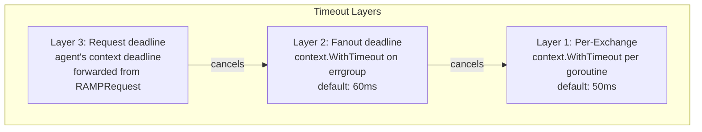
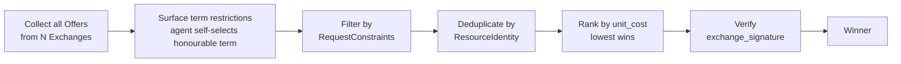
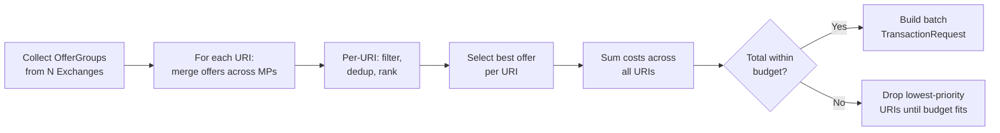
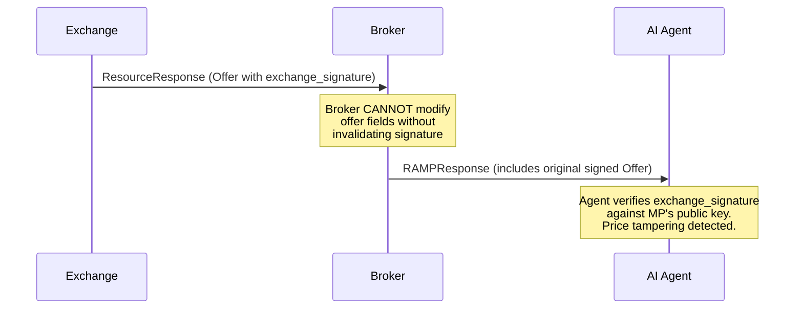

## Purpose

The Selection Engine compares offers across Exchanges, deduplicates by content identity, ranks by cost, and applies constraints. This is the "auction logic" of the Broker -- it determines which Exchange wins a given content request.

### Discovery-Mode Agnostic

The Selection Engine operates on offers, not on how those offers were discovered. Whether the agent sent specific URIs (`RAMPRequest.uris`), structured search filters (`RAMPRequest.search_filters`), or a natural-language query (`RAMPRequest.query`), the Broker resolves all three into a set of offers from Exchanges. The Selection Engine then applies the same pipeline -- filter, deduplicate, rank, verify -- to every offer identically.

This means the selection logic does not need to know or care about discovery mode. An offer discovered via structured search competes on equal footing with an offer from a specific URI request. The `OfferGroup.discovery_method` field records how each offer was found (for transparency and logging), but it does not influence ranking.

## Multi-Exchange Query Fanout

The core value proposition of the Broker is parallel supply discovery. The Broker fans out `DiscoverResources` to N Exchanges concurrently, collecting offers for comparison.

### Concurrency Model

Uses `errgroup.Group` with a semaphore for bounded concurrency and `context.WithTimeout` for per-Exchange deadlines. When the `RAMPRequest` contains multiple URIs, the Broker sends all URIs in a single `ResourceQuery` to each Exchange (not one query per URI). The Exchange returns `OfferGroups` -- one per URI -- so the Broker knows which offers map to which content.

```go
func (d *Discovery) FanOut(
    ctx context.Context,
    exchanges []ExchangeEntry,
    req *rampv1.RAMPRequest,
) []FanOutResult {

    // Hard deadline: don't wait longer than this for any Exchange.
    ctx, cancel := context.WithTimeout(ctx, d.fanoutTimeout) // default: 60ms (p99 target)
    defer cancel()

    results := make([]FanOutResult, len(exchanges))
    g, gctx := errgroup.WithContext(ctx)
    g.SetLimit(d.maxConcurrency) // default: 20

    for i, mp := range exchanges {
        i, mp := i, mp
        g.Go(func() error {
            query := toResourceQuery(req, mp) // includes all req.Uris
            start := time.Now()

            resp, err := d.clients[mp.Domain].DiscoverResources(gctx, connect.NewRequest(query))

            results[i] = FanOutResult{
                Exchange: mp,
                Response:    resp,
                Err:         err,
                Latency:     time.Since(start),
            }

            // Don't return error -- we want partial results, not all-or-nothing.
            return nil
        })
    }

    g.Wait()
    return results
}
```

### Time Budget in ResourceQuery

`ResourceQuery` carries an optional `deadline` field (default: 500ms). This informs the Exchange how much time the agent has allocated for the entire discovery phase. Exchanges SHOULD prioritize speed when the deadline is tight.

```go
func (d *Discovery) perExchangeDeadline(mp ExchangeEntry, requestDeadline time.Duration) time.Duration {
    p99 := d.latencyTracker.P99(mp.Domain)
    if p99 == 0 {
        return requestDeadline // no history, use full budget
    }
    // Allow 2x historical p99, capped at request deadline
    budget := min(p99*2, requestDeadline)
    return budget
}
```

### Timeout Handling

Three timeout layers, each independently enforced:



| Layer | Default | Purpose |
|---|---|---|
| Per-Exchange | 50ms | Individual slow Exchange doesn't block others |
| Fanout deadline | 60ms | Overall discovery phase has a hard cap |
| Request deadline | From agent's context | Agent controls the total request timeout |

**Partial results are normal.** If 3 of 5 Exchanges respond within the deadline, the Broker proceeds with 3 responses. Timed-out Exchanges are recorded in metrics and their health status is degraded.

### Client Pool

Pre-established HTTP/2 connections to each Exchange. Connect-Go clients are created at startup and reused.

```go
type ClientPool struct {
    mu      sync.RWMutex
    clients map[string]rampv1connect.ExchangeServiceClient
}

func (p *ClientPool) GetOrCreate(mp ExchangeEntry) rampv1connect.ExchangeServiceClient {
    p.mu.RLock()
    if c, ok := p.clients[mp.Domain]; ok {
        p.mu.RUnlock()
        return c
    }
    p.mu.RUnlock()

    p.mu.Lock()
    defer p.mu.Unlock()

    // Double-check after acquiring write lock.
    if c, ok := p.clients[mp.Domain]; ok {
        return c
    }

    httpClient := &http.Client{
        Transport: &http.Transport{
            MaxIdleConnsPerHost: 10,
            IdleConnTimeout:    90 * time.Second,
            ForceAttemptHTTP2:  true,
            TLSClientConfig:   &tls.Config{MinVersion: tls.VersionTLS13},
        },
        Timeout: 5 * time.Second, // connection-level timeout
    }

    client := rampv1connect.NewExchangeServiceClient(httpClient, mp.Endpoint)
    p.clients[mp.Domain] = client
    return client
}
```

## Selection Pipeline

### Single-URI Pipeline

For single-URI queries, five stages are executed sequentially on the combined offer set:



### Multi-URI Batch Pipeline

For multi-URI batch queries, selection is 2-dimensional: the engine selects the best offer per URI, then checks whether the total cost across all URIs fits within budget.



The batch selection algorithm:

1. For each URI, collect offers from all Exchange responses (flatten OfferGroups with matching URI).
2. Within each URI group, run the full single-URI pipeline (filter, dedup, rank).
3. Select the best offer per URI.
4. Sum costs across all selected offers to get the batch total.
5. If the total exceeds budget, drop offers for the lowest-priority URIs (by position in the original request) until the total fits.
6. Send a single batch `TransactionRequest` with `items` for all selected offers.

### Selection Interface

```go
type SelectionEngine interface {
    // Select handles single-URI queries. Returns one winning offer.
    Select(
        ctx context.Context,
        responses []FanOutResult,
        constraints *rampv1.RequestConstraints,
        budget BudgetTracker,
    ) (*Selection, error)

    // SelectBatch handles multi-URI queries. Returns one winning offer per URI,
    // with total cost checked against budget.
    SelectBatch(
        ctx context.Context,
        responses []FanOutResult,
        constraints *rampv1.RequestConstraints,
        budget BudgetTracker,
    ) (*BatchSelection, error)
}

type Selection struct {
    Exchange ExchangeEntry
    Offer       *rampv1.Offer
    Rationale   SelectionRationale
}

type BatchSelection struct {
    Selections []Selection
    TotalCost  float64
    Currency   string
    Rationale  BatchSelectionRationale
}

type SelectionRationale struct {
    TotalOffers       int
    WithHonourableTerm int // offers exposing a term whose restrictions the agent can honour
    AfterConstraints  int
    AfterDedup        int
    WinningUnitCost   float64
    RunnerUpUnitCost  float64  // 0 if no runner-up
    DeduplicatedSets  int      // how many content groups had multiple offers
    RejectedReasons   map[string]int // reason -> count
}
```

## Stage 1: Surface Term Restrictions (Agent Self-Selects)

Restrictions ride on the offer, not on a broker-side filter. Each `Offer.terms[]` entry is a `LicenseTerm` carrying `repeated Restriction` (with kinds like `RESTRICTION_KIND_FUNCTION`, `RESTRICTION_KIND_GEOGRAPHY`, `RESTRICTION_KIND_USER_TYPE`). The Broker does **not** match a requester's self-declared attributes (function, geography, user type) against these restrictions to drop offers. Instead it surfaces the restrictions on each offer's terms; the agent self-selects the term whose restrictions it can honour. Real enforcement happens downstream at accept -> report -> reconcile.

The Broker may help the agent by annotating which term it can honour, but it does not silently remove offers whose terms carry restrictions. The function-token vocabulary is the hyphenated string form (`ai-train`, `ai-index`, `ai-input`, `crawl`, `search`, ...).

```go
// honourableTerm returns the first LicenseTerm whose restrictions the agent
// can honour, given its declared function. It does NOT drop the offer when no
// term matches -- the offer is still surfaced; the agent decides.
func honourableTerm(offer *rampv1.Offer, declaredFunction string) *rampv1.LicenseTerm {
    for _, term := range offer.Terms {
        if restrictionsHonoured(term.Restrictions, declaredFunction) {
            return term
        }
    }
    return nil
}

func restrictionsHonoured(restrictions []*rampv1.Restriction, declaredFunction string) bool {
    for _, r := range restrictions {
        if r.Kind != rampv1.RestrictionKind_RESTRICTION_KIND_FUNCTION {
            continue // geography / user-type evaluated by the agent against its own context
        }
        // If prohibited contains the declared function, this term cannot be honoured.
        for _, prohibited := range r.Prohibited {
            if prohibited == declaredFunction {
                return false
            }
        }
        // If permitted is non-empty, the declared function must be in it.
        if len(r.Permitted) > 0 {
            found := false
            for _, perm := range r.Permitted {
                if perm == declaredFunction {
                    found = true
                    break
                }
            }
            if !found {
                return false
            }
        }
    }
    return true
}
```

## Stage 2: Filter by RequestConstraints

The agent's `RAMPRequest.constraints` specifies budget and preference limits.

```go
func filterByConstraints(offers []rankedOffer, c *rampv1.RequestConstraints, budget BudgetTracker) []rankedOffer {
    var passed []rankedOffer
    for _, o := range offers {
        p := o.Offer.Pricing

        // max_price: reject offers above the per-request ceiling
        if c.MaxPrice != nil && p.Rate > c.MaxPrice.Amount {
            continue
        }

        // max_unit_cost: reject offers with unit_cost above threshold
        if c.MaxUnitCost != nil && p.UnitCost != nil && *p.UnitCost > *c.MaxUnitCost {
            continue
        }

        // reporting_capable: if agent can't report, skip offers that require it
        if c.ReportingCapable != nil && !*c.ReportingCapable {
            if o.Offer.Reporting != nil && o.Offer.Reporting.Required {
                continue
            }
        }

        // delivery_preference: filter by supported delivery methods
        if len(c.DeliveryPreference) > 0 {
            if !deliveryMethodAccepted(o.Offer.DeliveryMethod, c.DeliveryPreference) {
                continue
            }
        }

        // Session budget: reject if cumulative spend would exceed session budget
        if !budget.CanAfford(p.Rate, p.Currency) {
            continue
        }

        passed = append(passed, o)
    }
    return passed
}
```

## Stage 3: Deduplicate by ResourceIdentity

The same article may be offered by multiple Exchanges (e.g., an AP wire story available from Exchange A and Exchange B). The Broker groups offers by resource identity and keeps only the cheapest per group.

```go
// contentIdentityKey produces a deduplication key from layered identity fields.
// Matching priority: iptc_guid > doi > content_hash > canonical_url
func contentIdentityKey(id *rampv1.ResourceIdentity) string {
    if id == nil {
        return uuid.NewString() // no identity = unique (no dedup)
    }
    if id.IptcGuid != nil && *id.IptcGuid != "" {
        return "iptc:" + *id.IptcGuid
    }
    if id.Doi != nil && *id.Doi != "" {
        return "doi:" + *id.Doi
    }
    if id.ContentHash != nil && *id.ContentHash != "" {
        return "hash:" + *id.ContentHash
    }
    if id.CanonicalUrl != nil && *id.CanonicalUrl != "" {
        return "url:" + *id.CanonicalUrl
    }
    return uuid.NewString()
}
```

For the full deduplication logic, see the [Content Deduplication](/components/broker/content-dedup/) page.

## Stage 4: Multi-Factor Ranking

After deduplication, remaining offers are ranked by a multi-factor scoring engine. "Lowest unit_cost wins" is the default policy but not the only option. The selection engine considers:

1. **Subscription content (zero marginal cost).** Offers with `subscription_id` set rank above all per-request offers. The selection engine discovers subscriptions when Exchange responses include offers with `subscription_id` populated.

2. **Agent's preferred Exchanges.** The agent declares `preferred_exchanges` in `RequestConstraints`. Ranking priority: (a) subscription offers from preferred Exchanges, (b) subscription offers from any Exchange, (c) per-request offers from preferred Exchanges, (d) per-request offers ranked by unit_cost.

3. **Provider reputation scores.** Exchanges that consistently deliver accurate, well-structured content rank higher.

4. **Content attestation level (v1.0).** Level 2 (third-party attested) > Level 1 (self-attested) > Level 0 (no attestation). Offers with `ResourceAttestation` entries from trusted verification vendors rank higher because they provide independently verifiable claims about the content.

5. **Quantity estimation accuracy.** Exchanges with historically accurate estimated_quantity values rank higher.

6. **Business relationships.** The agent declares known relationships via `RequestConstraints`.

```go
func (e *defaultEngine) rankOffers(offers []rankedOffer, constraints *rampv1.RequestConstraints) []rankedOffer {
    for i := range offers {
        score := 0.0

        // Zero marginal cost: subscription offers always win.
        if offers[i].Offer.SubscriptionId != nil && *offers[i].Offer.SubscriptionId != "" {
            score += 10000.0 // effectively infinite preference
            // Extra boost for subscription offers from preferred exchanges
            if isPreferred(offers[i].Exchange.Domain, constraints.PreferredExchanges) {
                score += 5000.0
            }
        }

        // unit_cost: lower is better (inverted for scoring)
        uc := unitCostOf(offers[i])
        if uc > 0 && uc < math.MaxFloat64 {
            score += 1000.0 / uc
        }

        // Preferred exchange bonus
        if isPreferred(offers[i].Exchange.Domain, constraints.PreferredExchanges) {
            score += 500.0
        }

        // Content attestation level bonus (v1.0)
        // Level 2 (third-party) > Level 1 (self-attested) > Level 0 (none)
        score += float64(attestationLevel(offers[i].Offer)) * 100.0

        // Quantity estimation accuracy bonus (historical)
        score += e.quantityAccuracy.Score(offers[i].Exchange.Domain) * 50.0

        offers[i].Score = score
    }

    sort.Slice(offers, func(i, j int) bool {
        return offers[i].Score > offers[j].Score // descending: highest score wins
    })
    return offers
}

func unitCostOf(o rankedOffer) float64 {
    if o.Offer.Pricing.UnitCost != nil {
        return *o.Offer.Pricing.UnitCost
    }
    // Fallback: compute from rate and estimated_quantity
    if o.Offer.Pricing.EstimatedQuantity != nil && *o.Offer.Pricing.EstimatedQuantity > 0 {
        return o.Offer.Pricing.Rate / float64(*o.Offer.Pricing.EstimatedQuantity)
    }
    return math.MaxFloat64 // no unit_cost available, rank last
}
```

## Stage 5: Verify exchange_signature

The Broker SHOULD verify `exchange_signature` on the winning Offer before proceeding. This prevents an Exchange from tampering with its own offer fields after signing.

```go
func verifyOfferSignature(offer *rampv1.Offer, exchange string, pubKeys map[string]crypto.PublicKey) error {
    if offer.Signature == "" {
        return fmt.Errorf("offer signature is required but empty")
    }

    payload := canonicalizeOffer(offer)

    alg := "ed25519" // default for offer signatures
    if offer.SignatureAlgorithm != "" {
        alg = offer.SignatureAlgorithm
    }

    key, ok := pubKeys[exchange]
    if !ok {
        return fmt.Errorf("no public key for exchange %q", exchange)
    }

    return verifySignature(alg, key, payload, []byte(offer.Signature))
}
```

## Pluggable Selection Policies

The default selection policy is "lowest unit_cost wins." Production deployments may want custom policies:

```go
type SelectionPolicy interface {
    // Rank orders offers by preference. Index 0 is the winner.
    Rank(offers []rankedOffer, constraints *rampv1.RequestConstraints) []rankedOffer
}

// Built-in policies
type LowestUnitCostPolicy struct{}       // Default: cheapest wins
type PreferredExchangePolicy struct{} // Prefer specific Exchanges, then unit_cost
type FreshnessWeightedPolicy struct{}    // Prefer newer content, weighted against unit_cost
type QualityScorePolicy struct{}         // Use Exchange reputation scores
```

The policy is set at Broker construction time, not per-request. Per-request behavior is controlled through `RequestConstraints`.

## Exchange Authorization Verification

Before executing a transaction, the Broker SHOULD verify that the Exchange is authorized by the provider whose content is being licensed. This is the RAMP equivalent of ads.txt verification in programmatic advertising.

```go
func (o *Broker) verifyExchangeAuthorization(
    ctx context.Context,
    contentDomain string,
    exchangeDomain string,
) (bool, error) {
    manifest, err := o.parseJSONCache.Get(ctx, contentDomain)
    if err != nil {
        return false, fmt.Errorf("fetching ramp.json for %s: %w", contentDomain, err)
    }
    for _, authorized := range manifest.AuthorizedExchanges {
        if authorized.Domain == exchangeDomain {
            return true, nil
        }
    }
    return false, nil // Exchange not authorized by provider
}
```

This check runs after offer selection, before `ExecuteTransaction`. If verification fails, the Broker falls back to the next-ranked offer.

## Selection Rationale Logging

Every selection decision is logged with full rationale for audit:

```go
type SelectionLog struct {
    RequestID           string              `json:"request_id"`
    Timestamp           time.Time           `json:"timestamp"`
    ExchangesQueried []string            `json:"exchanges_queried"`
    ExchangesResponded []string          `json:"exchanges_responded"`
    TotalOffers         int                 `json:"total_offers"`
    FilteredOffers      int                 `json:"filtered_offers"`
    DeduplicatedSets    int                 `json:"deduplicated_sets"`
    WinningExchange  string              `json:"winning_exchange"`
    WinningOfferID      string              `json:"winning_offer_id"`
    WinningUnitCost     float64             `json:"winning_unit_cost"`
    RunnerUpUnitCost    float64             `json:"runner_up_unit_cost,omitempty"`
    RejectionReasons    map[string]int      `json:"rejection_reasons"`
    SelectionPolicy     string              `json:"selection_policy"`
    LatencyMs           int64               `json:"latency_ms"`
}
```

## Transparency and Auditability

The Broker is an intermediary. RAMP addresses transparency through:

### Signed Offer Pass-Through

The Exchange signs the Offer using its private key. The Broker passes the signed offer through to the agent. **The Broker cannot inflate prices** because the Exchange's signature covers the pricing fields.



### Fee Disclosure

`RAMPResponse` includes an optional `broker_fee` field. The Broker MUST disclose fees when present.

```json
{
  "broker_fee": {
    "amount": 0.001,
    "currency": "USD"
  }
}
```

The fee is additive and disclosed, never hidden in the offer price. The agent sees: Exchange price + Broker fee = total cost.

### Audit Trail

For full auditability, the agent operator should:

1. **Verify offer signatures** on every RAMPResponse
2. **Retain selection logs** to prove the Broker selected the cheapest offer
3. **Spot-check by going direct** -- query Exchanges directly to verify the Broker isn't hiding better offers
