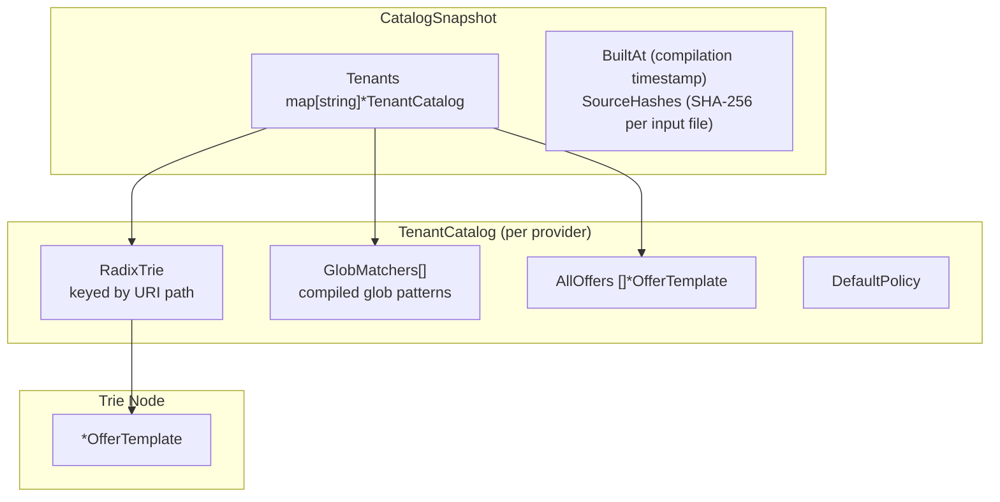

## From Entries to Lookup Structure

The compiler transforms a flat list of `CatalogEntry` structs into an efficient in-memory lookup structure. The output is a `CatalogSnapshot` containing per-tenant radix tries for exact-path lookup and compiled glob matchers for pattern-based entries.



## Content Identity Assignment

Each `CatalogEntry` maps to a protocol `OfferTemplate`. The content identity is assigned during compilation:

- **Package ID**: Generated from tenant ID and path hash: `PKG-{tenant}-{path-hash}`
- **Canonical URL**: Computed as `https://{domain}{path}`
- **Content ID**: Provider-assigned stable identifier (if provided), used as supplementary identifier for deduplication across URL changes

### CatalogEntry to OfferTemplate Mapping

| CatalogEntry Field | Protocol Object | Field | Notes |
|---|---|---|---|
| `TenantID` + `Path` | `comp.Package` | `id` | Generated: `PKG-{tenant}-{path-hash}` |
| `Title` | `comp.Package` | `title` | Also `comp.Text.title` |
| `Domain` | `comp.Package` | `seller` | Provider's canonical domain |
| `WordCount` | `comp.Text` | `wordcount` | Array (single element) |
| `PubDate` | `comp.Text` | `pubdate` | ISO 8601 |
| `Authors` | `comp.Text` | `author` | String array |
| `SourceType` | `comp.Text` | `sourcetype` | 0=human, 1=ai, 2=hybrid |
| `PricingModel` | `ramp.Pricing` | `model` | Enum mapping |
| `Rate` | `ramp.Pricing` | `rate` | Decimal |
| `Currency` | `ramp.Pricing` | `currency` | ISO 4217 |
| `EstimatedTokens` | `ramp.Pricing` | `estimated_quantity` | `WordCount * 1.32` |
| `Rate / EstimatedTokens` | `ramp.Pricing` | `unit_cost` | Computed at compilation |
| `Domain + Path` | `ramp.ResourceIdentity` | `canonical_url` | Full URL |
| `Permissions` | `ramp.Restriction` (kind `RESTRICTION_KIND_FUNCTION`, on `LicenseTerm.restrictions`) | `permitted` | From RSL permits (hyphenated tokens, e.g. `ai-input`) |
| `Prohibitions` | `ramp.Restriction` (kind `RESTRICTION_KIND_FUNCTION`, on `LicenseTerm.restrictions`) | `prohibited` | From RSL prohibits (hyphenated tokens, e.g. `ai-train`) |

## Pricing Attachment

Pricing is attached at compilation time by the Pricer stage (Stage 4), which runs before compilation. The unit_cost (effective cost per unit) is computed during the mapping:

```go
pricing := &rampv1.Pricing{
    Model:    mapPricingModel(entry.PricingModel),
    Rate:     entry.Rate,
    Currency: entry.Currency,
}
if entry.EstimatedTokens > 0 {
    quantity := int32(entry.EstimatedTokens)
    pricing.EstimatedQuantity = &quantity
    if entry.Rate > 0 {
        unitCost := entry.Rate / float64(entry.EstimatedTokens)
        pricing.UnitCost = &unitCost
    }
}
```

Pricing resolution follows this priority:

```
Exchange config DB has pricing for this path/tenant?
+-- YES -> Use authoritative private pricing (may vary per agent)
|
+-- NO -> Did RSL or RAMP sitemap provide pricing hints?
         +-- YES -> Use as fallback defaults
         |
         +-- NO -> Use tenant-level default pricing
```

## Attestation Attachment (v1.0)

Content attestations pushed via `CatalogService.PushResources` are attached to catalog entries during compilation. Each `CatalogEntry` may carry zero or more `ResourceAttestation` entries, which propagate to `OfferTemplate` and ultimately to `Offer.attestations` in `DiscoverResources` responses.

The Exchange verifies attestation signatures at push time (not at compilation time) using keys fetched from the verifier's WBA directory (the JWK Set at `/.well-known/http-message-signatures-directory`). Only valid, unexpired attestations with verified signatures are stored in the catalog.

When a catalog entry has attestations from multiple verifiers (e.g., a provider self-attestation and a DoubleVerify third-party attestation), all are carried on the offer. The agent decides which to trust.

## Content Integrity Signals

Content integrity signals flow into the `OfferTemplate` from multiple sources:

- **Attestation claims (v1.0)**: Signed claims from providers (Level 1) or third-party vendors (Level 2) provide cryptographically verifiable token counts, content hashes, and metadata. Attestations replace the former `ResourceAttestation` concept with independently verifiable data.
- **Token estimate accuracy**: Provider-provided tokens (Source 1) are the most accurate. Crawl-derived estimates carry +/-15% uncertainty.
- **Freshness**: `BuiltAt` timestamp on the `CatalogSnapshot` and per-entry `Freshness` timestamps enable staleness detection. Attestation `attested_at` timestamps provide per-entry freshness for verified claims.
- **Source hashes**: SHA-256 of each input source (rsl.txt, sitemap.xml). If unchanged since last build, the pipeline can skip rebuild.

## Radix Trie Construction

The compiler builds a per-tenant radix trie for O(path_length) URI lookup:

```go
func (c *CatalogCompiler) buildTenantCatalog(
    tenantID string,
    entries []CatalogEntry,
    tenantCfg *TenantConfig,
) *TenantCatalog {
    tc := &TenantCatalog{
        TenantID:      tenantID,
        URIIndex:      radixtree.New[*OfferTemplate](),
        GlobMatchers:  make([]GlobMatcher, 0),
        AllOffers:     make([]*OfferTemplate, 0, len(entries)),
        DefaultPolicy: tenantCfg.DefaultAccessPolicy,
    }

    for _, entry := range entries {
        offer := catalogEntryToOfferTemplate(entry)
        tc.AllOffers = append(tc.AllOffers, offer)

        if entry.IsGlobPattern {
            compiled, err := glob.Compile(entry.Path)
            if err != nil {
                c.logger.Warn("invalid glob pattern, skipping",
                    slog.String("pattern", entry.Path),
                    slog.String("tenant_id", tenantID),
                )
                continue
            }
            tc.GlobMatchers = append(tc.GlobMatchers, GlobMatcher{
                Pattern:  entry.Path,
                Compiled: compiled,
                Offer:    offer,
            })
        } else {
            tc.URIIndex.Insert(entry.Path, offer)
        }
    }

    // Sort glob matchers by specificity (longer patterns first)
    sort.Slice(tc.GlobMatchers, func(i, j int) bool {
        return len(tc.GlobMatchers[i].Pattern) > len(tc.GlobMatchers[j].Pattern)
    })

    return tc
}
```

## Lookup Precedence

When `DiscoverResources` needs to find an offer for a given URI path, the `TenantCatalog.Lookup` method applies three-tier matching:

1. **Exact match** in radix trie -- O(path_length)
2. **Longest prefix match** in radix trie -- O(path_length)
3. **Glob pattern match** -- O(glob_count), sorted by specificity (longer patterns first)

```go
func (tc *TenantCatalog) Lookup(path string) (*OfferTemplate, bool) {
    if offer, ok := tc.URIIndex.Get(path); ok {
        return offer, true
    }
    if offer, ok := tc.URIIndex.LongestPrefix(path); ok {
        return offer, true
    }
    for _, gm := range tc.GlobMatchers {
        if gm.Compiled.Match(path) {
            return gm.Offer, true
        }
    }
    return nil, false
}
```

## Serialization and Atomic Swap

The main Exchange process never builds the trie. It only loads pre-built binary. This separation ensures builder crash does not crash the server, and server restart is fast (load binary, don't rebuild from sources).

**Build flow** (background builder process or goroutine):
1. Ingest sources, normalize, enrich, price
2. Compile trie in memory
3. Serialize to binary file (gob or flatbuffers)
4. Write to temp file, then atomic rename to `catalog.bin`

**Load flow** (main server process):
1. On startup, load `catalog.bin` from disk, deserialize, serve
2. Watch for new `catalog.bin` (fsnotify or poll interval)
3. On change: load new binary, deserialize, atomic pointer swap
4. Old snapshot is garbage collected after in-flight reads complete

```go
type Catalog struct {
    current  atomic.Pointer[CatalogSnapshot]
    binPath  string
    watcher  *fsnotify.Watcher
    logger   *slog.Logger
}

func (c *Catalog) Swap(newSnapshot *CatalogSnapshot) {
    c.current.Store(newSnapshot)
}

func (c *Catalog) Snapshot() *CatalogSnapshot {
    return c.current.Load()
}
```

The pipeline includes a safety check: if the new catalog is empty but the current one is not, the swap is refused to prevent serving an empty catalog due to a transient source failure.

## Memory Estimate

| Component | Per Entry | 100K Entries | 1M Entries |
|---|---|---|---|
| OfferTemplate struct | ~500 bytes | 50 MB | 500 MB |
| Radix trie nodes | ~100 bytes (amortized, path sharing) | 10 MB | 100 MB |
| Glob matchers | ~200 bytes each | Negligible (typically < 100 patterns) | Negligible |
| **Total per tenant** | | **~60 MB** | **~600 MB** |

Realistic Growth estimate: 1K providers x 5K effective entries = 5M entries x 500 bytes = 2.5 GB total, distributed across 4 instances = 625 MB per instance.
