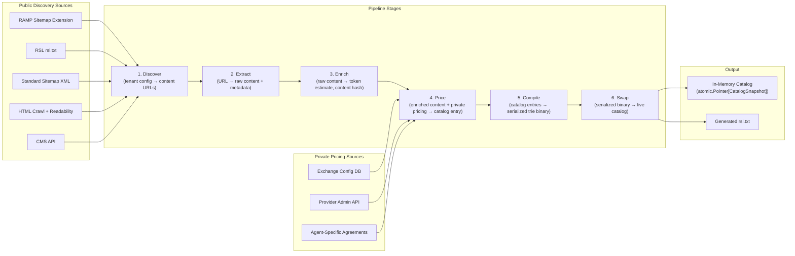

## What the Content Ingestion Pipeline Does

The Content Ingestion Pipeline is a background subsystem of the Exchange Node. It discovers content from provider sources, normalizes it into a common representation, enriches it with token estimates, applies private pricing from the Exchange configuration, compiles an efficient in-memory lookup structure, and atomically swaps it into the live catalog.

The hot path (`DiscoverResources`, `ExecuteTransaction`) never waits on the pipeline. Catalog rebuild targets under 5 seconds for 100K entries, with atomic pointer swap for zero-downtime refresh.

## How It Feeds the Exchange Catalog

The pipeline produces a `CatalogSnapshot` -- an immutable, in-memory data structure that the Exchange's `DiscoverResources` RPC reads on every request. The snapshot contains per-tenant radix tries for exact-path lookup and compiled glob matchers for pattern-based entries.



## Sources of Content Metadata

The pipeline has two fundamentally distinct input streams:

**Public: Content Availability (Discovery)** -- RSL (`rsl.txt`) and sitemap extensions declare what content exists and what terms apply. This information is public and crawlable by any agent.

**Private: Pricing (Exchange Authority)** -- The Exchange is the price authority, not static files. Pricing is private and dynamic. Different agents may see different prices based on volume discounts, contractual relationships, or subscription tiers.

**Attestations (v1.0)** -- Content attestations enter the catalog via `CatalogService.PushResources`. Providers push self-signed attestations (Level 1) and authorized third-party verification vendors push independent attestations (Level 2). The Exchange verifies attestation signatures at push time using keys from the verifier's `/.well-known/ramp.json` `public_keys`. Only callers listed in the provider's `catalog_contributors` may push attestations on behalf of that provider.

| Source | Description | Priority |
|---|---|---|
| Exchange config DB | Tenant-level and path-level pricing rules set by Exchange operator or provider | Authoritative |
| Provider admin API | `POST /admin/pricing` -- providers update pricing programmatically | Authoritative |
| Agent-specific agreements | Volume discounts, subscriptions, negotiated rates stored per agent/buyer | Highest (overrides defaults) |
| RSL/sitemap hints | `<amount>`, `ramp:rate` -- treated as fallback defaults if no private pricing is configured | Lowest |

## Processing Stages

Each stage is defined as a contract: an input schema and an output schema. The reference implementation uses Go goroutines. Production at scale: Dagster/Airflow DAGs calling the same stage logic packaged as Go libraries.

| Stage | Contract | Input | Output |
|---|---|---|---|
| **1. Discover** | `TenantConfig → []ContentURL` | Tenant configuration with source endpoints | Content URLs with source metadata |
| **2. Extract** | `ContentURL → RawContent + Metadata` | URL to fetch | Raw content with title, word count, dates |
| **3. Enrich** | `CatalogEntry[] → EnrichedContent` | Normalized catalog entries without token estimates | Token estimate, content hash, quality signals |
| **4. Price** | `EnrichedContent + PrivatePricing → CatalogEntry` | Enriched content + Exchange pricing config | Fully priced catalog entry |
| **5. Compile** | `[]CatalogEntry → SerializedBinary + CatalogSnapshot` | Flat list of catalog entries | Serialized trie binary (gob or flatbuffers) + CatalogSnapshot metadata |
| **6. Swap** | `SerializedBinary → LiveCatalog` | Serialized binary file | Atomic pointer swap into live catalog |

## Key Design Decisions

**Pluggable stage contracts.** Each stage implements a single-responsibility interface. Stages are composable -- the output of one feeds the input of the next. This enables stages to run as independent Dagster/Airflow tasks at scale.

```go
type Discoverer interface {
    Name() IngestionSource
    Priority() int
    Discover(ctx context.Context, tenant *TenantConfig) ([]RawEntry, error)
    SupportsIncremental() bool
}

type Extractor interface {
    Extract(ctx context.Context, entry *RawEntry) error
}

type Enricher interface {
    Enrich(ctx context.Context, entries []CatalogEntry) []CatalogEntry
}

type Pricer interface {
    Price(ctx context.Context, tenant *TenantConfig, entries []CatalogEntry) []CatalogEntry
}

type Compiler interface {
    Compile(entries []CatalogEntry, tenants map[string]*TenantConfig) ([]byte, *CatalogSnapshot, error)
}

type Swapper interface {
    Swap(data []byte) error
    SwapSnapshot(snapshot *CatalogSnapshot)
}
```

**Public discovery vs. private pricing.** Discovery stages (1-2) produce content availability data. The Pricing stage (4) merges private pricing from the Exchange config DB with any public pricing hints. The Exchange never exposes its private pricing schedule through RSL or sitemap files.

**Partial data is better than no data.** A single source failure must never crash the pipeline or leave the catalog empty. The pipeline operates with panic recovery and error isolation per source.

**Builder/server separation.** The main Exchange process never builds the trie -- it only loads pre-built binary. Builder crash does not crash the server. Server restart is fast (load binary, don't rebuild from sources).

**Atomic swap.** The live catalog is stored behind an `atomic.Pointer[CatalogSnapshot]`. Swapping is lock-free and safe for concurrent reads from any goroutine. The old snapshot is garbage collected after in-flight reads complete.
