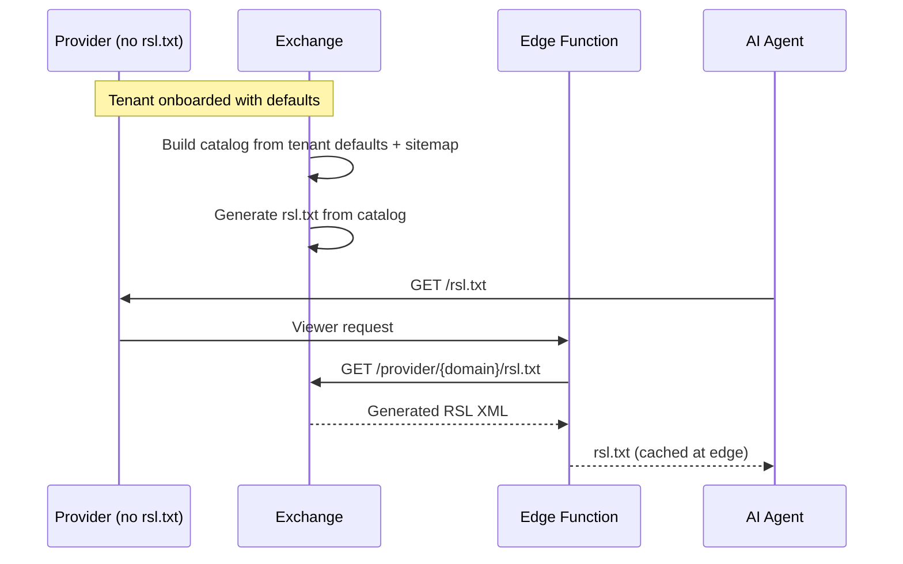
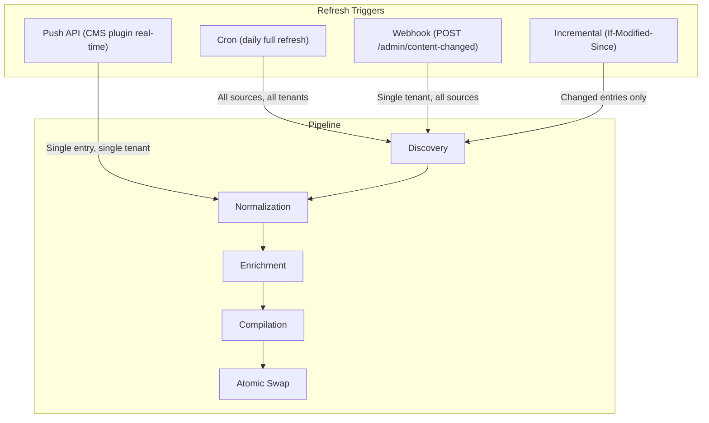

## Exchange as RSL Producer

The Exchange is both an RSL consumer (ingesting provider rsl.txt to build the catalog) and an RSL producer (generating rsl.txt for providers who don't have one). This enables a zero-configuration provider onboarding path: the Exchange operator sets tenant defaults, and the Exchange generates a standards-compliant rsl.txt that the edge function can serve.



## RSL Generator

The RSL generator produces valid RSL 1.0 XML from the compiled catalog. It maps RAMP protocol objects back to RSL elements:

```go
type RSLGenerator struct {
    logger *slog.Logger
}

func (g *RSLGenerator) Generate(
    tenant *TenantConfig,
    catalog *TenantCatalog,
) ([]byte, error) {
    rsl := &RSLDocument{
        XMLName: xml.Name{Local: "rsl"},
        XMLNS:   "https://rslstandard.org/rsl",
    }

    for _, offer := range catalog.AllOffers {
        content := RSLContent{
            URL: offer.ContentPath,
        }

        license := RSLLicense{}
        if offer.Pricing != nil {
            license.Payment = &RSLPayment{
                Type: mapPricingModelToRSL(offer.Pricing.Model),
                Amount: &RSLAmount{
                    Currency: offer.Pricing.Currency,
                    Value:    offer.Pricing.Rate,
                },
            }
        }

        if len(offer.PermittedFunctions) > 0 {
            license.Permits = &RSLPermits{
                Type:  "usage",
                Usage: mapFunctionsToRSL(offer.PermittedFunctions),
            }
        }
        if len(offer.ProhibitedFunctions) > 0 {
            license.Prohibits = &RSLProhibits{
                Type:  "usage",
                Usage: mapFunctionsToRSL(offer.ProhibitedFunctions),
            }
        }

        content.License = license
        rsl.Contents = append(rsl.Contents, content)
    }

    output, err := xml.MarshalIndent(rsl, "", "  ")
    if err != nil {
        return nil, fmt.Errorf("RSL XML marshal: %w", err)
    }

    return append([]byte(xml.Header), output...), nil
}
```

## RAMP to RSL Mapping

### PricingModel to RSL Payment Type

`PricingModel` is the charging structure only (`FREE`, `PER_UNIT`, `FLAT`). The metering basis ("per what") is the open `Pricing.unit` vocabulary, which maps to the RSL payment type granularity.

| RAMP PricingModel | RSL Payment Type |
|---|---|
| `PricingModelFlat` | `purchase` |
| `PricingModelPerUnit` (`unit: "tokens"`) | `use` |
| `PricingModelPerUnit` (`unit: "accesses"`) | `crawl` |
| `PricingModelFree` | `free` |

### CoMP Functions to RSL Usage Types

| CoMP Function | RSL Usage Type |
|---|---|
| `FunctionAll` | `all` |
| `FunctionAIAll` | `ai-all` |
| `FunctionAITrain` | `ai-train` |
| `FunctionAIInput` | `ai-input` |
| `FunctionAIIndex` | `ai-index` |
| `FunctionSearch` | `search` |

## Generated RSL Example

For a tenant with defaults "flat, $0.05, permits ai-input + search, prohibits ai-train":

```xml
<?xml version="1.0" encoding="UTF-8"?>
<rsl xmlns="https://rslstandard.org/rsl">
  <content url="/premium/*">
    <license>
      <permits type="usage">ai-input ai-index search</permits>
      <prohibits type="usage">ai-train</prohibits>
      <payment type="purchase">
        <amount currency="USD">0.05</amount>
      </payment>
    </license>
  </content>
  <content url="/free/*">
    <license>
      <permits type="usage">all</permits>
      <payment type="free"/>
    </license>
  </content>
</rsl>
```

## Serving the Generated RSL

The Exchange exposes the generated RSL via an HTTP endpoint:

```
GET /provider/{domain}/rsl.txt
```

The provider's edge function fetches and caches this, serving it at the standard `/rsl.txt` path. Cache TTL matches the ingestion refresh interval (default: 24h for full refresh, 5m for incremental).

## RAMP Sitemap Namespace (XSD)

The formal schema definition for the RAMP sitemap namespace extension:

```xml
<?xml version="1.0" encoding="UTF-8"?>
<xs:schema xmlns:xs="http://www.w3.org/2001/XMLSchema"
           xmlns:ramp="https://ramp.dev/sitemap/1.0"
           targetNamespace="https://ramp.dev/sitemap/1.0"
           elementFormDefault="qualified">

  <xs:annotation>
    <xs:documentation>
      RAMP Sitemap Extension Schema v1.0
      Extends standard Sitemap 0.9 with content monetization metadata.
      Namespace: https://ramp.dev/sitemap/1.0
    </xs:documentation>
  </xs:annotation>

  <xs:element name="content">
    <xs:complexType>
      <xs:all>
        <xs:element name="tokens" type="xs:positiveInteger" minOccurs="0"/>
        <xs:element name="content-id" type="xs:string" minOccurs="0"/>
        <xs:element name="wordcount" type="xs:positiveInteger" minOccurs="0"/>
        <xs:element name="pricing-model" type="ramp:pricingModelType" minOccurs="0"/>
        <xs:element name="rate" type="ramp:rateType" minOccurs="0"/>
        <xs:element name="permits" type="xs:string" minOccurs="0"/>
        <xs:element name="prohibits" type="xs:string" minOccurs="0"/>
        <xs:element name="content-type" type="ramp:contentTypeType" minOccurs="0"/>
        <xs:element name="author" type="xs:string" minOccurs="0"/>
        <xs:element name="source-type" type="ramp:sourceTypeType" minOccurs="0"/>
      </xs:all>
    </xs:complexType>
  </xs:element>

  <xs:complexType name="rateType">
    <xs:simpleContent>
      <xs:extension base="xs:decimal">
        <xs:attribute name="currency" type="xs:string" use="required"/>
      </xs:extension>
    </xs:simpleContent>
  </xs:complexType>

  <xs:simpleType name="pricingModelType">
    <xs:restriction base="xs:string">
      <xs:enumeration value="free"/>
      <xs:enumeration value="per_unit"/>
      <xs:enumeration value="flat"/>
    </xs:restriction>
  </xs:simpleType>

  <xs:simpleType name="contentTypeType">
    <xs:restriction base="xs:string">
      <xs:enumeration value="text"/>
      <xs:enumeration value="video"/>
      <xs:enumeration value="image"/>
      <xs:enumeration value="audio"/>
    </xs:restriction>
  </xs:simpleType>

  <xs:simpleType name="sourceTypeType">
    <xs:restriction base="xs:string">
      <xs:enumeration value="human"/>
      <xs:enumeration value="ai"/>
      <xs:enumeration value="hybrid"/>
    </xs:restriction>
  </xs:simpleType>
</xs:schema>
```

## Refresh Strategy

The pipeline supports four refresh modes that compose -- a tenant can use cron for baseline freshness plus webhooks for real-time updates.



**Cron**: Full daily refresh. Re-crawls all sitemaps, re-parses all RSL files, rebuilds the entire catalog. This is the consistency baseline.

**Webhook**: Provider notifies the Exchange via `POST /admin/content-changed` when content changes. Triggers a single-tenant re-ingestion.

**Push API**: CMS plugin pushes individual content updates as they are published. Lowest-latency path -- content appears in the catalog within seconds. Performs a partial catalog update (copy-on-write) without full rebuild.

**Incremental**: For sitemaps that support `lastmod` and HTTP `If-Modified-Since`, the pipeline only re-processes URLs that have changed since the last successful ingestion.

### Staleness Detection

Every `CatalogEntry` carries a `Freshness` timestamp. A background goroutine flags stale entries:

- **Warning threshold**: 48 hours since last verification
- **Critical threshold**: 7 days since last verification
- If more than half of a tenant's entries are critically stale, an error is logged and the `ingestion_catalog_staleness_ratio` metric is updated.
