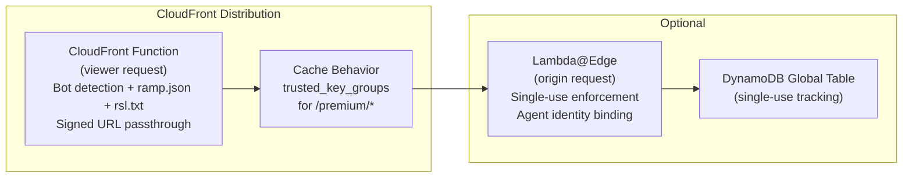
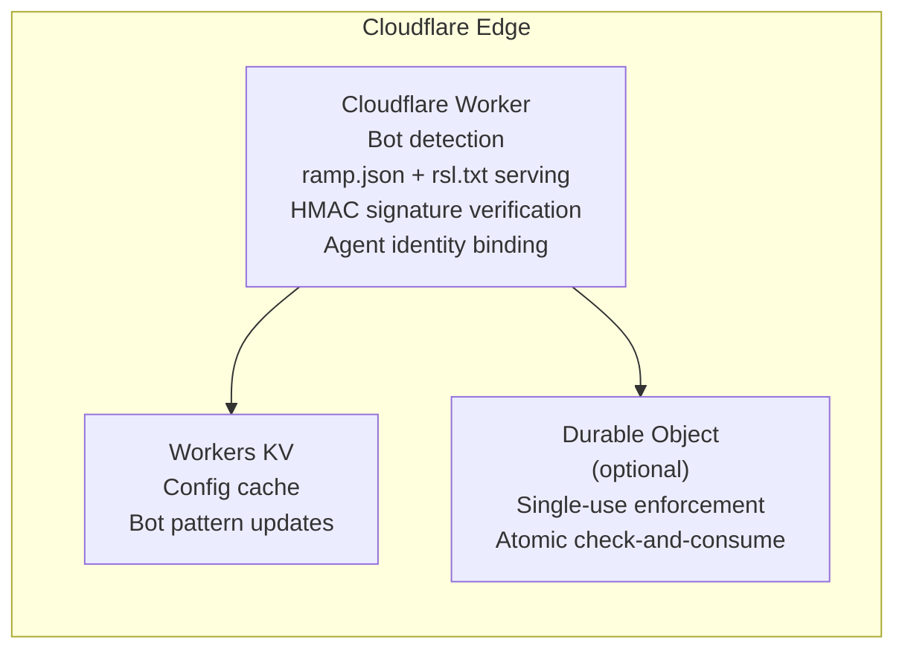
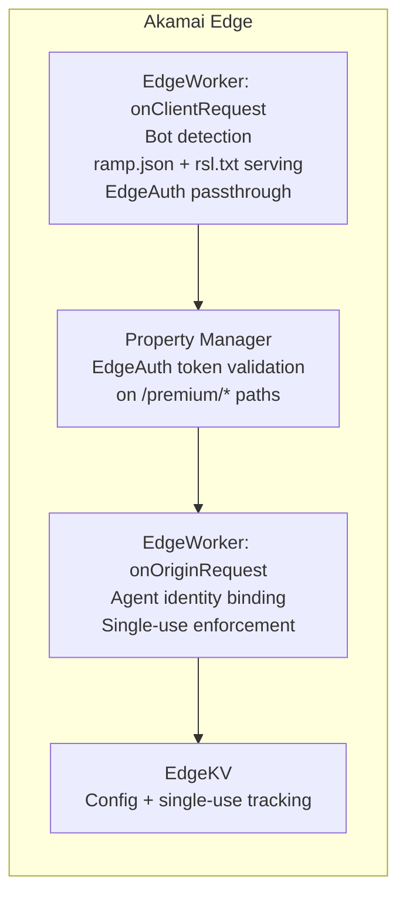
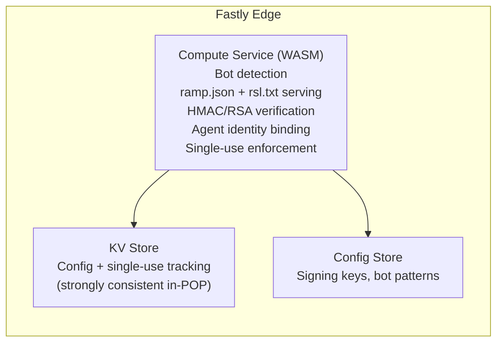

The Edge Function is defined as a platform-agnostic interface. Each CDN platform gets a thin adapter that maps platform primitives to the interface. The core decision logic is CDN-agnostic -- every adapter calls the same core function.

## Generic Adapter Interface

```typescript
/**
 * Platform-agnostic Edge Function interface.
 * Each CDN adapter implements this contract.
 */
interface RampEdgeHandler {
  /**
   * Inspect an incoming request and decide: block, pass, or serve.
   */
  handleRequest(ctx: EdgeContext): Promise<EdgeResponse>;
}

interface EdgeContext {
  /** Incoming request URL (full, including query params). */
  url: URL;

  /** HTTP method. */
  method: string;

  /** Request headers (case-insensitive lookup). */
  headers: ReadonlyHeaders;

  /** Client IP address. */
  clientIp: string;

  /** Provider configuration loaded from config source. */
  config: EdgeConfig;

  /** Edge KV store (optional, for single-use enforcement). */
  kv?: EdgeKV;
}

interface EdgeResponse {
  status: number;
  headers: Record<string, string>;
  body: string | ReadableStream | null;
}

interface EdgeKV {
  /** Atomic put-if-absent. Returns true if key was inserted (first use). */
  putIfAbsent(key: string, value: string, ttlSeconds: number): Promise<boolean>;
  /** Read a key. */
  get(key: string): Promise<string | null>;
}

interface EdgeConfig {
  /** WellKnownManifest for ramp.json generation. */
  manifest: WellKnownManifest;

  /** RSL text content for /rsl.txt serving. */
  rslTxt: string;

  /** Content path policies (which paths are protected). */
  contentPolicy: AccessPolicy;

  /** Exchange info endpoint URL for X-Content-Rules header. */
  exchangeInfoUrl: string;

  /** Exchange API base URL for fetching ramp.json and rsl.txt. */
  exchangeApiUrl?: string;

  /** Serving mode for ramp.json and rsl.txt. */
  servingMode: "exchange" | "inline" | "kv" | "origin";

  /** Bot User-Agent patterns to detect (regexes). */
  botPatterns: RegExp[];

  /** Signing verification mode: "cdn-native" | "hmac" */
  signingMode: "cdn-native" | "hmac";

  /** HMAC secret (only when signingMode is "hmac"). */
  hmacSecret?: string;

  /** Maximum signed URL TTL in seconds (enforced independently). */
  maxUrlTtlSeconds: number;

  /** Whether to enforce single-use URLs (best-effort). Requires kv. */
  singleUseEnabled: boolean;

  /** Whether to enforce agent identity binding. */
  agentBindingEnabled: boolean;
}
```

## CloudFront Functions (AWS)

**Runtime**: CloudFront Functions (viewer request event) or Lambda@Edge.

**Capabilities and limitations**:

| Capability | CloudFront Function | Lambda@Edge |
|---|---|---|
| Execution time limit | 1ms (viewer request) | 5s (viewer request), 30s (origin request) |
| Memory | 2 MB | 128-3008 MB |
| Network access | No | Yes |
| KV access | CloudFront KeyValueStore | DynamoDB (requires network) |
| Native signed URL verification | Yes (`trusted_key_groups` on behavior) | Yes |
| Package size | 10 KB | 50 MB |
| Languages | JavaScript (ES 5.1 subset) | Node.js, Python |
| Cost | $0.10/million invocations | $0.60/million + duration |

**Recommended approach**: Two-layer deployment.



- **CloudFront Function** handles bot detection, ramp.json serving, and signature passthrough. CloudFront's `trusted_key_groups` on the cache behavior natively verifies RSA-signed URLs -- no custom code needed.
- **Lambda@Edge** (optional) handles agent identity binding and single-use enforcement. These require network access (DynamoDB lookup) which CloudFront Functions cannot do.

**What CloudFront does natively that you do not reimplement**:
- RSA signature verification on signed URLs via `trusted_key_groups` configured on the cache behavior. The CDN itself rejects invalid signatures before your function code runs.
- Expiry enforcement (the `Expires` or `Policy` parameter).
- Edge caching of content responses.

**What you must implement in the function**:
- Bot detection (User-Agent check against `botPatterns`).
- ramp.json and rsl.txt serving.
- Custom parameters validation (agent_id binding).
- Single-use enforcement (requires Lambda@Edge + DynamoDB, best-effort).
- The 403 response body and `X-Content-Rules` header.

```javascript
// CloudFront Function (viewer-request) - ES 5.1 subset
function handler(event) {
    var request = event.request;
    var uri = request.uri;
    var qs = request.querystring;

    // Serve ramp.json
    if (uri === '/.well-known/ramp.json') {
        return {
            statusCode: 200,
            statusDescription: 'OK',
            headers: {
                'content-type': { value: 'application/json' },
                'cache-control': { value: 'public, max-age=3600' }
            },
            body: MANIFEST_JSON
        };
    }

    // Serve rsl.txt
    if (uri === '/rsl.txt') {
        return {
            statusCode: 200,
            statusDescription: 'OK',
            headers: {
                'content-type': { value: 'text/plain' },
                'cache-control': { value: 'public, max-age=3600' }
            },
            body: RSL_TXT
        };
    }

    // Only process protected paths
    if (!uri.startsWith('/premium/')) {
        return request; // pass through
    }

    // If signed URL params present, let CloudFront trusted_key_groups handle verification
    if (qs.Signature || qs['Key-Pair-Id']) {
        return request; // pass through to native verification
    }

    // Bot detection
    var ua = (request.headers['user-agent'] || {}).value || '';
    if (isAiBot(ua)) {
        return {
            statusCode: 403,
            statusDescription: 'Forbidden',
            headers: {
                'content-type': { value: 'application/json' },
                'x-content-rules': { value: EXCHANGE_INFO_URL }
            },
            body: '{"error":"Licensed content. Negotiate access via the Exchange.","protocol":"RAMP","version":"1.0","info_url":"' + EXCHANGE_INFO_URL + '"}'
        };
    }

    // Regular browser traffic - pass through
    return request;
}
```

## Cloudflare Workers

**Runtime**: Cloudflare Workers (V8 isolate, Service Worker or Module Worker syntax).

**Capabilities and limitations**:

| Capability | Cloudflare Worker |
|---|---|
| Execution time limit | 10ms CPU (free), 30s (paid) |
| Memory | 128 MB |
| Network access | Yes (fetch) |
| KV access | Workers KV (eventually consistent, ~60s) |
| Durable Objects | Yes (strongly consistent, for single-use) |
| Native signed URL verification | No (no equivalent to CloudFront trusted_key_groups) |
| Package size | 10 MB |
| Languages | JavaScript, TypeScript, Rust (WASM) |

**Key difference from CloudFront**: Cloudflare has no native signed URL verification. The Worker must implement HMAC or RSA verification in code. This means the Worker holds the signing secret or public key.

**Recommended approach**: Single Worker with optional Durable Objects.



- **Signature verification**: Must be done in Worker code. Use Web Crypto API for HMAC-SHA256. For RSA, use `crypto.subtle.verify` with imported public key.
- **Single-use enforcement**: Workers KV is eventually consistent (up to 60 seconds propagation). For strict single-use, use Durable Objects which provide transactional consistency. For soft single-use (acceptable eventual consistency), Workers KV with a short TTL is cheaper.
- **Config**: Store `EdgeConfig` in Workers KV. Refresh on a timer or via Cron Trigger.

## Akamai EdgeWorkers

**Runtime**: Akamai EdgeWorkers (JavaScript, V8-based).

**Capabilities and limitations**:

| Capability | EdgeWorker |
|---|---|
| Execution time limit | 4ms (onClientRequest), 4ms (onClientResponse) |
| Memory | 2 MB per event handler |
| Network access | Yes (httpRequest -- limited, async) |
| KV access | EdgeKV (eventually consistent, ~5-10s in-region) |
| Native signed URL verification | Akamai EdgeAuth tokens (property-level config) |
| Package size | 1 MB |
| Languages | JavaScript (ES6+), limited stdlib |

**Key considerations**:
- Akamai's EdgeAuth token system can verify signed URLs at the property level (similar to CloudFront `trusted_key_groups`). Configure EdgeAuth on the property manager for protected paths.
- EdgeKV provides edge-local key-value storage for single-use enforcement, but with eventual consistency (~5-10 seconds within a region).
- The 4ms execution limit is tight. Bot detection (string matching) and ramp.json serving fit. HMAC verification with Web Crypto fits. HTTP subrequests do not fit in 4ms.
- Complex logic (agent identity binding with HTTP subrequests) should be moved to the `onOriginRequest` handler (longer timeout, up to 120s).

**Recommended approach**:



## Fastly Compute@Edge

**Runtime**: Fastly Compute (WebAssembly, compiled from Rust, Go, JavaScript, or AssemblyScript).

**Capabilities and limitations**:

| Capability | Fastly Compute |
|---|---|
| Execution time limit | No hard limit (billing-based) |
| Memory | 128 MB |
| Network access | Yes (backend fetch) |
| KV access | Fastly KV Store (strongly consistent within POP) |
| Native signed URL verification | No native equivalent |
| Package size | 100 MB (WASM binary) |
| Languages | Rust (primary), JavaScript/TypeScript, Go |

**Key advantages**:
- No execution time limit (billed per request + compute duration). Complex verification logic is fine.
- Fastly KV Store is strongly consistent within a POP, making single-use enforcement reliable without the eventual-consistency problems of Workers KV or EdgeKV.
- Full WASM runtime means you can compile the same Rust/Go verification logic that runs in the Exchange.

**Recommended approach**: Single Compute service.



## Platform Comparison Matrix

| Feature | CloudFront Function | CloudFront + Lambda@Edge | Cloudflare Worker | Akamai EdgeWorker | Fastly Compute |
|---|---|---|---|---|---|
| Bot detection | Yes | Yes | Yes | Yes | Yes |
| ramp.json + rsl.txt serving | Yes | Yes | Yes | Yes | Yes |
| Native signed URL verification | Yes (trusted_key_groups) | Yes (trusted_key_groups) | No (must implement) | Yes (EdgeAuth) | No (must implement) |
| Custom HMAC verification | No (1ms limit) | Yes | Yes | Tight (4ms limit) | Yes |
| Agent identity binding | No (no network) | Yes (DynamoDB lookup) | Yes | Yes (onOriginRequest) | Yes |
| Single-use enforcement | No (no KV write) | Yes (DynamoDB) | Yes (Durable Objects) | Yes (EdgeKV, eventual) | Yes (KV Store, strong) |
| Consistency model | N/A | Strong (DynamoDB) | Strong (Durable Objects) | Eventual (~5-10s) | Strong (in-POP) |
| Latency overhead | &lt;0.1ms | 1-5ms | &lt;1ms | &lt;1ms | &lt;1ms |
| Cost at 1M req/day | $0.10 | $0.70 + DDB | $0.50 | Tier-based | Usage-based |
