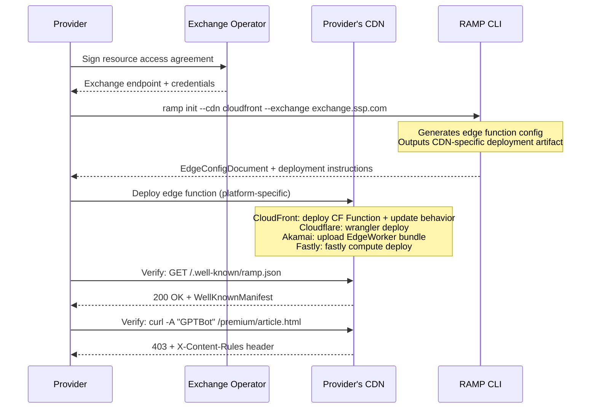
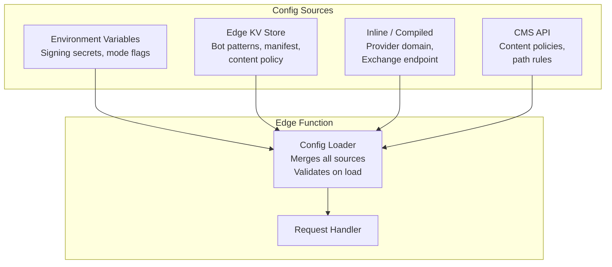
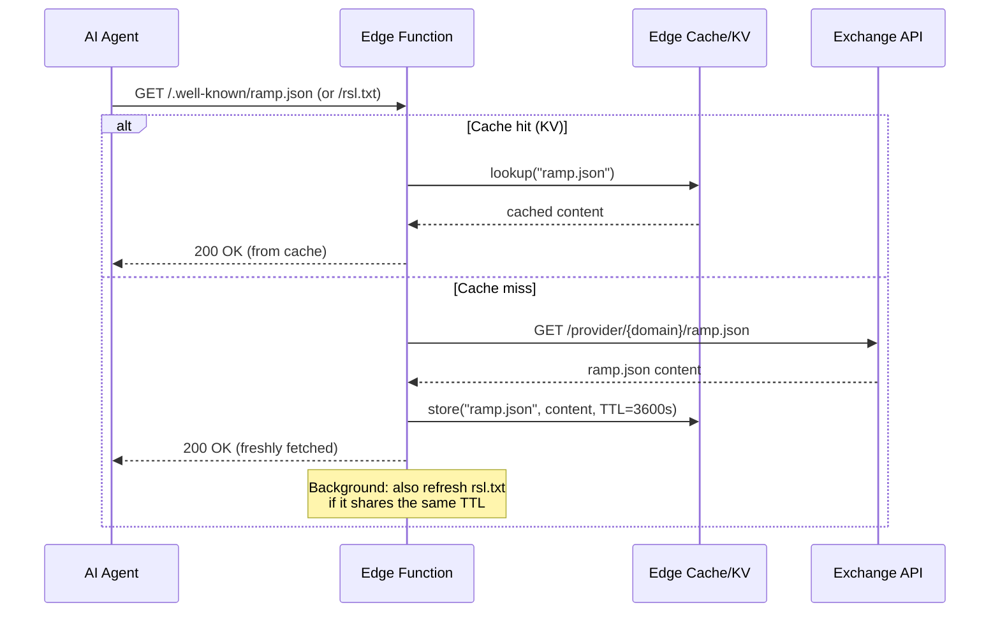

The Edge Function is the only RAMP component that providers deploy. This page covers the deployment model, configuration, secrets management, and onboarding procedure.

## Provider Onboarding Flow



## Simplest Possible Onboarding

The absolute minimum a provider needs to do:

1. **Get an Exchange endpoint** from their Exchange operator (one-time business relationship).
2. **Deploy the edge function** using the Terraform module or manual deployment (see below).
3. **Verify** -- `curl -I https://techcrunch.com/.well-known/ramp.json` returns the manifest.

import { Aside } from '@astrojs/starlight/components';

<Aside type="tip">
The `@ramp/cli` tool is planned. For now, deploy manually using the [Terraform module](https://github.com/RAMP-Protocol/protocol/tree/main/terraform/aws-ramp-edge/) or follow the CDN-specific deployment steps below.
</Aside>

Target: **under 10 minutes** from Exchange operator contract to live edge function.

## Distribution Formats

The edge function is distributed in multiple formats to match provider deployment practices.

### Format 1: CloudFront Function (Reference Implementation)

The working reference implementation is a vanilla JavaScript CloudFront Function at [`poc/edge-function/cloudfront-function.js`](https://github.com/RAMP-Protocol/protocol/tree/main/poc/edge-function/cloudfront-function.js). It handles bot detection, signed URL verification, and `ramp.json` serving.

<Aside type="note">
The `@ramp/edge-function` npm package is planned. For now, use the reference implementation directly or deploy via the Terraform module.
</Aside>

### Format 2: Terraform Module

```hcl
module "ramp_edge" {
  source = "github.com/RAMP-Protocol/protocol//terraform/aws-ramp-edge"

  cloudfront_distribution_id = aws_cloudfront_distribution.main.id
  exchange_endpoint       = "https://exchange.ssp.com/ramp/v1"
  exchange_domain         = "exchange.ssp.com"
  protected_paths            = ["/premium/*", "/archive/*"]
  signing_key_pair_id        = aws_cloudfront_public_key.ramp.id
}
```

The Terraform module provisions: CloudFront Function, cache behavior update, trusted key group association, and optional Lambda@Edge + DynamoDB table for single-use enforcement.

### Format 3: CDN Exchange App

For providers who prefer click-to-deploy:

- **Cloudflare Apps** -- installable from Cloudflare dashboard. Provider enters Exchange endpoint, protected paths. The app deploys a Worker.
- **AWS CloudFormation StackSet** -- one-click deploy via AWS Exchange or a shared CloudFormation template.
- **Akamai Exchange** -- EdgeWorker bundle with configuration UI in Akamai Control Center.

### Format 4: CLI Tool (Planned)

<Aside type="caution">
The `@ramp/cli` tool is planned but not yet available. For now, use the [Terraform module](https://github.com/RAMP-Protocol/protocol/tree/main/terraform/aws-ramp-edge/) for automated deployment, or deploy the [CloudFront Function](https://github.com/RAMP-Protocol/protocol/tree/main/poc/edge-function/cloudfront-function.js) manually via the AWS console or AWS CLI.
</Aside>

When available, the CLI will generate the platform-specific deployment artifact (CloudFront Function JS, Cloudflare Worker, etc.) and output deployment instructions.

## Environment Configuration

### What the Edge Function Needs to Know

| Configuration Item | Source | Change Frequency | Example |
|---|---|---|---|
| Exchange endpoint URL | Provider-Exchange contract | Rarely (months) | `https://exchange.ssp.com/ramp/v1` |
| Exchange domain | Provider-Exchange contract | Rarely | `exchange.ssp.com` |
| Seller relationship | Provider-Exchange contract | Rarely | `DIRECT` |
| Provider domain | Deployment config | Never | `techcrunch.com` |
| Contact email | Provider | Rarely | `licensing@techcrunch.com` |
| Protected path patterns | Provider editorial policy | Monthly | `["/premium/*", "/archive/*"]` |
| Bot User-Agent patterns | RAMP community list | Weekly | `["ClaudeBot", "GPTBot", ...]` |
| Signing mode | Deployment architecture | Never | `"cdn-native"` or `"hmac"` |
| HMAC secret | Security team | Quarterly (rotation) | `"hmac-secret-..."` |
| Max URL TTL | Policy | Rarely | `300` (seconds) |
| Single-use enabled | Policy | Rarely | `true` |
| Agent binding enabled | Policy | Rarely | `false` |

### Configuration Sources



**Merge order** (later overrides earlier):

1. **Inline / compiled defaults** -- provider domain, protocol version.
2. **Environment variables** -- signing secrets, mode flags, Exchange endpoint.
3. **Edge KV** -- bot patterns (updated frequently), content policy rules.
4. **CMS API** -- dynamic content policy (which paths are newly protected/released). Only fetched if CMS integration is configured. Cached at edge with TTL.

### Configuration Schema

```typescript
/**
 * Complete edge function configuration.
 * Serializable to JSON for storage in KV.
 * Secrets are resolved from environment, not stored here.
 */
interface EdgeConfigDocument {
  /** Config schema version (for forward compatibility). */
  config_version: "1.0";

  /** Provider identity. */
  provider: {
    domain: string;
    contact?: string;
  };

  /** Serving mode for ramp.json and rsl.txt. */
  serving_mode: "exchange" | "inline" | "kv" | "origin";

  /** Exchange API base URL (required when serving_mode is "exchange"). */
  exchange_api_url?: string;

  /** Authorized Exchanges (becomes ramp.json exchanges[]). */
  exchanges: Array<{
    domain: string;
    endpoint: string;
    relationship: "DIRECT" | "RESELLER";
  }>;

  /** Content access policy. */
  content_policy: {
    /** Default policy for paths not matching any rule. */
    default: "open" | "licensed" | "blocked";
    /** Path-specific rules. Evaluated in order, first match wins. */
    rules: Array<{
      /** Glob pattern (e.g. "/premium/*"). */
      pattern: string;
      /** Policy for matching paths. */
      policy: "open" | "licensed" | "blocked";
    }>;
  };

  /** Bot detection configuration. */
  bot_detection: {
    /** User-Agent substrings to match (case-insensitive). */
    user_agent_patterns: string[];
    /** Whether to use CDN-native bot scoring (platform-specific). */
    use_cdn_bot_score: boolean;
    /** CDN bot score threshold (0-100, lower = more likely bot). */
    cdn_bot_score_threshold?: number;
  };

  /** Signed URL verification configuration. */
  signing: {
    /** Verification mode. */
    mode: "cdn-native" | "hmac";
    /** Maximum URL TTL in seconds (enforced independently of CDN). */
    max_ttl_seconds: number;
    /** Whether to enforce agent identity binding. */
    agent_binding_enabled: boolean;
    /** Whether to enforce single-use URLs (best-effort, see Section 5.3). */
    single_use_enabled: boolean;
  };
}
```

## Secrets Management

- HMAC secrets and signing keys are **environment variables** or **CDN secret stores** (Cloudflare Secrets, AWS Secrets Manager, Akamai Property Manager variables). Never stored in KV.
- Secrets are loaded once at function initialization (cold start), not per-request.

### Platform-Specific Wrangler Deployment (Cloudflare)

For Cloudflare Workers, use `wrangler` for deployment:

```bash
# Local development
cd packages/edge-function && npx wrangler dev

# Production deploy
cd packages/edge-function && npx wrangler deploy

# Set secrets (never in wrangler.toml)
npx wrangler secret put HMAC_SECRET
```

### CDN-Specific Deployment Commands

| CDN | Deploy Command |
|---|---|
| Cloudflare | `npx wrangler deploy` |
| CloudFront | Deploy CF Function + update behavior via AWS CLI or Terraform |
| Akamai | Upload EdgeWorker bundle via Akamai CLI or Control Center |
| Fastly | `fastly compute deploy` |

## ACME Domain Verification Challenge Serving (v1.0)

During provider onboarding, the RAMP CLI writes ACME challenge tokens to the CDN's KV store. The edge function auto-serves these tokens at `/.well-known/ramp-verify/{token}`, eliminating the need for providers to manually place files on their origin server.

```
ramp-cli writes to KV:
  Key:   ramp-verify:{token}
  Value: {token}
  TTL:   10 minutes

Edge function route:
  /.well-known/ramp-verify/* -> read from KV -> return as text/plain
```

The Exchange fetches the challenge URL during `ConfirmDomainVerification` to prove the provider controls the domain. After verification succeeds, the challenge token is cleaned up from KV.

For providers without the RAMP edge function deployed, `ramp-cli` provides fallback instructions to manually place the token file on their web server.

## Configurable Serving Modes for ramp.json and rsl.txt

```yaml
serving_mode: "exchange"  # pull from Exchange API, cache in KV (recommended)
# serving_mode: "inline"     # values baked into edge function config
# serving_mode: "kv"         # manually populated KV
# serving_mode: "origin"     # proxy to origin server
```

**Mode: exchange (recommended)**

The edge function fetches both files from the Exchange API on cache miss. This is the recommended mode for providers registered with an Exchange.

```
GET https://exchange.ssp-example.com/provider/techcrunch.com/ramp.json
GET https://exchange.ssp-example.com/provider/techcrunch.com/rsl.txt
-> edge function caches in KV for TTL
-> serves from KV on subsequent requests
-> background refresh when TTL expires (stale-while-revalidate)
```

**Mode: inline**

Both files are baked into the edge function's environment variables or deployment configuration.

```
# Environment variables
RAMP_PROVIDER=techcrunch.com
RAMP_EXCHANGE_DOMAIN=exchange.ssp-example.com
RAMP_EXCHANGE_ENDPOINT=https://exchange.ssp-example.com/ramp/v1
RAMP_EXCHANGE_RELATIONSHIP=DIRECT
RAMP_CONTACT=licensing@techcrunch.com
```

The edge function constructs ramp.json and rsl.txt at startup. Simplest approach, suitable for providers with a single Exchange relationship that changes infrequently.

**Mode: kv**

The full ramp.json and rsl.txt content is stored in the CDN's edge KV (Workers KV, CloudFront KeyValueStore, EdgeKV, Fastly Config Store). A separate management process writes to KV when configuration changes.

Advantage: configuration changes propagate to all edge locations without redeployment.

**Mode: origin**

The provider's origin server serves both files as static files. The edge function does not generate them -- it only caches and serves them. This is the zero-edge-logic approach.

Disadvantage: requires the provider to manage and deploy static files.

## Caching Strategy



| Parameter | Value | Rationale |
|---|---|---|
| Edge cache TTL | 3600s (1 hour) | Exchange relationships change infrequently |
| `Cache-Control` sent to agent | `public, max-age=3600` | Agents cache locally, reducing edge load |
| `Stale-While-Revalidate` | 86400s (1 day) | Serve stale while refreshing in background |
| Invalidation trigger | KV write, env var change, manual purge | When provider updates Exchange config |
| Applies to | Both ramp.json and rsl.txt | Same caching strategy for both files |

## Preventing Edge Function Bypass

The edge function is only effective if all requests to protected content pass through it. Bypass vectors and mitigations:

| Bypass Vector | Mitigation |
|---|---|
| Direct origin access (skipping CDN) | Origin should only accept requests from CDN IPs. Use origin shield, security groups, or origin access identity (CloudFront OAI/OAC). |
| Alternate domain pointing to same origin | All domains serving protected content must have the edge function deployed. |
| CDN cache serving stale content without re-verification | Set `Cache-Control: private` or short TTL on protected content. Or use CDN-native signed URL verification which applies to cached responses too. |
| Agent using a different path to the same content (URL alias) | Content policy rules must cover all URL patterns that resolve to protected content. |

## Verification Procedure

After deployment, verify with these checks:

1. `GET /.well-known/ramp.json` returns valid manifest with `200 OK`.
2. `GET /rsl.txt` returns valid RSL content with `200 OK`.
3. `GET /premium/article.html` with bot User-Agent returns `403 + X-Content-Rules` header.
4. `GET /premium/article.html` with valid signed URL returns `200`.
5. `GET /premium/article.html` with expired signed URL returns `403`.
6. `GET /premium/article.html` with tampered signed URL returns `403`.
7. `GET /free/article.html` with bot User-Agent returns `200` (open content).
