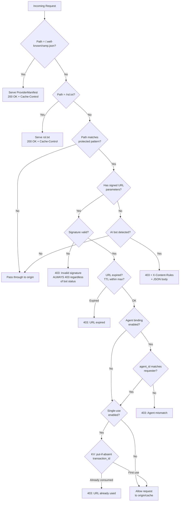

The Edge Function is the provider-side enforcement point of the RAMP protocol. It runs on the provider's existing CDN infrastructure and is the only RAMP component that providers deploy. Everything else (Exchange, Broker, Client SDK) is deployed by Exchange operators, AI companies, or third parties.

## What It Does

The Edge Function has three jobs:

1. **Block unauthorized bots** -- detect AI crawlers hitting protected content without a signed URL and return `403 + X-Content-Rules` header pointing them to the Exchange.
2. **Verify signed URL access** -- validate that incoming signed URLs are authentic, unexpired, bound to the correct agent identity, and (optionally) single-use.
3. **Serve ramp.json and rsl.txt** -- generate, cache, and serve `/.well-known/ramp.json` and `/rsl.txt` so protocol-aware agents discover the Exchange without triggering a 403.
4. **Serve ramp-verifier.json (v1.0)** -- serve `/.well-known/ramp-verifier.json` for providers that self-attest resources. This publishes the provider's Ed25519 public keys and claims schema so agents and Exchanges can verify attestation signatures.
5. **Serve ACME domain verification challenges (v1.0)** -- auto-serve challenge tokens at `/.well-known/ramp-verify/{token}` from the CDN's KV store during provider onboarding domain verification.

## Single Deploy for Providers

The absolute minimum a provider needs to do:

1. **Get a Exchange endpoint** from their Exchange operator (one-time business relationship).
2. **Deploy the edge function** using the [Terraform module](https://github.com/postindustria-tech/ramp-protocol/tree/main/terraform/aws-ramp-edge/) or deploy the [CloudFront Function](https://github.com/postindustria-tech/ramp-protocol/tree/main/poc/edge-function/cloudfront-function.js) manually.
3. **Verify** -- `curl -I https://example.com/.well-known/ramp.json` returns the manifest.

import { Aside } from '@astrojs/starlight/components';

<Aside type="tip">
The `@ramp/cli` tool is planned to automate this process. For now, deploy manually -- see [Edge Function Deployment](/components/edge-function/deployment/).
</Aside>

Target: **under 10 minutes** from Exchange operator contract to live edge function.

## Signing Scope

The edge function deals exclusively with **signed URL verification** (HMAC-SHA256 or CDN-native RSA). It does NOT verify offer signatures. Offer signatures use Ed25519 and are verified by agents and Brokers, not the edge function. The two signing subsystems are independent:

- **Signed URLs** (Exchange to CDN): HMAC-SHA256 -- shared secret between Exchange and edge function
- **Offer signatures** (Exchange to Agent/Broker): Ed25519 -- asymmetric, verified via public key

## How It Fits in the RAMP Architecture

The Edge Function sits at the CDN layer between AI agents and provider content. It intercepts requests before they reach origin servers.



## Core Decision Logic

The decision logic is CDN-agnostic. Every adapter calls the same core function:

```
handleRequest(ctx):
  1. If path == "/.well-known/ramp.json":
       -> Serve cached ProviderManifest JSON
       -> Return 200

  1b. If path == "/rsl.txt":
       -> Serve cached rsl.txt content
       -> Return 200

  1c. If path == "/.well-known/ramp-verifier.json":
       -> Serve cached verifier keys JSON (for self-attesting providers)
       -> Return 200

  1d. If path starts with "/.well-known/ramp-verify/":
       -> Read challenge token from KV store
       -> Return 200 + text/plain (ACME domain verification)
       -> Return 404 if token not found or expired

  2. If path does not match any protected pattern in contentPolicy:
       -> Pass through (no edge function involvement)

  3. If request has signed URL parameters:
       a. Verify signature (CDN-native or HMAC)
       b. If signature invalid -> 403 (always, regardless of bot status)
       c. Check expiry (reject if > maxUrlTtlSeconds from issuance)
       d. If agentBindingEnabled: validate agent_id param
       e. If singleUseEnabled: atomic check-and-consume via KV
       f. All pass -> allow request through to origin/cache
       g. Any fail -> 403 with specific error

  4. If request is from detected bot (no signed URL):
       -> 403 + X-Content-Rules header + JSON body

  5. If request is from a regular browser (no signed URL):
       -> Pass through (normal website traffic)
```

**Key invariant**: A request with signed URL parameters that fails signature verification always gets a 403, regardless of whether the requester is a bot or a browser. Bot detection only applies to requests *without* signed URL parameters.

## Responsibilities

### Bot Detection and 403 Redirect

When an AI crawler requests protected content without signed URL parameters, the edge function detects the request is from a bot and returns `403 Forbidden` with an `X-Content-Rules` header pointing to the Exchange info endpoint. This is the "accidental discovery" path (Path C in the protocol flow). The 403 is not punitive -- it is a protocol handshake directing the bot to the correct transaction endpoint. See [Bot Detection](./bot-detection) for details.

### ramp.json and rsl.txt Generation and Serving

The edge function serves `/.well-known/ramp.json` containing the `ProviderManifest` message and `/rsl.txt` containing the machine-readable licensing signal. Both files are sourced from the same configuration (Exchange API, inline config, or KV store), cached aggressively with `Cache-Control: public, max-age=3600`.

### Signed URL Passthrough with Agent Identity Validation

When a request arrives with signed URL parameters, the edge function verifies the signature, checks expiry, validates agent identity binding (if enabled), and enforces single-use (if enabled). See [Signed URL Verification](./signed-url-verification) for the full verification flow.

## Performance Budget

The edge function must add **< 5ms** to request latency (p99). Per-request operations are strictly limited to:

- String comparison (User-Agent matching against bot patterns)
- Signature verification (HMAC-SHA256 or RSA via Web Crypto API)
- KV read (agent_id check, if agent binding is enabled)
- URL parameter parsing

HTTP calls to external services, database queries (except edge KV for single-use), DNS resolution, signing key loading, and config parsing are all **forbidden** in the per-request hot path.

## Failure Mode Summary

The edge function degrades gracefully:

```
Full functionality
  | KV unavailable
Single-use disabled, everything else works
  | Config refresh fails
Stale config, core functionality preserved
  | ramp.json generation fails
Bot detection + 403 redirect still work
  | Signing secret missing
Bot detection works, paid access broken (503)
  | Edge function itself crashes
CDN serves content normally (no protection)
```

The bottom of the hierarchy (edge function crash) is acceptable because the edge function is defense-in-depth. The CDN still serves content, and the Exchange's transaction log + CDN access logs enable reconciliation to detect unauthorized access.
