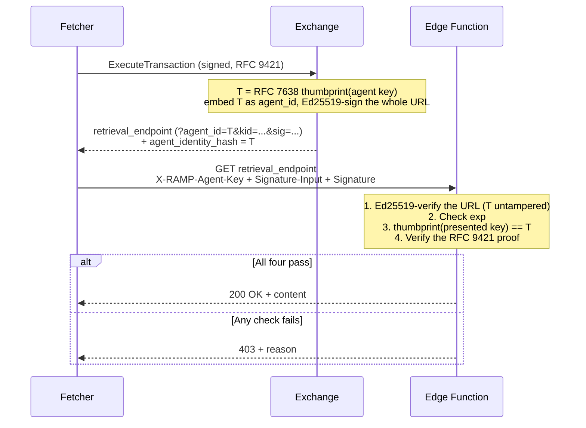
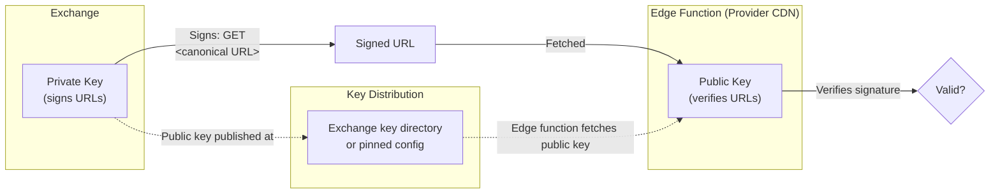
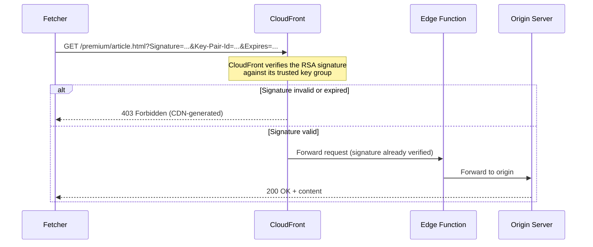

The Edge Function verifies signed URLs to gate access to protected content.

There is **one signing scheme and two deployment postures**. A code-capable edge — Cloudflare Workers, Fastly Compute, AWS Lambda@Edge — verifies an Ed25519 signature itself and can enforce agent binding. AWS CloudFront verifies an RSA signature natively, before any function code runs, but cannot run the binding check, so that path is bearer-only. Which one a publisher gets is selected per tenant by the Exchange's `signing_scheme`, whose values are `ED25519` and `AWS_CLOUDFRONT_RSA`.

In both postures the delivery endpoint holds **public keys only**. Nothing secret is shared between the Exchange and the CDN.

## The Signed URL

```
https://cdn.provider.example/premium/article.html
  ?agent_id=NzbLsXh8uDCcd-6MNwXF4W_7noWXFZAfHkxZsRGC9Xs
  &exp=1773451434
  &kid=vJ3xR1mQ7nT2aB8kL0pY5wZ6cE4dF9gH1jK3lM7nO2p
  &sig=k7Qm2xR9vT4nB8aL...
```

| Parameter | Meaning |
|---|---|
| `agent_id` | RFC 7638 JWK Thumbprint of the **agent's** request-signing key. Optional — when it is absent the URL is a bearer credential. |
| `exp` | Expiry, Unix seconds. |
| `kid` | RFC 7638 JWK Thumbprint of the **tenant's** Ed25519 public key. The edge resolves it against the Exchange's key directory. |
| `sig` | The Ed25519 signature, **base64url with no padding**. |

Four properties of this URL are load-bearing and easy to get wrong:

- **Parameters are sorted lexicographically by key** and encoded exactly as Go's `url.Values.Encode()` produces them. The Go, TypeScript and Python SDKs reproduce that encoding byte for byte, pinned by shared vectors.
- **Publisher query parameters carried over from the resource URI are preserved, and they are covered.** The signature covers everything on the URL except `sig` itself: scheme, host, path, and every query parameter.
- **Scheme, host and path are signed verbatim, byte for byte.** No host lowercasing, no default-port stripping, no path re-escaping. A verifier that normalizes the URL rebuilds a message the signer never produced.
- **The signature covers no HTTP method, header or body.** Method binding comes from the proof-of-possession check alone — see [Method Binding](#method-binding).

The edge strips `agent_id`, `exp`, `kid` and `sig` before forwarding to origin, on both the signed and the unsigned path, so an origin can never receive attacker-injected attribution parameters.

There is **no transaction-id parameter**. Reconciliation joins on the signed-URL hash — SHA-256 of the URL verbatim — which the Exchange records on the transaction and the edge records on its delivery event.

## The Canonical Message

```
GET\n<canonical URL>
```

The literal ASCII `GET`, one newline, then the canonical URL. Building it:

1. Split the raw URL at its **first** `?`. Keep the prefix — scheme, host, path — verbatim.
2. Parse the query into pairs.
3. **Drop `sig`.**
4. Sort the remaining pairs by key and re-encode.
5. Rejoin prefix and query.

Sign the UTF-8 bytes of that message with Ed25519 and encode the signature as base64url without padding.

Signer and verifier must agree on these bytes exactly. One consequence worth stating, because it bites in test environments: if a deployment rewrites the URL's authority for port routing, it must still send a `Host` header matching the authority that was originally signed.

## Verification Order

```mermaid
sequenceDiagram
    participant Agent as Fetcher (agent or registry)
    participant Edge as Edge Function (Workers / Compute / Lambda@Edge)
    participant Dir as Exchange key directory
    participant Origin as Origin Server

    Agent->>Edge: GET /premium/article.html?agent_id=<thumbprint>&exp=1773451434&kid=<thumbprint>&sig=...

    Note over Edge: 1. No sig parameter? bot gate, then origin<br/>2. Resolve kid to a public key<br/>3. Rebuild "GET\n&lt;canonical URL&gt;"<br/>4. Ed25519 verify, then check exp<br/>5. Method gate<br/>6. Proof of possession, if agent_id is present

    Edge->>Dir: fetch public keys (cached; skipped when keys are pinned in config)
    Dir-->>Edge: JWK Set

    alt Key resolution fails
        Edge-->>Agent: 503 verify_unavailable
    else Signature invalid or expired
        Edge-->>Agent: 403 + reason
    else Signed non-read method with no binding to run
        Edge-->>Agent: 405 method_not_bound
    else All checks pass
        Note over Edge: strip agent_id, exp, kid, sig
        Edge->>Origin: forward
        Origin-->>Agent: 200 OK + content
    end
```

Two behaviours here are deliberate and neither is obvious.

**Verification fails closed.** If the key-resolution leg throws — the directory is unreachable, the response is malformed — the edge answers `503 verify_unavailable`. It never falls through to the origin.

**The signature is checked before the expiry.** Both `exp` and `sig` come from the same untrusted URL. Reading `exp` first would mean acting on attacker-supplied bytes before anything had proven they were Exchange-issued.

Refusals from the URL check:

| Reason | Meaning |
|---|---|
| `missing_sig` | No `sig` parameter on a request that reached the verifier. |
| `missing_exp` | No `exp` parameter. |
| `bad_sig_encoding` | `sig` is not valid base64url. |
| `bad_exp_encoding` | `exp` is not an integer. |
| `expired` | `exp` is in the past. |
| `bad_agent_encoding` | `agent_id` is not valid base64url. |
| `signature_mismatch` | The signature does not verify, or `kid` resolved to no key. |

Refusals from the edge itself: `method_not_bound` (405), `ai_bot` (403), `verify_unavailable` (503), `origin_fetch_failed` (502), and `unknown` (403) when a result carries no reason. Every rejection uses the same JSON body shape, `{error, reason}`, and the `reason` matches the structured log record.

Cost on a capable edge: one Ed25519 verify at roughly 50-100 µs, plus a SHA-256 thumbprint under 10 µs. No socket, and well inside every edge runtime's CPU budget.

## Expiry

The edge rejects a URL whose `exp` has passed, using its own clock. That is the only time check the verifier performs.

The Exchange chooses the lifetime when it signs; the reference deployment uses five minutes. Because `exp` is covered by the signature, a URL holder cannot extend it.

## Method Binding

The URL signature covers no HTTP method. A signed request with a method other than `GET` or `HEAD` is therefore refused with `405 method_not_bound`, **unless** the proof-of-possession check will run — that check covers `@method`, and it is the only thing that binds one.

## Agent Identity Binding

The signed URL can be bound to the agent that purchased the resource, so a leaked URL is useless to anyone else. The binding follows the **DPoP pattern ([RFC 9449](https://www.rfc-editor.org/rfc/rfc9449))**: the Exchange embeds the agent's key thumbprint into the URL it signs, and a capable edge function enforces proof of possession at fetch time — **with no outbound network call**.

**Definition.** `agent_identity_hash` (URL parameter `agent_id`) is the **[RFC 7638](https://www.rfc-editor.org/rfc/rfc7638) JWK Thumbprint (SHA-256, base64url)** of the agent's Ed25519 request-signing key — the same key published in the agent's directory at `{domain}/.well-known/http-message-signatures-directory` and used for RFC 9421 request signatures. RFC 7638 defines one canonical JSON form and one hash, so signer and verifier compute the identical value. It is present whenever a bound `retrieval_endpoint` is returned, and it is covered by the URL signature.

:::caution
This is **not** a hash of an account identifier. An identifier is not a secret, so hashing it binds nothing an attacker cannot reproduce. The thumbprint binds the URL to a key whose *private* half the fetcher must prove it holds.
:::

### Who fetches

Two deployments, one implementation.

An agent that holds its own key fetches the URL itself through the SDK, which mints the proof of possession from that key.

An agent registered through a custodial registry does **not** fetch. Its private key is held in the registry's custody and never reaches it, so an agent-side fetch could only ever be refused — it cannot prove possession of a key it does not have. The registry performs the fetch on the agent's behalf, presenting the same key it signed the offer acceptance with, and returns the bytes. Both paths run the same SDK fetcher; they differ only in whose key is used and which process runs the call.

### What the fetcher presents

1. Its **public key**, in the `X-RAMP-Agent-Key` header — raw Ed25519 key, base64url with no padding. The choice of carrier is security-irrelevant, because the thumbprint is locked by the URL signature.
2. An **RFC 9421 HTTP Message Signature** over the retrieval request, covering exactly `@method` and `@target-uri`.

The signature parameters are a wire contract, in this order:

```
Signature-Input: sig1=("@method" "@target-uri");keyid=...;alg="ed25519";created=...;expires=...
Signature: sig1=:<standard base64>:
```

Two details a verifier will not forgive. The order `keyid;alg;created;expires` is fixed — a generic RFC 9421 emitter produces a different order and its signature base will not match. And `Signature` uses **standard** base64, while the URL's `sig` uses base64url without padding; the two encodings are not interchangeable.

`@target-uri` is signed as the URL string **verbatim**. Routing it through a parsed URL decodes percent-escapes, and `%2F` then becomes a real separator — producing a proof that cannot verify and a 403 that says nothing about the URL having been the cause.

### What the edge checks, fully offline

1. Verify the URL's Ed25519 signature against the Exchange's published public key. This proves `agent_id` is Exchange-issued and untampered.
2. Check `exp`, local clock only.
3. `thumbprint(presented public key) == agent_id`.
4. Verify the RFC 9421 signature with the presented key, and reject a `created` more than 300 seconds ahead of the edge's own clock.

All four pass, and the request is served. No key fetch is required for the agent: the Exchange already authenticated that key at transaction time and froze its thumbprint into a signature the edge can verify locally.



**Why a stolen URL is harmless.** To pass step 3 the attacker must present the agent's *public* key; to pass step 4 they must hold its *private* key. They can do one or the other, never both. Rewriting `agent_id` to match their own key fails step 1, because they cannot forge the Exchange's signature. The defence is a signature-locked thumbprint combined with proof of possession, not key secrecy — which is why the public key may travel in the clear.

| Attacker with a stolen URL tries to… | Fails at |
|---|---|
| present their own key + sign with their own private key | step 3 — `thumbprint(their key) ≠ agent_id` |
| rewrite `agent_id` to match their own key | step 1 — they cannot forge the Exchange's Ed25519 signature |
| present the agent's public key (it is public) | step 4 — they cannot produce the RFC 9421 signature |

Refusals from the proof-of-possession check: `missing_agent_key`, `bad_agent_key`, `missing_sig`, `malformed_sig_input`, `unsupported_alg`, `bad_covered_components`, `keyid_mismatch`, `thumbprint_mismatch`, `pop_missing_created`, `pop_future_created`, `pop_missing_exp`, `pop_expired`, `pop_sig_invalid`.

**Enforcement depends on what the delivery node can do, and defaults on where it can.**

| Delivery node | Enforces binding? | Behaviour |
|---|---|---|
| Edge function (Cloudflare Workers, Fastly Compute, Lambda@Edge) | Yes, by default | Full steps 1-4. RAMP reference implementations run here. |
| CloudFront-native, or any bearer-only signed-URL CDN | No | Validates its own signature and expiry only; falls back to the URL signature + short TTL + TLS. |

On a capable edge the check is on unless it is explicitly turned off: the configuration value must be the literal string `false` to disable it, and any other value — including an absent one — enforces. Turning it off is a downgrade to bearer security, and it is the reason the method gate above exists.

Because the RFC 9421 signature covers `@method` and `@target-uri`, a captured fetch signature cannot be replayed against a different URL, or outside its short window.

## Key Distribution

**The edge function verifies, it does not sign.** It holds public keys only, in both postures.

| Posture | Who signs | Who verifies | Edge function holds |
|---|---|---|---|
| Edge Ed25519 | Exchange (private key) | Edge function (public key) | The public key |
| CloudFront RSA | Exchange (private key) | CloudFront infrastructure (public key) | Nothing — the CDN verifies |

Because verification needs no secret, compromising an edge does not let an attacker forge URLs, and rotation is one-sided: publish the new public key, and the edge picks it up. Nothing has to be updated on two sides at the same moment.

The edge resolves `kid` to a key from the Exchange's key directory at `/.well-known/http-message-signatures-directory`, cached with a one-hour TTL and a single in-flight fetch. Keys may instead be pinned in configuration, in which case a covering `kid` skips the fetch entirely.

**Directory keys carry no key identifier of their own.** The edge computes the map key locally as the RFC 7638 thumbprint of the key material. That is why `kid` on the URL is a thumbprint rather than an operator-chosen label: there is nothing a publisher could assert that the edge would have to trust.



## The CloudFront-Native Path

CloudFront verifies the signature at the infrastructure level, before any function code runs.



Configure a trusted key group on the cache behaviour for the protected path and upload the RSA public key to CloudFront key management. The Exchange signs with a canned policy, producing `Expires`, `Signature` and `Key-Pair-Id`; CloudFront verifies them natively.

`agent_id` is set on the resource URL before signing, so the CloudFront signature covers it and a URL holder cannot swap the value. But CloudFront cannot run code at verification time, so it cannot require proof of possession. This path is **bearer-only**: whoever holds the URL can fetch until it expires. Publishers needing the binding enforced run a code-capable edge.

Akamai is not a supported target. EdgeAuth is a symmetric token scheme built on a secret shared with the CDN, which is the model RAMP deliberately does not use.

## Single-Use URL Enforcement

:::caution
Not implemented in the reference edge. This section describes the option and why it is not the primary defence.
:::

A provider wanting additional replay protection can enforce single-use URLs through edge KV, keyed on the URL's `sig`.

```mermaid
sequenceDiagram
    participant Agent as Fetcher
    participant Edge as Edge Function
    participant KV as Edge KV Store

    Agent->>Edge: GET /premium/article.html?...&sig=k7Qm2xR9...

    Note over Edge: Signature verified OK

    Edge->>KV: PUT-IF-ABSENT<br/>key: "used:&lt;sig&gt;"<br/>value: timestamp<br/>TTL: URL lifetime + 60s

    alt Key did not exist (first use)
        KV-->>Edge: success (inserted)
        Edge-->>Agent: 200 OK + content
    else Key already exists (replay)
        KV-->>Edge: conflict (already exists)
        Edge-->>Agent: 403: URL already consumed
    end
```

**It would be best-effort.** Edge KV stores are eventually consistent across locations, so two near-simultaneous fetches in different regions can both see an absent key.

| Platform | KV Mechanism | Consistency Model | Propagation Delay |
|---|---|---|---|
| CloudFront | No native KV; Lambda@Edge + DynamoDB | Per-region, eventually consistent (DynamoDB Global Tables) | Seconds across regions |
| Cloudflare Workers KV | Workers KV | Eventually consistent | ~60s propagation across PoPs |
| Cloudflare Durable Objects | Durable Objects | Strong consistency | Single-location (latency tradeoff) |
| Fastly KV Store | KV Store | Eventually consistent | Seconds across PoPs |

**The primary replay defences are the ones already in the request path:**

1. **Agent identity binding** — the URL is bound to one key, and a replay by anyone else fails proof of possession.
2. **Short TTL** — five minutes in the reference deployment, which narrows the window.
3. **Reconciliation** — the Exchange transaction log and the edge delivery log both record the signed-URL hash. Cross-referencing them detects replay after the fact.

This matches ad-tech's approach to impression deduplication: real time is best-effort, reconciliation is authoritative.
