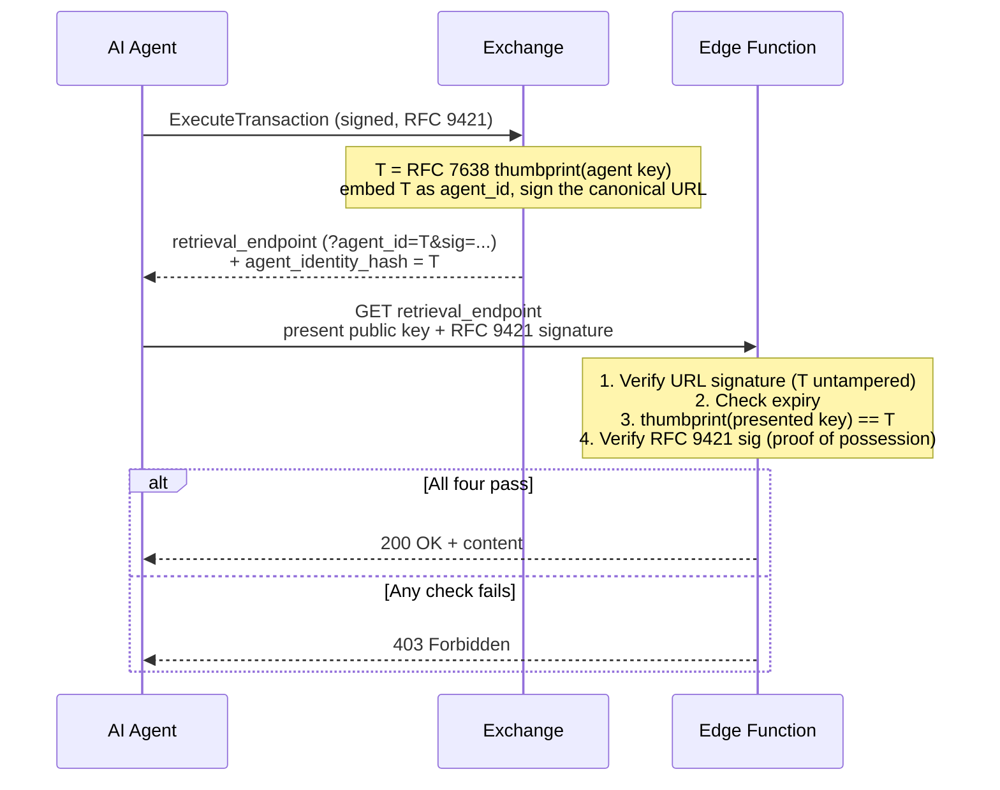
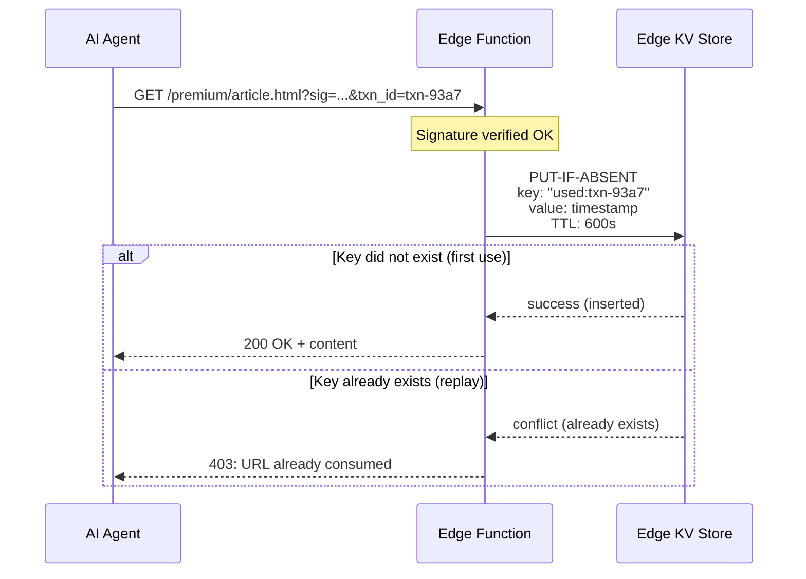
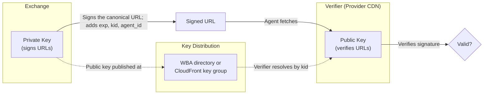

A signed URL is the capability that lets an agent fetch paid content. This page defines how one is built and how a verifier checks it.

## Two schemes, chosen when the URL is minted

RAMP defines two signing schemes. Both are **asymmetric**: the Exchange holds a private key, the verifier holds only a public key or a CDN-managed key group. There is no shared secret anywhere in either scheme, and no deployment holds signing material at the edge.

| Scheme | Signature | Verified by | Proof of possession |
|---|---|---|---|
| **Ed25519** | Ed25519 over a canonical message, `sig` parameter, base64url unpadded | Edge function code (Cloudflare Workers, Fastly Compute, Lambda@Edge) | **Yes** — the edge can require the fetcher to prove it holds the bound key |
| **CloudFront RSA** | RSA canned policy, AWS parameter format | CloudFront infrastructure, before any function code runs | **No** — native verification cannot run the check |

**The scheme is a mint-time selector. No verifier reads it.** The Exchange picks the scheme per tenant when it creates the URL; a verifier never consults it, because each scheme's URL is self-describing. That is why there is no "unknown scheme" case at fetch time: an unrecognized scheme fails at mint, before any URL exists, and the transaction fails with it.

**Verifiers fail closed on their own terms.** An edge function denies any URL without a valid signature and an unexpired `exp`. CloudFront verifies natively and denies on its own rules. Neither needs to know which scheme was intended.

That difference in proof-of-possession is the important one. It decides whether a leaked URL is usable (see [Agent Identity Binding](#agent-identity-binding)), and it decides whether a stored URL is a live capability at rest — which is why the [Exchange storage model](/components/exchange/storage-model/#storing-the-full-signed-url) treats the two schemes differently.

## Ed25519: the canonical form

This is protocol, not implementation detail. A signer and a verifier that disagree by one byte reject every URL, so the form is stated exactly.

```
message       = "GET\n" + canonical_url

canonical_url = prefix [ "?" query ]      (no "?" when the query is empty)

prefix        = every byte before the first "?" — scheme://host/path VERBATIM.
                No host, port, or path normalization of any kind.

query         = take the raw query;
                split on "&", split each pair on the FIRST "=";
                percent-DECODE each key and value ("+" decodes to space);
                DROP the "sig" pair — before sorting, before anything else;
                (exp, and kid / agent_id when present, are set here);
                SORT pairs by key — stable, per-key value order preserved;
                re-ENCODE each key and value: space -> "+",
                A-Za-z0-9 - . _ ~ kept, every other byte -> %XX uppercase hex;
                join as "k=v" with "&".

sig           = Ed25519 over the message, encoded base64url with NO padding,
                then appended as the "sig" parameter through the SAME
                canonicalization — so the published URL is itself the
                canonical form, with sig included.
```

Three points a reader gets wrong otherwise:

- **The prefix is verbatim.** A mixed-case host stays mixed case, an explicit `:443` stays, a space in the path stays a space, and `%2F` is not decoded. Normalizing any of it produces a different message and a failed verification.
- **`sig` is dropped before sorting**, not after. Sorting first and removing later gives the same set but a different intermediate, and an implementation that reorders around the removal will drift.
- **The query is decoded and re-encoded**, not passed through. The re-encode is idempotent on input that was already encoded this way, so a URL that round-trips unchanged is the normal case rather than a special one.

`exp` is Unix seconds and is covered by the signature, so a verifier checks the signature **before** trusting the expiry.

The Go, Python and TypeScript SDKs all implement this form and are pinned against one shared vector file, which fixes complete signed URLs byte for byte from a fixed key seed. The awkward cases above each have their own vector.

## CloudFront RSA

The signature, the policy and the parameter format are AWS's contract, not RAMP's. Use [AWS's CloudFront signed-URL documentation](https://docs.aws.amazon.com/AmazonCloudFront/latest/DeveloperGuide/private-content-signed-urls.html) as the definition; restating it here would create a second copy that drifts.

Two RAMP-specific facts are worth stating:

- **`agent_id` is set on the resource URL before signing**, so the canned policy commits to it. It cannot be swapped afterwards, even though CloudFront itself does not check who presents the URL.
- **The reconciliation digest is scheme-independent.** Both schemes store SHA-256 over the verbatim signed-URL string, so a delivery join works the same way whichever scheme minted the URL.

Configure a trusted key group on the cache behaviour for the protected path and upload the RSA public key to CloudFront Key Management. CloudFront verifies before the request reaches any function code.

## Key identification

**Ed25519.** The URL carries `kid`, the [RFC 7638](https://www.rfc-editor.org/rfc/rfc7638) thumbprint of the tenant's signing public key. A thumbprint rather than an opaque identifier means the verifier can confirm that the key it resolved is the key the `kid` names, without trusting a lookup table.

A verifier resolves `kid` to a public key however its deployment allows, and **must fail closed** when it cannot: a URL whose key does not resolve is denied, and so is a URL with no `kid` at all, because nothing can be resolved for it. A resolution failure caused by *infrastructure* — a directory fetch that times out — is a different outcome from a signature that does not verify, and a verifier should keep them distinguishable so a broken dependency is not read as an attack.

**CloudFront RSA.** There is no `kid`. AWS's `Key-Pair-Id` plays that role and its URL format requires it.

:::note[Reference implementation, not protocol]
The reference edge worker resolves `kid` against pre-provisioned static keys where they cover it, otherwise against the Exchange's WBA directory at `/.well-known/http-message-signatures-directory`, with a one-shot refetch on a miss so a key rotation heals itself. It answers `403` for an unresolvable key or a bad signature, and `503` for a directory fetch that failed, so a retryable outage is distinguishable from a denial.

A second implementation must fail closed. It does not have to fail closed in these two flavours.
:::

## TTL Checking

Signed URLs carry an expiry. A verifier enforces two checks:

1. **Expiry check** — reject when `exp` is in the past.
2. **Max TTL check** — reject when `exp` is further ahead than `maxUrlTtlSeconds`, which stops a URL signed far into the future.

The default max TTL is 300 seconds. This bounds the replay window even without single-use enforcement, and it is the reason a stored URL is a short-lived capability rather than a permanent one.

## Constant-time comparison

Compare signature bytes in constant time, never with a short-circuiting equality operator. A comparison that returns early on the first differing byte leaks, through response timing, how much of a guessed signature was correct — which turns forgery into a byte-at-a-time search.

This applies to any fixed-length secret comparison in the verify path. Ed25519 verification itself is constant-time in every reputable library, so the concern is the surrounding code, not the primitive.

## Agent Identity Binding

The signed URL is bound to the agent that paid for the resource, so a leaked URL is useless to anyone else. The binding follows the **DPoP pattern ([RFC 9449](https://www.rfc-editor.org/rfc/rfc9449))**: the Exchange puts the agent's key thumbprint inside the signed URL, and a capable verifier requires proof of possession at fetch time — **with no outbound network call**.

**Definition.** `agent_identity_hash` (URL parameter `agent_id`) is the **[RFC 7638](https://www.rfc-editor.org/rfc/rfc7638) JWK Thumbprint (SHA-256, base64url)** of the agent's Ed25519 **acceptance key** — the key whose signature over `AgentAcceptancePayload` the Exchange verified at execute time. RFC 7638 defines one canonical JSON form and one hash, so signer and verifier compute the identical value. It is present whenever a signed `retrieval_endpoint` is returned, and it is covered by the URL signature.

The acceptance key, not the RFC 9421 request signer: a Broker may author a re-packaged transaction as sender, and on that leg the request signer is the broker while the in-body acceptance is the only agent-authored signature. An agent that runs the ordinary direct flow signs its requests and its acceptances with one key — the key published in its manifest at `{domain}/.well-known/ramp.json` — so the two are the same value there. Using two keys is what breaks: the URL binds to the acceptance key, and an enforcing endpoint refuses a fetcher presenting the other one.

:::caution
This is **not** a hash of an account identifier such as `billing_ref` — an identifier is not a secret, so hashing it binds nothing an attacker cannot reproduce. The thumbprint binds the URL to a key whose *private* half the fetcher must prove it holds.
:::

**What the agent presents at fetch:**

1. Its **public key** — in a header or a query parameter; the choice is security-irrelevant because the thumbprint is inside the signed URL (see below).
2. An **RFC 9421 HTTP Message Signature** over the retrieval request (covering `@target-uri` + `created`), proving possession of the corresponding private key.

**What the verifier checks — fully offline:**

1. Verify the URL signature → proves `agent_id` is Exchange-issued and untampered.
2. Check `exp` (local clock only).
3. `thumbprint(presented public key) == agent_id`.
4. Verify the RFC 9421 signature with the presented key (proof of possession).

All four pass → serve. No JWKS fetch is required: the Exchange already authenticated the key at transaction time and froze its thumbprint into the signed message, so the verifier inherits that authentication from a signature it can check locally.



**Why a stolen URL is harmless.** To pass step 3 the attacker must present the agent's *public* key; to pass step 4 they must hold its *private* key. They can do one or the other, never both. Rewriting `agent_id` to match their own key fails step 1, because they cannot re-sign the URL. The defence is `(signature-locked thumbprint) ∧ (proof of possession)`, not key secrecy — which is why the public key may travel in the clear.

| Attacker with a stolen URL tries to… | Fails at |
|---|---|
| present their own key + sign with their own private key | step 3 — `thumbprint(their key) ≠ agent_id` |
| rewrite `agent_id` to match their own key | step 1 — they cannot produce the Exchange's signature |
| present the agent's public key (it is public) | step 4 — they cannot produce the RFC 9421 signature |

**Enforcement is OPTIONAL, and capability depends on the delivery node:**

| Delivery node | Enforces binding? | Behaviour |
|---|---|---|
| Edge function (Cloudflare Workers, Lambda@Edge, Fastly Compute) | Yes | Full steps 1–4. RAMP reference implementations run here and **do** enforce. |
| CDN-native verification (CloudFront) | No | Validates its own signature and expiry only; falls back to **signature + short TTL + TLS**. |

This is the same split as the scheme table at the top, seen from the other end: Ed25519 URLs are verified by code that can run steps 3 and 4, CloudFront URLs are verified by infrastructure that cannot.

Cost on a capable edge: one Ed25519 verify for the URL, one SHA-256 thumbprint, one Ed25519 verify for the request signature — well under a millisecond, with no socket. Because the RFC 9421 signature covers `@target-uri` and `created`, a captured fetch signature cannot be replayed against a different URL or outside the short TTL.

## Single-Use URL Enforcement

For providers wanting additional replay protection, the edge function can enforce single-use URLs via edge KV.

This needs a per-URL key. The signer itself adds only `exp`, `kid`, `agent_id` and `sig`, so a transaction identifier is present only when the Exchange already put it on the resource URL before signing — it is covered by the signature either way, because the canonical form takes the query verbatim. A deployment without one can key on `sig` instead, which is unique per URL by construction.



**KV TTL**: Set to `maxUrlTtlSeconds + 60s` (URL max TTL plus a safety buffer). After this period, the signed URL is expired anyway, so the KV entry can be evicted.

**Single-use enforcement is best-effort.** CDN edge KV stores are eventually consistent across locations. The primary replay protection is agent identity binding plus a short TTL. Authoritative deduplication happens during reconciliation, against CDN access logs and Exchange transaction records.

**CDN KV consistency reality**:

| Platform | KV Mechanism | Consistency Model | Propagation Delay |
|---|---|---|---|
| CloudFront | No native KV; Lambda@Edge + DynamoDB | Per-region, eventually consistent (DynamoDB Global Tables) | Seconds across regions |
| Cloudflare Workers KV | Workers KV | Eventually consistent | ~60s propagation across PoPs |
| Cloudflare Durable Objects | Durable Objects | Strong consistency | Single-location (latency tradeoff) |
| Akamai EdgeKV | EdgeKV | Eventually consistent | ~5-10s in-region |
| Fastly KV Store | KV Store | Eventually consistent | Seconds across PoPs |

**Recommendation: do not enforce strict single-use at the edge.** Instead, use:

1. **Agent identity binding** — the signed URL is bound to a specific `agent_id`, so a replay by anyone else fails proof of possession.
2. **Short TTL** — limits the replay window to a narrow period.
3. **Reconciliation** — the Exchange transaction log and CDN access logs both carry `txn_id`. Cross-reference to detect replays after the fact.

This matches ad-tech's approach to impression deduplication: real time is best-effort, reconciliation is authoritative.

## Key Custody

**The verifier never holds signing material.** That is true of both schemes, and it is what makes a compromised edge node unable to mint URLs.

| Scheme | Exchange holds | Verifier holds |
|---|---|---|
| Ed25519 | The private signing key | The public key only, resolved by `kid` |
| CloudFront RSA | The private signing key | Nothing — CloudFront holds the public key in a trusted key group |

Rotation follows from that. An Ed25519 rotation publishes a new public key and mints with a new `kid`; URLs already in flight keep verifying against the old key until they expire, so there is no coordinated switchover. A CloudFront rotation adds the new public key to the key group before the Exchange starts using it.


