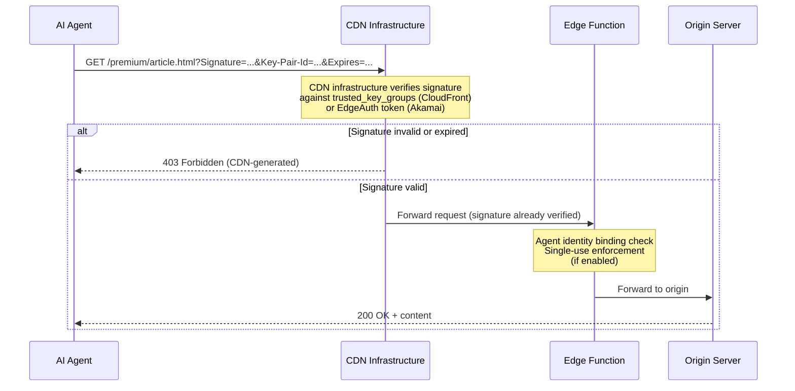
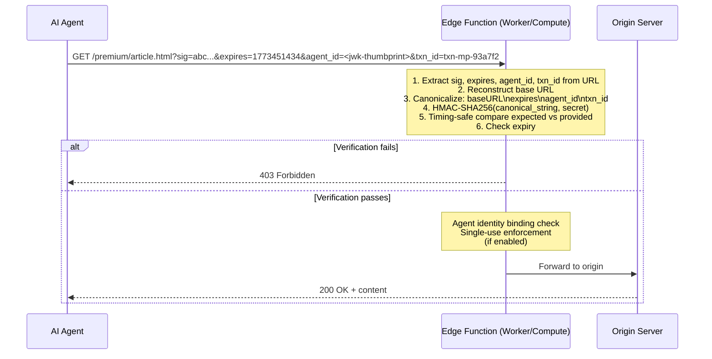
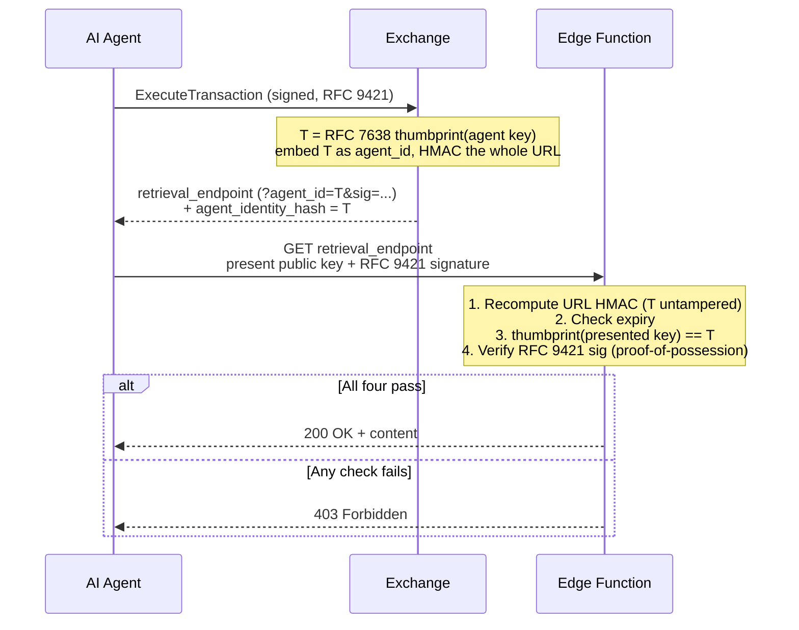
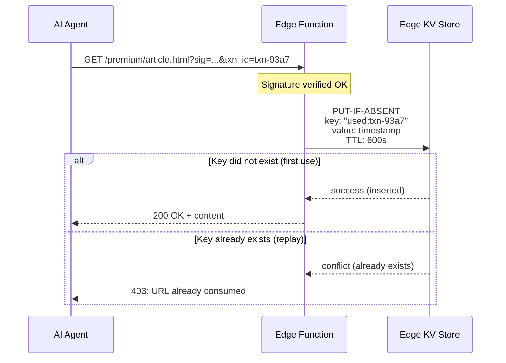
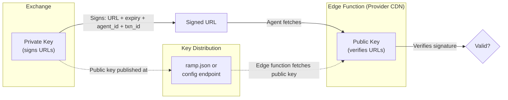

The Edge Function verifies signed URLs to gate access to protected content. Two verification modes are available, chosen per deployment: CDN-native verification and custom HMAC verification.

## Verification Modes

### Mode A: CDN-Native Verification (CloudFront, Akamai)

The CDN platform handles signature verification at the infrastructure level, before the edge function code runs.



**CloudFront implementation**: Configure a `trusted_key_groups` reference on the cache behavior for `/premium/*`. Upload the RSA public key to CloudFront Key Management. CloudFront verifies the `Signature`, `Key-Pair-Id`, and `Expires` (or canned/custom `Policy`) parameters before the request reaches any function code.

**Akamai implementation**: Configure EdgeAuth token verification on the property manager for protected paths. The EdgeAuth token includes a hash, expiry, and optional IP binding. Verification happens at the property level.

The Edge Function does not verify the cryptographic signature in this mode. It only performs additional checks (agent binding, single-use) that the CDN cannot do natively.

### Mode B: Custom HMAC Verification (Cloudflare, Fastly)

The edge function code verifies the signature using HMAC-SHA256.



## URL Parameter Parsing

**HMAC signed URL format** (current implementation):

```
https://cdn.provider.com/premium/article.html?expires=1773451434&sig=a7f3b2c1...
```

- `expires` -- Unix timestamp (seconds since epoch).
- `sig` -- HMAC-SHA256 hex digest of `{baseURL}{expires}` using the shared secret.

**Production enhancement** -- add delimiter and agent binding:

```
https://cdn.provider.com/premium/article.html
  ?expires=1773451434
  &agent_id=NzbLsXh8uDCcd-6MNwXF4W_7noWXFZAfHkxZsRGC9Xs
  &txn_id=txn-mp-93a7f2
  &sig=HMAC-SHA256(baseURL\nexpires\nagent_id\ntxn_id, secret)
```

- `agent_id` -- the agent's `agent_identity_hash` from `TransactionResponse`: the RFC 7638 JWK Thumbprint (SHA-256, base64url) of the agent's Ed25519 request-signing key. Because it is part of the HMAC input, a URL holder cannot swap the Exchange-issued value.
- `txn_id` -- transaction ID for reconciliation and single-use enforcement.
- `\n` delimiter between fields prevents canonicalization ambiguity (as noted in the threat model's HMAC implementation note).

## HMAC Canonicalization

Both the Exchange (signer) and the edge function (verifier) MUST use the same canonical format for HMAC input. Fields are concatenated with `\n` delimiters in this fixed order:

```
baseURL\nexpires\nagent_id\ntxn_id
```

Where:
- `baseURL` -- the content URL without query parameters (e.g., `https://cdn.example.com/premium/article.html`)
- `expires` -- Unix timestamp in seconds (string representation)
- `agent_id` -- the agent's RFC 7638 JWK Thumbprint (matches `TransactionResponse.agent_identity_hash`)
- `txn_id` -- the transaction ID (ULID)

All four fields are REQUIRED in production signed URLs. The `agent_id` field binds the URL to a specific agent (preventing sharing, Threat T8). The `txn_id` field enables three-sided reconciliation (CDN logs, Exchange transactions, Usage reports).

This canonicalization format MUST match the Exchange's signing format. Any mismatch between signer and verifier will cause all signed URLs to be rejected.

## TTL Checking

Signed URLs include an expiry timestamp. The edge function enforces two checks:

1. **Expiry check** -- reject URLs where `expires` < current time.
2. **Max TTL check** -- reject URLs where `expires` is more than `maxUrlTtlSeconds` from the current time (prevents URLs signed too far in the future).

The default max TTL is 300 seconds (5 minutes). This limits the replay window even without single-use enforcement.

## Timing-Safe Comparison

HMAC comparisons use constant-time comparison (XOR loop), never `===`. This prevents timing side-channel attacks where an attacker could determine partial signature matches based on response timing.

| Operation | Time |
|---|---|
| HMAC-SHA256 computation (Web Crypto) | 0.1-0.5ms |
| Timing-safe comparison (64-byte hex) | < 0.01ms |

## Agent Identity Binding

The signed URL is bound to the agent that purchased the resource, so a leaked URL is useless to anyone else. The binding follows the **DPoP pattern ([RFC 9449](https://datatracker.ietf.org/doc/html/rfc9449))**: the Exchange embeds the agent's key thumbprint into the URL it HMAC-signs, and a capable edge function enforces proof-of-possession at fetch time — **with no outbound network call**.

**Definition.** `agent_identity_hash` (URL parameter `agent_id`) is the **[RFC 7638](https://datatracker.ietf.org/doc/html/rfc7638) JWK Thumbprint (SHA-256, base64url)** of the agent's Ed25519 request-signing key — the same key published in the agent's manifest at `{domain}/.well-known/ramp.json` and used for RFC 9421 request signatures. RFC 7638 defines one canonical JSON form and one hash, so signer and verifier compute the identical value. It is present whenever a signed `retrieval_endpoint` is returned, and it is covered by the URL HMAC.

:::caution
This is **not** `SHA-256(billing_ref)`. The billing reference is a public identifier — hashing it binds nothing an attacker cannot reproduce. The thumbprint binds the URL to a key whose *private* half the fetcher must prove it holds.
:::

**What the agent presents at fetch:**

1. Its **public key** — in a header or a query parameter; the choice is security-irrelevant because the thumbprint is HMAC-locked (see below).
2. An **RFC 9421 HTTP Message Signature** over the retrieval request (covering `@target-uri` + `created`), proving possession of the corresponding private key.

**What the edge function checks -- fully offline:**

1. Recompute the URL HMAC with the shared secret → proves `agent_id` is Exchange-issued and untampered.
2. Check `expires` (local clock only).
3. `thumbprint(presented public key) == agent_id`.
4. Verify the RFC 9421 signature with the presented key (proof-of-possession).

All four pass → serve. No JWKS fetch is required: the Exchange already authenticated the key at transaction time and froze its thumbprint into the HMAC; the edge inherits that authentication through the HMAC it can verify locally.



**Why a stolen URL is harmless.** To pass step 3 the attacker must present the agent's *public* key; to pass step 4 they must hold its *private* key. They can do one or the other, never both. Rewriting `agent_id` to match their own key fails step 1 (they do not hold the HMAC secret). The defense is `(HMAC-locked thumbprint) ∧ (proof-of-possession)`, not key secrecy — which is why the public key may travel in the clear.

| Attacker with a stolen URL tries to… | Fails at |
|---|---|
| present their own key + sign with their own private key | step 3 — `thumbprint(their key) ≠ agent_id` |
| rewrite `agent_id` to match their own key | step 1 — HMAC fails; they lack the shared secret |
| present the agent's public key (it is public) | step 4 — they cannot produce the RFC 9421 signature |

**Enforcement is OPTIONAL -- capability depends on the delivery node:**

| Delivery node | Enforces binding? | Behavior |
|---|---|---|
| Edge function (Cloudflare Workers, Lambda@Edge, Fastly Compute) | Yes | Full steps 1-4. RAMP reference implementations run here and **do** enforce. |
| Bearer-only signed-URL CDN (CloudFront / S3 presigned, native Fastly) | No | Validates its own HMAC + expiry only; falls back to **HMAC + short TTL + TLS**. |

Cost budget on a capable edge: HMAC-SHA256 (µs) + SHA-256 thumbprint (µs) + one Ed25519 verify (~50-100 µs) ≪ 1 ms, no socket. Because the RFC 9421 signature covers `@target-uri` + `created`, a captured fetch signature cannot be replayed against a different URL or outside the short TTL.

## Single-Use URL Enforcement

For providers wanting additional replay protection, the edge function can enforce single-use URLs via edge KV:



**KV TTL**: Set to `maxUrlTtlSeconds + 60s` (URL max TTL plus a safety buffer). After this period, the signed URL is expired anyway, so the KV entry can be evicted.

**Single-use enforcement is best-effort.** CDN edge KV stores are eventually consistent across locations. The primary replay protection is agent identity binding + short TTL (5 minutes). Authoritative deduplication happens during reconciliation via CDN access logs and Exchange transaction records.

**CDN KV consistency reality**:

| Platform | KV Mechanism | Consistency Model | Propagation Delay |
|---|---|---|---|
| CloudFront | No native KV; Lambda@Edge + DynamoDB | Per-region, eventually consistent (DynamoDB Global Tables) | Seconds across regions |
| Cloudflare Workers KV | Workers KV | Eventually consistent | ~60s propagation across PoPs |
| Cloudflare Durable Objects | Durable Objects | Strong consistency | Single-location (latency tradeoff) |
| Akamai EdgeKV | EdgeKV | Eventually consistent | ~5-10s in-region |
| Fastly KV Store | KV Store | Eventually consistent | Seconds across PoPs |

**Recommendation: Do not enforce strict single-use at the edge.** Instead, use:

1. **Agent identity binding** -- the signed URL is bound to a specific agent_id. Even if replayed, only the authorized agent can use it.
2. **Short TTL (5 minutes)** -- limits the replay window to a narrow period.
3. **Reconciliation (detect abuse after the fact)** -- the Exchange transaction log and CDN access logs contain `txn_id` for every request. Cross-reference to detect replays and take action.

This matches ad-tech's approach to impression deduplication: real-time is best-effort, reconciliation is authoritative.

## Key Custody Model

**The edge function verifies, it does not sign.**

| Signing Scheme | Who Signs | Who Verifies | Edge Function Has |
|---|---|---|---|
| CloudFront RSA (asymmetric) | Exchange (private key) | CloudFront infra (public key) | Nothing (CDN-native) |
| Akamai EdgeAuth (symmetric) | Exchange (shared secret) | Akamai infra (shared secret) | Nothing (CDN-native) |
| HMAC-SHA256 (symmetric) | Exchange (shared secret) | Edge function (same secret) | **The shared secret** |
| RSA/Ed25519 (asymmetric, custom) | Exchange (private key) | Edge function (public key) | Public key only |

**Concern with HMAC**: When using HMAC verification (Cloudflare, Fastly), the edge function must hold the shared secret. If the edge function is compromised, the attacker can forge signed URLs. Key rotation requires updating both the Exchange and the edge function simultaneously.

**Recommendation**: Use asymmetric signing (Ed25519 or RSA) when the CDN does not provide native signed URL verification.


