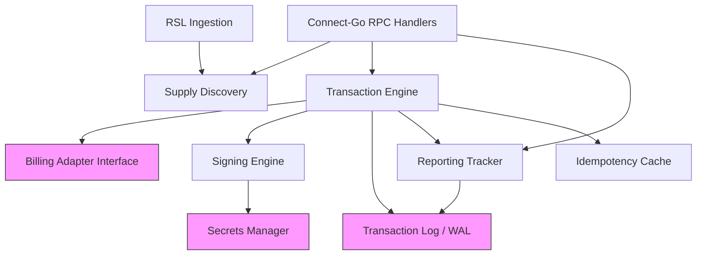

## What the Exchange Does

The Exchange Node is the core transaction component in the RAMP architecture. It is a single Go binary (using Connect-Go for gRPC/HTTP) that acts as the commercial intermediary between AI agents requesting resources and providers offering them. A single Exchange Node serves many providers — one Exchange operator runs an Exchange that serves 10, 100, or 1000+ providers.

The Exchange implements the RAMP v1.0 `ExchangeService` (4 RPCs: `DiscoverResources`, `ExecuteTransaction`, `ReportUsage`, `DisputeTransaction`).

**NFR targets**: 10K RPS, &lt;100ms p99 ExecuteTransaction, &lt;$0.00005/txn.

## Key Responsibilities

| Responsibility | Description |
|---|---|
| **Catalog Management** | Maintains an in-memory resource catalog (radix trie) per provider tenant, built from RSL, sitemaps, CMS APIs, and third-party intelligence providers. Scope-based catalog filtering ensures requesters only see resources matching their declared scopes |
| **Pricing** | Computes offer pricing from Exchange config overrides, RSL-derived pricing, and tenant defaults. Includes unit_cost normalization for cross-provider comparison |
| **Transaction Execution** | Stateless offer verification (Ed25519), billing authorization via pluggable adapter, durable transaction logging (write-before-sign invariant). Subscription offers include `SubscriptionQuotaInfo` for proactive quota signaling |
| **Signed URL Generation** | Per-tenant HMAC-SHA256 signed URLs for CDN-verified resource delivery, with configurable TTL and requester identity binding |
| **Usage Reporting** | Tracks reporting obligations per transaction, enforces compliance rates, blocks non-compliant agents. Returns `report_id` for dispute chain linkage (v1.0) |
| **Attestation Verification (v1.0)** | Verifies `ResourceAttestation` signatures at catalog push time using keys from the verifier's `/.well-known/ramp.json` `public_keys`. Propagates valid attestations to offers |
| **Dispute Resolution (v1.0)** | Accepts `DisputeTransaction` RPCs, auto-resolves disputes using CDN logs and cryptographic evidence (Tier 1), applies rule-based review (Tier 2), and escalates patterns (Tier 3) |
| **[Health Checks](/components/exchange/health-checks/)** | Three-layer health checking: gRPC `grpc.health.v1`, HTTP `/healthz` (liveness), HTTP `/readyz` (readiness). Subsystem health matrix with background probes |
| **[Exchange Manifest](/protocol/exchange-manifest/)** | Machine-readable self-description at `/.well-known/ramp.json` (`role=ROLE_EXCHANGE`). Declares endpoints, capabilities, accepted verifiers, `supported_profiles`, and `base_currency`. Enables Broker capability negotiation and cross-exchange price comparison |
| **Streaming Delivery** | Supports `DELIVERY_METHOD_STREAMING` for real-time connections (WebSocket, SSE, HLS). Generates streaming signed URLs with appropriate TTL for long-running sessions |
| **Extension Profiles** | Declares conformance to domain extension profiles (e.g., `ramp-news-v1`, `ramp-academic-v1`, `ramp-legal-v1`) via `supported_profiles` in the manifest. Includes profile-specific ext fields in offers |

## Component Architecture

The Exchange Node has five internal modules. Each module owns a distinct responsibility. Modules communicate via Go interfaces — no internal RPC, no message queues, no shared mutable state between modules. Identity verification uses the `Requester` model (Ed25519 domain-bound keys) with optional delegation (JWT) and verification of the stacked RFC 9421 HTTP Message Signatures that record the forwarding chain.

```
┌──────────────────────────────────────────────────────────────────┐
│                      Exchange Node (Go binary)                │
│                                                                  │
│  ┌────────────────┐   ┌────────────────────┐   ┌──────────────┐ │
│  │ Supply         │   │ Transaction        │   │ Signing      │ │
│  │ Discovery      │   │ Engine             │   │ Engine       │ │
│  │                │   │                    │   │              │ │
│  │ - Catalog      │   │ - Idempotency      │   │ - Per-tenant │ │
│  │   (in-memory)  │   │ - Billing authz    │   │   keys       │ │
│  │ - Offer build  │   │ - Txn log write    │   │ - CDN-aware  │ │
│  │ - URI matching │   │ - Signed URL issue │   │   signing    │ │
│  └───────┬────────┘   └────────┬───────────┘   └──────┬───────┘ │
│          │                     │                       │         │
│  ┌───────┴────────┐   ┌───────┴───────────┐                     │
│  │ RSL            │   │ Reporting         │                     │
│  │ Ingestion      │   │ Tracker           │                     │
│  │                │   │                   │                     │
│  │ - Crawl + parse│   │ - Obligation FSM  │                     │
│  │ - Diff detect  │   │ - Enforcement     │                     │
│  │ - Catalog push │   │ - Compliance log  │                     │
│  └────────────────┘   └───────────────────┘                     │
│                                                                  │
│          │                     │                                  │
│          ▼                     ▼                                  │
│  ┌──────────────────────────────────────────────────────────────┐│
│  │                Billing Adapter (pluggable interface)            ││
│  └──────────────────────────────────────────────────────────────┘│
└──────────────────────────────────────────────────────────────────┘
```

## Module Summary

| Module | In-Memory | External I/O | Hot Path? |
|---|---|---|---|
| **Supply Discovery** | Resource catalog (radix trie), offer templates | None (reads from in-memory catalog) | Yes — DiscoverResources |
| **Transaction Engine** | Idempotency cache (LRU) | Billing Adapter, Transaction Log Store | Yes — ExecuteTransaction |
| **Signing Engine** | Per-tenant signing keys | None (all in-process) | Yes — ExecuteTransaction |
| **Reporting Tracker** | Obligation state machine (in-memory + durable) | Transaction Log Store (for obligation records) | Moderate — ReportUsage |
| **RSL Ingestion** | Parsed RSL documents | HTTP fetch to provider domains | No — background goroutine |

## Module Interaction Rules

1. **Supply Discovery** is read-only on the hot path. The ingestion pipeline serializes the trie to a binary file; the Exchange loads the pre-built binary via atomic pointer swap (see Concurrency Model).
2. **Transaction Engine** verifies the offer's signature (Ed25519 for offers, stateless — no catalog lookup), then calls the Billing Adapter, then writes to the Transaction Log, then calls the Signing Engine. This is a sequential pipeline — no parallelism within a single transaction. Offers are stateless: no OfferStore, no OfferCache, no ResolveOffer.
3. **Reporting Tracker** is called by the ReportUsage RPC handler. It reads the obligation from the Transaction Log to validate the report, then updates the obligation state.
4. **RSL Ingestion** runs on a configurable interval (default: 5 minutes). It fetches, parses, diffs, and produces a serialized catalog binary that the Exchange loads via atomic pointer swap. Source priority is defined in the Resource Ingestion Pipeline design doc.
5. **Signing Engine** has two subsystems: (a) Ed25519 for offer signatures (asymmetric — agents and Brokers verify with the public key), and (b) HMAC-SHA256 for signed URLs (symmetric — shared secret between Exchange and CDN). Both are pure function calls — no external I/O. Keys are loaded at startup and rotated via a background goroutine watching a key store.

## Module Dependency Graph



Pink nodes are external dependencies. Everything else runs in-process.

## How It Fits in the RAMP Architecture

The Exchange sits between AI agents/Brokers and provider CDN infrastructure:

1. An AI agent discovers available resources by calling `DiscoverResources` — the Exchange verifies the `Requester` identity (Ed25519 signature over domain-bound key), filters the catalog by the requester's scopes, and returns signed offers. If a `Delegation` is present, the Exchange verifies the delegation JWT chain before granting scoped access. When the request was forwarded through one or more intermediaries, each adds a labeled RFC 9421 HTTP Message Signature to the header stack (each covering the request plus the prior hop's signature); the Exchange verifies the whole stack to prove the request path and counts hops against `max_hops` / `max_intermediary_hops`
2. The agent executes a transaction by calling `ExecuteTransaction` with a chosen offer — the Exchange verifies the offer signature, authorizes billing, logs the transaction, and returns a signed URL
3. The agent fetches the resource using the signed URL — the CDN edge function verifies the URL signature using the same HMAC secret shared with the Exchange
4. The agent reports usage by calling `ReportUsage` — the Exchange validates the report and updates the obligation state

## Key Design Decisions

- **Stateless offer verification**: Offers are Ed25519-signed tokens. ExecuteTransaction verifies and decodes the offer from its signature — no offer storage, no offer cache, no re-resolution against the catalog. This eliminates a class of consistency bugs and simplifies horizontal scaling.
- **Write-before-sign invariant**: The transaction log write MUST complete before the Signing Engine generates the signed URL. No signed URL is ever issued for an unrecorded transaction.
- **Two signing subsystems**: Ed25519 for offer signatures (asymmetric, agents verify with public key) and HMAC-SHA256 for signed URLs (symmetric, shared secret between Exchange and CDN). Different trust models require different cryptographic primitives.
- **Pluggable Billing Adapter**: The single point of custom integration per deployment. The open-source Exchange is billing-system-agnostic.
- **Copy-on-write catalog**: The resource catalog uses `atomic.Pointer` for lock-free reads on the hot path. The ingestion pipeline builds a new catalog snapshot in the background and swaps it atomically.
- **Single currency per deployment (v1)**: No cross-currency conversion. The Exchange operator sets a single operating currency. Cross-currency is a v2 feature.

## Key Go Interfaces

```go
// The five pluggable interfaces that define the Exchange's extension points.

type BillingAdapter interface {
    Authorize(ctx context.Context, req *BillingAuthorizeRequest) (*BillingAuthorizeResponse, error)
    Record(ctx context.Context, req *BillingRecordRequest) (*BillingRecordResponse, error)
    Release(ctx context.Context, billingID string) error
    GetBalance(ctx context.Context, requesterID string) (*BillingBalance, error)
    CheckSubscription(ctx context.Context, requesterID string, tenantID string) (*SubscriptionStatus, error)
}

type OfferSigner interface {
    Sign(offer *rampv1.Offer) (string, error)
    VerifyAndDecode(offerID string, signature string, algorithm string) (*rampv1.Offer, error)
}

type Signer interface {
    SignURL(ctx context.Context, tenantID string, req SignRequest) (string, error)
}

type TransactionStore interface {
    Write(ctx context.Context, record *TransactionRecord) error
    WriteBatch(ctx context.Context, records []*TransactionRecord) error
    Lookup(ctx context.Context, transactionID string) (*TransactionRecord, error)
    LookupByRequestID(ctx context.Context, requestID string) (*TransactionRecord, error)
    WriteUsageReport(ctx context.Context, report *UsageReportRecord) error
}

type SecretsProvider interface {
    GetSigningKey(ctx context.Context, keyRef string) (*SigningKey, error)
    WatchRotation(ctx context.Context, keyRef string, callback func(*SigningKey)) error
}
```
