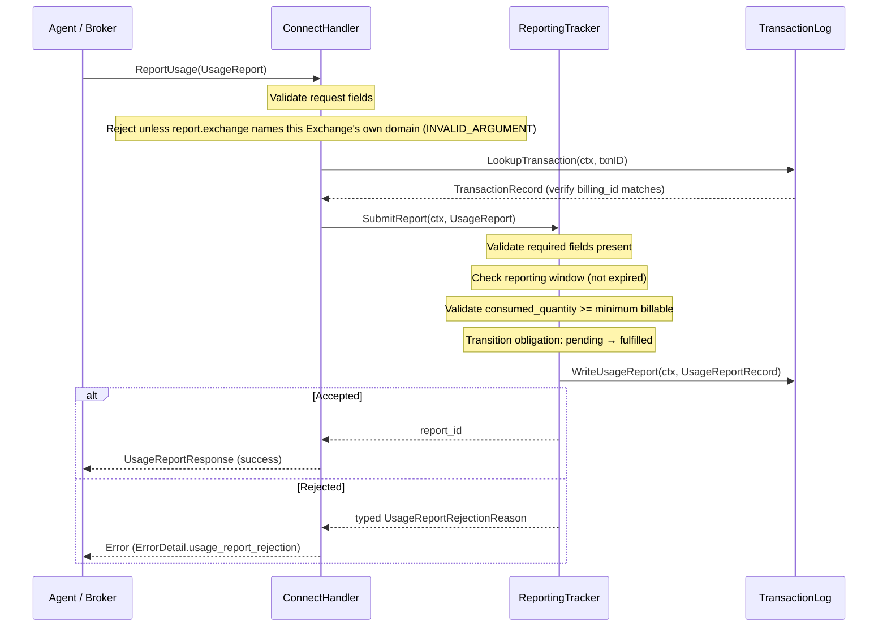
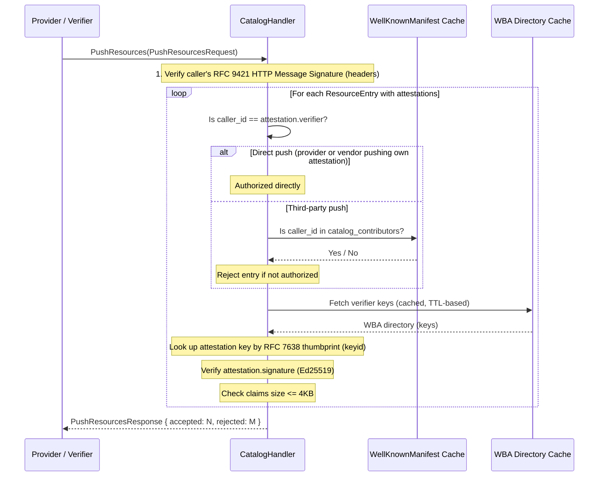
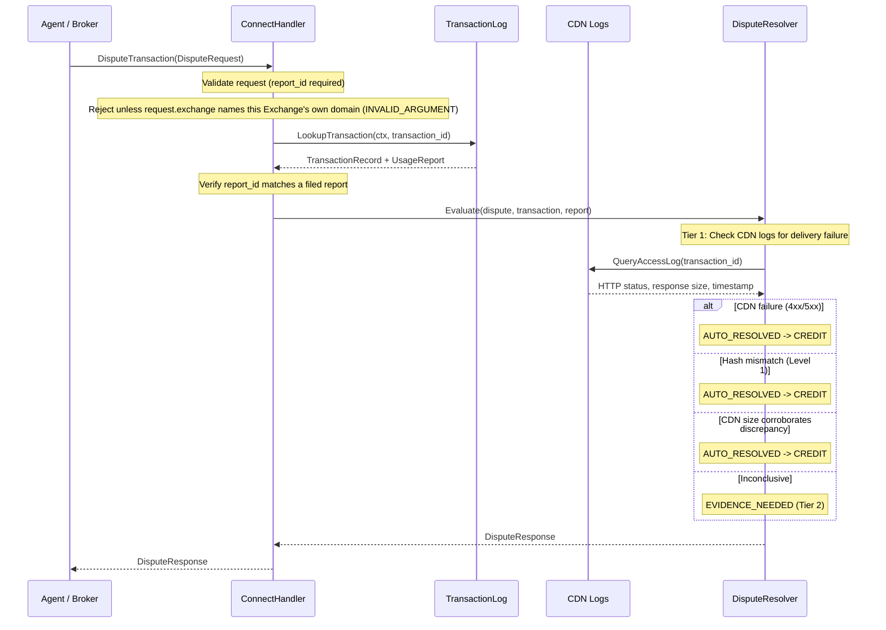

## DiscoverResources

The fastest path. No external I/O. In-memory catalog lookup, offer construction, and response serialization.

```mermaid
sequenceDiagram
    participant Agent as Agent / Broker
    participant Handler as ConnectHandler
    participant SD as SupplyDiscovery
    participant RT as ReportingTracker

    Agent->>Handler: DiscoverResources(ResourceQuery)

    Note over Handler: Validate request (proto validation)
    Note over Handler: Reject unless request.exchange names this Exchange's own domain (INVALID_ARGUMENT)
    Note over Handler: Verify requester RFC 9421 HTTP Message Signature in the HTTP headers (Ed25519 via domain key lookup)
    Note over Handler: Verify the stack of forwarding HTTP Message Signatures (RFC 9421, one per hop; if present)
    Note over Handler: Extract tenant from ResourceQuery.uris[0] domain
    Note over Handler: (Volumetric rate limiting handled by infra layer — HAProxy/Envoy)

    Handler->>SD: FindOffers(ctx, tenantID, query.uris, requester.scopes)

    Note over SD: Lookup URI(s) in radix trie
    Note over SD: Filter catalog by requester.scopes
    Note over SD: Attach LicenseTerm.restrictions to each Offer<br/>(surfaced on Offer.terms[]; agent self-selects, no server-side filter)
    Note over SD: Build []Offer from templates + live pricing

    SD-->>Handler: []Offer

    Handler->>RT: GetReportingPolicy(ctx, tenantID)
    RT-->>Handler: ReportingObligation (tenant-level default)

    Note over Handler: Attach tenant's ReportingObligation to each Offer<br/>(per-tenant default, rarely overridden per-offer)
    Note over Handler: Ed25519-sign every offer (MANDATORY)
    Note over Handler: Build ResourceResponse

    Handler-->>Agent: ResourceResponse
```

### Handler Implementation

```go
func (h *ExchangeHandler) DiscoverResources(
    ctx context.Context,
    req *connect.Request[rampv1.ResourceQuery],
) (*connect.Response[rampv1.ResourceResponse], error) {
    // 1. Validate
    if err := validate(req.Msg); err != nil {
        return nil, connect.NewError(connect.CodeInvalidArgument, err)
    }

    // 1b. Respect deadline field from ResourceQuery.
    //     If req.Msg.Deadline is set, use it as the context timeout.
    //     If absent, use a 500ms default timeout for the entire handler.
    if req.Msg.Deadline != nil {
        var cancel context.CancelFunc
        ctx, cancel = context.WithTimeout(ctx, req.Msg.Deadline.AsDuration())
        defer cancel()
    } else {
        var cancel context.CancelFunc
        ctx, cancel = context.WithTimeout(ctx, 500*time.Millisecond)
        defer cancel()
    }

    // 2. Verify Requester identity (RFC 9421 HTTP Message Signature in the HTTP headers, Ed25519, domain-bound key).
    //    Lookup the requester's public key via {domain}/.well-known/ramp.json.
    //    The Exchange MUST verify the requester's HTTP Message Signature. Reject on failure.
    requester := req.Msg.Requester
    requesterPubKey, err := h.requesterKeys.LookupPublicKey(ctx, requester.Domain)
    if err != nil {
        return nil, connect.NewError(connect.CodeUnauthenticated,
            fmt.Errorf("unknown requester domain: %s", requester.Domain))
    }
    if err := h.verifyRequesterSignature(req, requesterPubKey); err != nil {
        slog.Warn("requester signature verification failed on DiscoverResources",
            slog.String("requester_id", requester.Id),
            slog.String("domain", requester.Domain),
            slog.Any("error", err),
        )
        return nil, connect.NewError(connect.CodeUnauthenticated, err)
    }

    // 2b. Verify the forwarding chain: the stack of RFC 9421 HTTP Message
    //     Signatures carried in the request headers (Signature / Signature-Input).
    //     There is no in-message hop list — each forwarding party (e.g. a Broker)
    //     adds ONE labeled signature (keyid names the signer) that covers the
    //     request essentials plus the previous hop's signature, so the ordered
    //     set of header signatures IS the chain and is tamper-evident.
    //     verifyForwardingChain resolves each keyid via {domain}/.well-known/ramp.json,
    //     verifies every signature, and confirms the chain is contiguous.
    if err := h.verifyForwardingChain(ctx, req); err != nil {
        slog.Warn("forwarding signature chain verification failed",
            slog.String("requester_id", requester.Id),
            slog.String("domain", requester.Domain),
            slog.Any("error", err),
        )
        return nil, connect.NewError(connect.CodeUnauthenticated, err)
    }

    // 2c. Verify delegation (if present).
    //     Verifies the delegation JWT chain (chain linkage + cnf holder binding)
    //     against the principal's published key.
    if requester.Delegation != nil {
        if err := h.verifyDelegationJWT(ctx, requester); err != nil {
            return nil, connect.NewError(connect.CodePermissionDenied, err)
        }
    }

    // 3. Resolve tenant
    tenantCfg, err := h.tenants.ResolveFromURIs(req.Msg.Uris)
    if err != nil {
        return nil, connect.NewError(connect.CodeNotFound, err)
    }

    // 4. Application-level abuse check (optional — volumetric rate limiting is at infra layer)
    // The Exchange MAY return 429 for application-level abuse, e.g., query-to-transaction
    // ratio too low (agent discovering but never buying). Volumetric rate limiting (per-IP,
    // per-tenant RPS caps) belongs in HAProxy/Envoy/API Gateway in front of this service.

    // 5. Catalog lookup (lock-free read, scope-filtered)
    //    The catalog is filtered by requester.scopes — resources outside the
    //    requester's declared scopes are not returned. If a delegation
    //    is present, effective scopes are the intersection of requester.scopes
    //    and the delegation's granted scopes.
    effectiveScopes := requester.Scopes
    if requester.Delegation != nil {
        effectiveScopes = intersectScopes(requester.Scopes, requester.Delegation.Scopes)
    }
    offers, err := h.catalog.FindOffers(ctx, tenantCfg.ID, req.Msg.Uris, effectiveScopes)
    if err != nil {
        return nil, connect.NewError(connect.CodeInternal, err)
    }

    // 5b. Check for active subscription.
    //     If the requester has an active subscription with this tenant, include a
    //     subscription offer variant (rate=0) for each catalog offer with
    //     SubscriptionQuotaInfo attached. Quota enforcement is deferred to
    //     ExecuteTransaction time — DiscoverResources checks subscription status
    //     and populates quota visibility. Subscription/entitlement is resolved
    //     from the verified requester identity (requester.id + domain, and any
    //     delegation).
    var subStatus *SubscriptionStatus
    if sub, err := h.billing.CheckSubscription(ctx, requester.Id, tenantCfg.ID); err == nil && sub.Active {
        subStatus = sub
    }

    // Build subscription offer variants per catalog offer (if subscription active).
    // Each subscription offer includes SubscriptionQuotaInfo so agents can see
    // remaining quota before committing to a transaction.
    if subStatus != nil {
        var subOffers []*rampv1.Offer
        for _, offer := range offers {
            subOffer := proto.Clone(offer).(*rampv1.Offer)
            subOffer.OfferId = "sub-" + offer.OfferId
            subOffer.SubscriptionId = proto.String(subStatus.SubscriptionID)
            subOffer.Pricing = &rampv1.Pricing{
                Model:           offer.Pricing.Model,
                Rate:            0, // zero marginal cost under subscription
                Currency:        offer.Pricing.Currency,
                UnitCost:          proto.Float64(0),
                EstimatedQuantity: offer.Pricing.EstimatedQuantity,
            }
            // Populate SubscriptionQuotaInfo for proactive quota signaling
            subOffer.SubscriptionQuota = h.billing.GetSubscriptionQuota(
                ctx, subStatus.SubscriptionID, tenantCfg.ID,
            )
            subOffers = append(subOffers, subOffer)
        }
        offers = append(offers, subOffers...)
    }

    // 6. Attach reporting obligations (per-tenant default, not per-offer lookup)
    //    Reporting obligation is set once in tenant config. All offers inherit the
    //    tenant's reporting obligation unless explicitly overridden (rare).
    tenantReporting := h.reporting.GetPolicy(tenantCfg.ID)
    for _, offer := range offers {
        offer.Reporting = tenantReporting
    }

    // 7. Ed25519-sign every offer (MANDATORY — enables stateless ExecuteTransaction)
    //    Ed25519 is the default for offers because agents and Brokers must
    //    verify signatures without holding the signing key. The Exchange signs
    //    with its Ed25519 private key; anyone verifies with the public key.
    for _, offer := range offers {
        sig, err := h.offerSigner.Sign(offer)
        if err != nil {
            return nil, connect.NewError(connect.CodeInternal, err)
        }
        offer.Signature = sig
        offer.SignatureAlgorithm = "EdDSA"
    }

    // 8. Build response — flat offers or OfferGroups depending on URI count.
    //    When the ResourceQuery contains multiple URIs, return OfferGroups
    //    (one per URI) so the caller knows which offers map to which resource.
    //    When a single URI is queried, use the flat offers field.
    uris := req.Msg.Uris
    if len(uris) > 1 {
        // Batch mode: group offers by requested URI.
        groups := make([]*rampv1.OfferGroup, 0, len(uris))
        for _, uri := range uris {
            var uriOffers []*rampv1.Offer
            for _, offer := range offers {
                if offerMatchesURI(offer, uri) {
                    uriOffers = append(uriOffers, offer)
                }
            }
            groups = append(groups, &rampv1.OfferGroup{
                Uri:    uri,
                Offers: uriOffers, // empty slice = resource not available for this URI
            })
        }
        return connect.NewResponse(&rampv1.ResourceResponse{
            Ver:         helpers.ProtocolVersion,
            Exchange: h.exchangeDomain,
            OfferGroups: groups,
        }), nil
        // Correlation is not echoed in the body: it rides the X-Request-ID
        // HTTP header, propagated across the request/response round-trip.
    }

    return connect.NewResponse(&rampv1.ResourceResponse{
        Ver:         helpers.ProtocolVersion,
        Exchange: h.exchangeDomain,
        Offers:      offers,
    }), nil
}
```

**IAB Content Taxonomy**: When building offers, the DiscoverResources handler includes `iab_categories` from the catalog entry on each Offer. This enables agents and Brokers to filter offers by topic (e.g., "only finance resources"). Categories use IAB Content Taxonomy 3.1 codes and are populated during resource ingestion — either from RAMP sitemap extensions, CMS metadata, or third-party intelligence providers via CatalogService.

**Latency budget**: 10ms p50, 50ms p99. All in-memory. The only variable is offer count and serialization cost.

### Requester Authentication

Requester authentication uses an RFC 9421 HTTP Message Signature in the HTTP headers, signed with a domain-bound Ed25519 key. The `Requester.domain` field determines where the public key is published (`{domain}/.well-known/ramp.json`). The `Requester.id` identifies the specific entity within that domain. The requester's private key never leaves the requester.

**Two onboarding paths:**

1. **Enterprise (out-of-band key exchange)**: During contract signing, the Exchange operator registers the requester's public key via an internal admin API: `POST /admin/requesters { requester_id, domain, public_key, subscription }`. The public key is exchanged out-of-band (email, portal, API) as part of the commercial agreement.

2. **Self-signup (domain verification)**: The requester registers via the public API: `POST /exchange/v1/requesters/register { requester_id, domain }`. The Exchange fetches the requester's WBA directory (the JWK Set at `/.well-known/http-message-signatures-directory`) from the domain, reads the matching key (identified by its RFC 7638 thumbprint, the RFC 9421 `keyid`), and verifies that `requester_id` matches. No subscription is created — self-signup requesters use per-request billing only.

**Requester public key storage:**

```go
type RequesterRecord struct {
    RequesterID   string
    Domain        string
    PublicKey     ed25519.PublicKey
    ManifestURL   string  // {domain}/.well-known/ramp.json
    Subscriptions map[string]SubscriptionStatus  // tenantID -> status
}
```

### Forwarding Chain Verification

The forwarding chain lives entirely in the HTTP layer as a **stack of RFC 9421 HTTP Message Signatures** — there is no `intermediaries` field on the message. Each party that originates or forwards a `ResourceQuery` or `TransactionRequest` adds **one** labeled signature (`Signature` / `Signature-Input`, e.g. `ramp-agent`, `ramp-broker-1`) to the request headers. Each forwarder's signature covers the request essentials (`@method`, `@authority`, `@path`, `Content-Digest`) **plus the previous hop's signature**, so the ordered set of header signatures *is* the chain and cannot be reordered, dropped, or extended undetectably. The Exchange MUST:

1. **Verify the requester's (originating) RFC 9421 HTTP Message Signature** — proves the original requester authorized the request. The `keyid` names the signer; the Exchange resolves the public key via `{requester.domain}/.well-known/ramp.json` and verifies the Ed25519 signature.

2. **Verify every forwarding signature in the stack** — proves each intermediary (e.g., Broker) handled the request. For each labeled signature, the Exchange resolves its `keyid` via `{domain}/.well-known/ramp.json`, verifies the Ed25519 signature, and confirms it covers the prior hop's signature so the chain is contiguous and ordered.

All signatures must pass for the request to proceed. If any verification fails — or the chain is not contiguous — the Exchange rejects the request with `CodeUnauthenticated`.

When only the originating signature is present, the requester is calling the Exchange directly — no intermediary was involved. Chain depth is bounded by `RequestConstraints.max_hops` (agent-set) and `WellKnownManifest.max_intermediary_hops` (Exchange-published); the Exchange counts the signatures in the stack against these caps.

```go
// Forwarding chain verification — the ordered stack of RFC 9421 HTTP
// Message Signatures in the request headers IS the chain.
//
// verifyForwardingChain:
//   1. Parses the Signature / Signature-Input headers into ordered, labeled hops.
//   2. Verifies the originating (requester) signature against
//      {requester.domain}/.well-known/ramp.json.
//   3. For each subsequent labeled signature, resolves its keyid via
//      {domain}/.well-known/ramp.json, verifies the Ed25519 signature, and
//      confirms it covers the prior hop's signature (contiguous + ordered).
//   4. Counts the hops against max_hops / max_intermediary_hops.
// Any failure returns CodeUnauthenticated.
if err := h.verifyForwardingChain(ctx, req); err != nil {
    return nil, connect.NewError(connect.CodeUnauthenticated, err)
}
```

### Delegation Verification

When `Requester.delegation` is present, the Exchange verifies the delegation JWT chain before granting scoped access:

1. Decode the base64url-encoded `token` (JWS) from the `Delegation` message
2. Verify the Ed25519 signature chain — the authority JWT signed by `principal_domain`'s published key, each child JWT signed by the key its parent named in `cnf` (chain-linkage invariant)
3. Verify holder binding — the key that signed the RFC 9421 request MUST hash to the final JWT's `cnf.jkt`
4. Evaluate constraints (scope coverage, spend caps, expiration) — the grant covers scopes only if each child's `scope` is contained in its parent's
5. Extract effective scopes (intersection of requester scopes and delegation scopes)
6. Check `expires_at` against current time
7. Optionally check `revocation_uri` for high-value transactions

See [Authentication](/protocol/authentication/) for the full delegation model.

### Provider Trust Verification

The Exchange SHOULD periodically re-fetch `/.well-known/ramp.json` for each tenant's domains to confirm the provider still authorizes this Exchange to sell their resources. If the Exchange is removed from a provider's `ramp.json`:

- Revoke the tenant configuration
- Stop serving offers for that provider's resources
- Log the revocation for audit

This is ongoing verification, not just onboarding. Providers can revoke authorization at any time by updating their `ramp.json`. The Exchange SHOULD check at least once per hour (configurable via tenant settings).

---

## ExecuteTransaction

The critical path. Stateless offer verification — no offer storage or re-resolution. A request carries one or more `items` (items-only model): each item presents the FULL signed offer it was issued, and the Exchange verifies that presented offer against its own offer-signing key. A single offer is the degenerate 1-element `items` list. Per item the pipeline is: validate -> verify the presented offer's signature (Ed25519 default) -> check idempotency -> authorize billing -> write transaction log -> sign URL -> respond.

```mermaid
sequenceDiagram
    participant Agent as Agent / Broker
    participant Handler as ConnectHandler
    participant Idemp as IdempotencyCache
    participant BA as BillingAdapter
    participant TxLog as TransactionLog
    participant SE as SigningEngine
    participant RT as ReportingTracker

    Agent->>Handler: ExecuteTransaction(TransactionRequest{items})

    Note over Handler: Validate request
    Note over Handler: Reject unless EVERY items[].offer.exchange names this Exchange's own domain (INVALID_ARGUMENT)
    Note over Handler: Verify requester RFC 9421 HTTP Message Signature
    Note over Handler: Check idempotency key

    Handler->>Idemp: Check(idempotency_key)
    alt Already processed
        Idemp-->>Handler: cached TransactionResponse
        Handler-->>Agent: TransactionResponse (replay)
    end

    loop For each item in items
        Note over Handler: Verify the presented item.offer signature<br/>(Ed25519 default; no offer storage, no re-resolution)
        Note over Handler: Extract tenant via domain→tenant lookup

        Handler->>BA: Authorize(ctx, AuthorizeRequest)
        Note over BA: Check requester balance/credit<br/>Resolve billing reference<br/>Reserve funds

        alt Authorization failed
            BA-->>Handler: AuthorizeResponse{Approved: false}
            Note over Handler: record per-item denial_reason (in-body)
        end

        BA-->>Handler: AuthorizeResponse{Approved: true, BillingID: "..."}

        Note over Handler: Generate transaction_id (ULID)

        Handler->>TxLog: Write(TransactionRecord) [MUST succeed before signing]
        Note over TxLog: Append to WAL buffer<br/>Durable write confirmed

        Handler->>SE: SignURL(ctx, tenantID, contentURL, txnID, agentID, expiry)
        SE-->>Handler: signedURL

        Handler->>RT: CreateObligation(ctx, txnID, reportingPolicy)

        Handler->>BA: Record(ctx, RecordRequest)
        Note over BA: Confirm transaction in billing system
    end

    Handler->>Idemp: Store(idempotency_key, response)

    Handler-->>Agent: TransactionResponse{items}
```

**Critical ordering invariant**: The transaction log write MUST complete successfully before the Signing Engine generates the signed URL. If the transaction log write fails, the request is rejected — no signed URL is ever issued for an unrecorded transaction. This is the "write-before-sign" rule from the NFR document.

### Handler Implementation

A transaction carries one or more `items` (items-only model): there is no single-offer request shape. The handler validates, verifies the requester's RFC 9421 identity, checks idempotency once for the whole request, then **always** iterates `req.Msg.Items` — a single offer is simply a 1-element list. Each item presents the FULL signed offer it received at discovery; the Exchange verifies that presented `item.Offer` against its own offer-signing key (stateless, no reconstruct-from-catalog) and reads pricing, delivery, and domain from `item.Offer` itself.

**Denial semantics**: a **1-element** request that is denied returns a non-OK transport error carrying `ErrorDetail.transaction_denial` (the "single transaction" rule — a lone commitment either succeeds as a body or fails as a transport error). A **multi-element batch** returns 200 with the failed item's `denial_reason` in-body, so surviving items still commit. `transactionDenied(...)` produces the 1-element transport error; the loop records in-body denials for batches.

```go
func (h *ExchangeHandler) ExecuteTransaction(
    ctx context.Context,
    req *connect.Request[rampv1.TransactionRequest],
) (*connect.Response[rampv1.TransactionResponse], error) {
    // 1. Validate
    if err := validate(req.Msg); err != nil {
        return nil, connect.NewError(connect.CodeInvalidArgument, err)
    }

    // 2. Verify Requester identity (RFC 9421 HTTP Message Signature in the HTTP headers, Ed25519, domain-bound key).
    requester := req.Msg.Requester
    requesterPubKey, err := h.requesterKeys.LookupPublicKey(ctx, requester.Domain)
    if err != nil {
        return nil, connect.NewError(connect.CodeUnauthenticated,
            fmt.Errorf("unknown requester domain: %s", requester.Domain))
    }
    if err := h.verifyRequesterSignature(req, requesterPubKey); err != nil {
        slog.Warn("requester signature verification failed on ExecuteTransaction",
            slog.String("requester_id", requester.Id),
            slog.String("domain", requester.Domain),
            slog.Any("error", err),
        )
        return nil, connect.NewError(connect.CodeUnauthenticated, err)
    }

    // 3. Idempotency check (idempotency_key — REQUIRED, keyed on the whole request)
    if cached, ok := h.idempotency.Get(req.Msg.IdempotencyKey); ok {
        return connect.NewResponse(cached), nil
    }

    // 3a. Reporting gate: reject up front if the requester has overdue reports.
    //     This is a whole-request precondition, so a 1-element request surfaces it
    //     as a transport-level denial (see the single-vs-batch rule below).
    if blocked, reason := h.reporting.CheckBuyerCompliance(ctx, requester.Id); blocked {
        slog.Warn("requester blocked for overdue reporting",
            slog.String("requester_id", requester.Id),
            slog.String("domain", requester.Domain),
            slog.String("reason", reason),
        )
        if len(req.Msg.Items) == 1 {
            return nil, transactionDenied(rampv1.DenialReason_DENIAL_REASON_REPORTING_OVERDUE)
        }
        // multi-element batch: mark every item overdue in-body, return 200
        return connect.NewResponse(denyAllItems(req, rampv1.DenialReason_DENIAL_REASON_REPORTING_OVERDUE)), nil
    }

    // 4. Items-only pipeline. There is no separate single-offer branch: a single
    //    offer is the degenerate 1-element `items` list. Process each item
    //    independently — items are NOT atomic; one can fail (signature invalid,
    //    resource unavailable, billing denied) while others succeed.
    singleItem := len(req.Msg.Items) == 1
    agentHash := sha256Hex(requester.Id + ":" + requester.Domain)
    // The account handle (the billing_ref minted at Register) is resolved from
    // the signature-bound requester identity — the claimed id/domain is only
    // used after the RFC 9421 verification in step 1 bound it to the signing
    // key. The request carries no caller-written billing field.
    billingRef := h.accounts.ResolveBillingRef(ctx, requester.Id, requester.Domain)
    var resultItems []*rampv1.TransactionResultItem
    var totalAmount float64
    var currency string

    for _, item := range req.Msg.Items {
        resultItem := &rampv1.TransactionResultItem{OfferId: item.Offer.OfferId}

        // deny records a per-item denial in-body for a batch, or — for a lone
        // 1-element request — bubbles it up as a non-OK transport error carrying
        // ErrorDetail.transaction_denial (the "single transaction" rule; the
        // transport code is the error CLASS, the ErrorDetail the typed reason).
        deny := func(reason rampv1.DenialReason) (*connect.Response[rampv1.TransactionResponse], error, bool) {
            if singleItem {
                return nil, transactionDenied(reason), true
            }
            resultItem.DenialReason = &reason
            resultItems = append(resultItems, resultItem)
            return nil, nil, false
        }

        // 4a. Verify the PRESENTED signed offer (stateless — no offer storage,
        //     no reconstruct-from-catalog). The id and signature live inside the
        //     reflected offer: item.Offer.OfferId, item.Offer.Signature,
        //     item.Offer.SignatureAlgorithm. offerVerifier.Verify checks the
        //     signature over the presented offer bytes against the Exchange's own
        //     offer-signing key and returns that same offer to read pricing from.
        offer, err := h.offerVerifier.Verify(item.Offer)
        if err != nil {
            if resp, denyErr, done := deny(rampv1.DenialReason_DENIAL_REASON_SIGNATURE_INVALID); done {
                return resp, denyErr
            }
            continue
        }

        // Resolve tenant from the offer's Exchange domain (domain→tenant lookup)
        tenantCfg, err := h.tenants.ResolveFromDomain(offer.Exchange)
        if err != nil {
            if resp, denyErr, done := deny(rampv1.DenialReason_DENIAL_REASON_CONTENT_UNAVAILABLE); done {
                return resp, denyErr
            }
            continue
        }

        // 4b. Authorize billing (per item) — skip for subscription offers
        var billingID string
        var amount float64
        if offer.SubscriptionId != nil {
            billingID = "sub-" + ulid.Make().String()
            amount = 0
            resultItem.SubscriptionId = proto.String(*offer.SubscriptionId)
            resultItem.SubscriptionUnitValue = &rampv1.Cost{
                Amount:   offer.OriginalRate,
                Currency: offer.Pricing.Currency,
                UnitCost: offer.Pricing.UnitCost,
            }
        } else {
            authResp, err := h.billing.Authorize(ctx, &BillingAuthorizeRequest{
                BillingRef: billingRef,
                Amount:     offer.Pricing.Rate,
                Currency:   offer.Pricing.Currency,
                OfferID:    offer.OfferId,
                TenantID:   tenantCfg.ID,
            })
            if err != nil {
                slog.Error("billing authorization failed",
                    slog.String("offer_id", offer.OfferId),
                    slog.String("tenant_id", tenantCfg.ID),
                    slog.Any("error", err),
                )
                if singleItem {
                    return nil, billingErrToConnect(err)
                }
            }
            if err != nil || !authResp.Approved {
                if err == nil {
                    slog.Warn("billing authorization denied",
                        slog.String("offer_id", offer.OfferId),
                        slog.String("reason", authResp.Reason),
                    )
                }
                if resp, denyErr, done := deny(txnErrToDenialReason(err)); done {
                    return resp, denyErr
                }
                continue
            }
            billingID = authResp.BillingID
            amount = offer.Pricing.Rate
        }

        // 4c. Write transaction log (MUST succeed before signing — WAL invariant
        //     applies per item). No signed URL is ever issued for an unrecorded
        //     transaction.
        txnID := ulid.Make().String()
        record := &TransactionRecord{
            TransactionID:     txnID,
            BillingID:         billingID,
            OfferID:           offer.OfferId,
            TenantID:          tenantCfg.ID,
            BillingRef:        billingRef,
            AgentIdentityHash: agentHash,
            Amount:            amount,
            Currency:          offer.Pricing.Currency,
            UnitCost:          derefFloat64(offer.Pricing.UnitCost),
            OfferSnapshotJSON: marshalOfferSnapshot(offer),
            DeliveryMethod:    offer.DeliveryMethod,
            ReportingRequired: tenantCfg.ReportingPolicy.GetRequired(),
            IdempotencyKey:    req.Msg.IdempotencyKey,
            CreatedAt:         time.Now().UTC(),
        }
        if err := h.txLog.Write(ctx, record); err != nil {
            slog.Error("txlog write failed",
                slog.String("txn_id", txnID),
                slog.String("billing_id", billingID),
                slog.Any("error", err),
            )
            if releaseErr := h.billing.Release(ctx, billingID); releaseErr != nil {
                slog.Error("billing release after txlog failure also failed",
                    slog.String("billing_id", billingID),
                    slog.Any("error", releaseErr),
                )
            }
            if singleItem {
                return nil, connect.NewError(connect.CodeInternal,
                    fmt.Errorf("transaction log write failed: %w", err))
            }
            if resp, denyErr, done := deny(rampv1.DenialReason_DENIAL_REASON_CONTENT_UNAVAILABLE); done {
                return resp, denyErr
            }
            continue
        }

        // 4d. Sign URL (only after durable log write)
        signedURL, err := h.signer.SignURL(ctx, tenantCfg.ID, SignRequest{
            ContentURL:    tenantCfg.ContentBaseURL + offer.ContentPath,
            TransactionID: txnID,
            AgentIdentity: agentHash,
            Expiry:        tenantCfg.URLTTLOrDefault(5 * time.Minute),
        })
        if err != nil {
            slog.Error("URL signing failed",
                slog.String("txn_id", txnID),
                slog.String("tenant_id", tenantCfg.ID),
                slog.Any("error", err),
            )
            if singleItem {
                return nil, connect.NewError(connect.CodeInternal,
                    fmt.Errorf("URL signing failed: %w", err))
            }
            if resp, denyErr, done := deny(rampv1.DenialReason_DENIAL_REASON_CONTENT_UNAVAILABLE); done {
                return resp, denyErr
            }
            continue
        }

        // 4e. Create reporting obligation
        h.reporting.CreateObligation(ctx, txnID, tenantCfg.ReportingPolicy)

        // 4f. Record in billing (async-safe — transaction is already logged)
        if err := h.billing.Record(ctx, &BillingRecordRequest{
            BillingID:     billingID,
            TransactionID: txnID,
            Amount:        amount,
            Currency:      offer.Pricing.Currency,
        }); err != nil {
            slog.Error("billing record failed",
                slog.String("txn_id", txnID),
                slog.String("billing_id", billingID),
                slog.Any("error", err),
            )
        }

        // 4g. Populate the successful per-item result.
        resultItem.TransactionId = txnID
        resultItem.BillingId = billingID
        resultItem.ResourceTitle = offer.Title // human-readable title echoed from the Offer
        resultItem.RetrievalEndpoint = proto.String(signedURL)
        resultItem.Cost = &rampv1.Cost{
            Amount:   amount,
            Currency: offer.Pricing.Currency,
            UnitCost: offer.Pricing.UnitCost,
        }
        resultItem.DeliveryMethod = offer.DeliveryMethod
        resultItem.ReportingObligation = tenantCfg.ReportingPolicy
        resultItem.ExpiresAt = timestamppb.New(time.Now().Add(tenantCfg.URLTTLOrDefault(5 * time.Minute)))
        resultItems = append(resultItems, resultItem)

        totalAmount += amount
        currency = offer.Pricing.Currency
    }

    // 5. Build response — every per-result datum lives on its TransactionResultItem;
    //    the top-level fields carry only shared aggregate state. Correlation is not
    //    in the body — it rides the X-Request-ID HTTP header across the round-trip.
    resp := &rampv1.TransactionResponse{
        Ver:               helpers.ProtocolVersion,
        AgentIdentityHash: agentHash,
        Items:             resultItems,
        TotalCost:         &rampv1.Cost{Amount: totalAmount, Currency: currency},
    }

    // 6. Cache for idempotency (keyed by the request's idempotency_key)
    h.idempotency.Set(req.Msg.IdempotencyKey, resp, 10*time.Minute)
    return connect.NewResponse(resp), nil
}

// transactionDenied maps a typed DenialReason to a non-OK transport error
// carrying ErrorDetail.transaction_denial. A denied 1-element transaction is an
// error, not a success body — the transport code is the error class, the
// attached ErrorDetail carries the typed reason (and restriction_mismatches
// when the reason is RESTRICTION_NOT_SATISFIED).
func transactionDenied(reason rampv1.DenialReason, mismatches ...rampv1.RestrictionKind) error {
    detail := &rampv1.ErrorDetail{
        Reason: &rampv1.ErrorDetail_TransactionDenial{
            TransactionDenial: &rampv1.TransactionDenial{
                Reason:                reason,
                RestrictionMismatches: mismatches,
            },
        },
    }
    err := connect.NewError(connect.CodePermissionDenied, errors.New("transaction denied"))
    if d, derr := connect.NewErrorDetail(detail); derr == nil {
        err.AddDetail(d)
    }
    return err
}
```

**Latency budget**: 20ms p50, 100ms p99 per item. The billing adapter authorization (5ms p50) and transaction log write (1-2ms p50 for local WAL) dominate. Multi-item requests are processed sequentially, so latency scales with item count.

**Atomicity note**: Multi-item requests are best-effort per item and **NOT atomic**. The Exchange processes items sequentially in original order. If item 3 of 5 fails billing authorization, items 1-2 are already committed (signed URLs issued) and items 4-5 continue processing. The caller MUST check each `TransactionResultItem.denial_reason` to determine which items succeeded. This non-atomic model is deliberate: it matches how programmatic resource access handles multi-slot requests. A 1-element request has nothing to keep partial, so its denial travels as a non-OK transport error carrying `ErrorDetail.transaction_denial` instead of an in-body `denial_reason`.

### Partial Failure Handling

The ExecuteTransaction pipeline has multiple steps that can fail independently:

| Step Failed | Already Done | Action |
|---|---|---|
| Validation | Nothing | Return `CodeInvalidArgument` |
| Offer signature verification | Nothing | Return `CodeInvalidArgument` |
| Billing Authorize | Nothing | Return per timeout policy (sentinel errors) |
| Transaction log write | Billing authorized | Release billing hold, return `CodeInternal` |
| URL signing | Billing authorized + log written | Log error, return `CodeInternal` (txn recorded as failed) |
| Reporting obligation create | Billing + log + URL | Log warning, continue (non-critical) |
| Billing Record | Billing + log + URL | Log warning, continue (reconciliation catches) |

The key invariant: if the transaction log write fails, no signed URL is ever issued. If the signed URL generation fails, the transaction is recorded as failed for reconciliation.

---

## ReportUsage

Lower-latency path. Validates report against recorded obligation, updates state, persists.



```go
func (h *ExchangeHandler) ReportUsage(
    ctx context.Context,
    req *connect.Request[rampv1.UsageReport],
) (*connect.Response[rampv1.UsageReportResponse], error) {
    // 1. Validate
    if err := validate(req.Msg); err != nil {
        return nil, connect.NewError(connect.CodeInvalidArgument, err)
    }

    // 2. Verify transaction exists and billing_id matches
    txn, err := h.txLog.Lookup(ctx, req.Msg.TransactionId)
    if err != nil {
        return nil, connect.NewError(connect.CodeNotFound,
            fmt.Errorf("transaction %s not found", req.Msg.TransactionId))
    }
    if txn.BillingID != req.Msg.BillingId {
        return nil, connect.NewError(connect.CodeInvalidArgument,
            fmt.Errorf("billing_id mismatch"))
    }

    // 3. Submit to reporting tracker. A rejection is NOT a success body: it
    //    travels as a non-OK transport error carrying a typed
    //    ErrorDetail.usage_report_rejection (UsageReportRejectionReason).
    //    Success returns the Exchange-assigned report_id, required to anchor
    //    the dispute chain.
    result, err := h.reporting.SubmitReport(ctx, req.Msg, txn)
    if err != nil {
        return nil, connect.NewError(connect.CodeInternal, err)
    }
    if !result.Accepted {
        return nil, usageReportRejected(result.Reason) // ErrorDetail.usage_report_rejection
    }

    return connect.NewResponse(&rampv1.UsageReportResponse{
        ReportId: result.ReportID,
    }), nil
}
```

**Latency budget**: 5ms p50, 20ms p99. Transaction lookup is a key-value read. Report write is appended to the same WAL as transactions.

---

## Attestation Verification at Catalog Push

When `CatalogService.PushResources` includes attestations, the Exchange performs additional verification before accepting entries into the resource catalog.



**Rejection reasons**: `SIGNATURE_INVALID`, `UNAUTHORIZED_CONTRIBUTOR`, `ATTESTATION_SIGNATURE_INVALID`, `UNKNOWN_VERIFIER`, `CLAIMS_TOO_LARGE`.

See [Content Attestation](/protocol/content-attestation/) for the full attestation system design.

---

## DisputeTransaction

The dispute path handles post-delivery resource complaints. Agents must file a `UsageReport` before disputing -- `DisputeRequest.report_id` is required.



A `DisputeResponse` is only returned when the dispute is **accepted for processing**. A refusal to file (transaction unknown, no preceding usage report, window expired, duplicate, ineligible) is a non-OK transport error carrying a typed `ErrorDetail.dispute_failure` (`DisputeFailureReason`) — not a `DisputeResponse` with a rejection field.

**Tier 1 resolution** completes in under 1 second using CDN access logs as the authoritative evidence source. CDN logs are infrastructure-level records that neither party controls, making them the most trustworthy evidence in the hierarchy.

See [Dispute Resolution](/protocol/dispute-resolution/) for the three-tier resolution system and abuse prevention.
