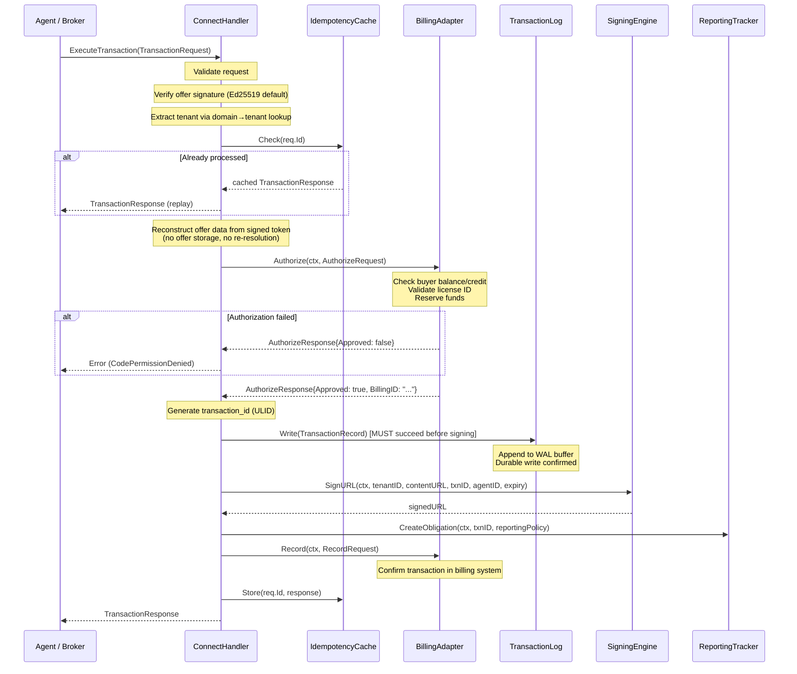
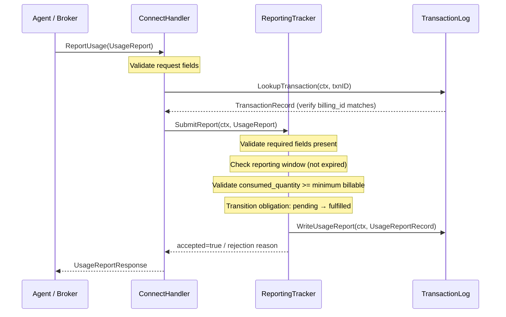
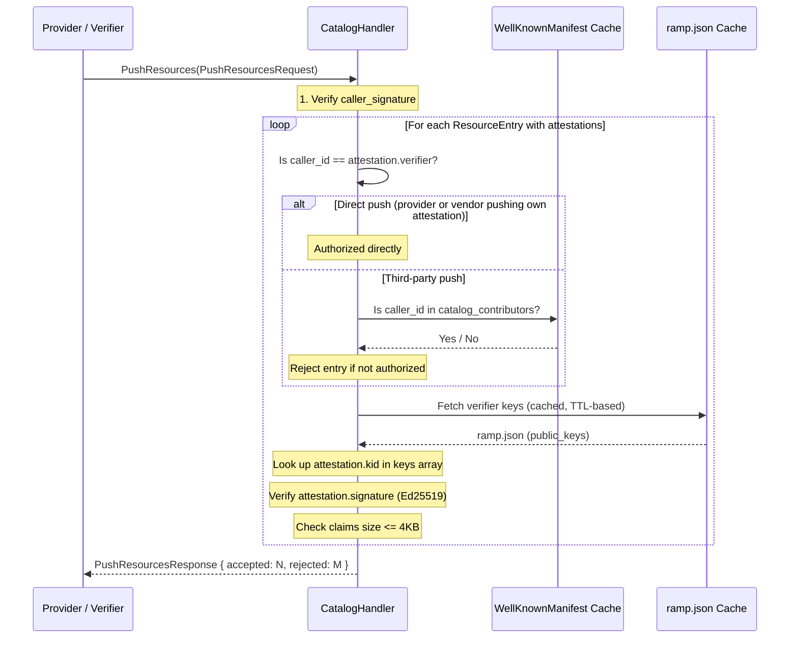
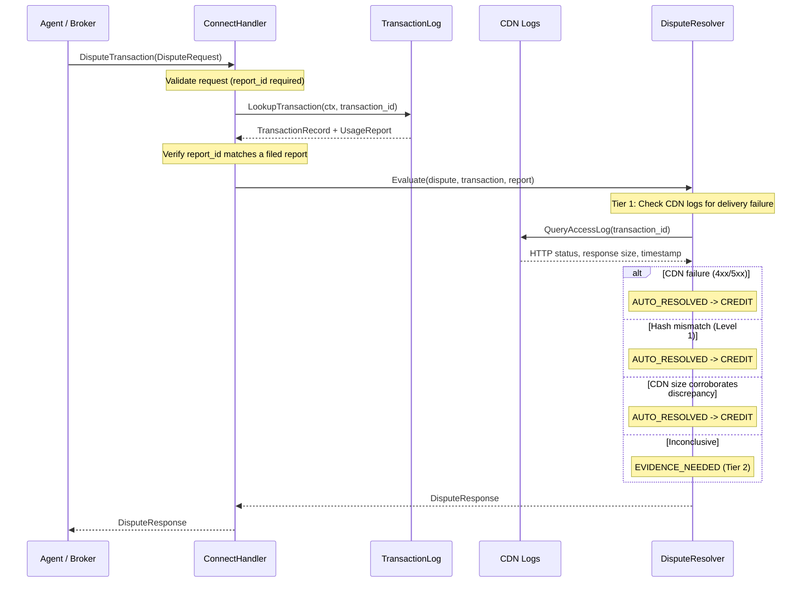

## DiscoverResources

The fastest path. No external I/O. In-memory catalog lookup, offer construction, and response serialization.

```mermaid
sequenceDiagram
    participant Agent as Agent / Broker
    participant Handler as ConnectHandler
    participant SD as SupplyDiscovery
    participant RT as ReportingTracker

    Agent->>Handler: DiscoverResources(ResourceQuery)

    Note over Handler: Validate request (proto validation)
    Note over Handler: Verify Requester.signature (Ed25519 via domain key lookup)
    Note over Handler: Verify IntermediaryHop chain (if present)
    Note over Handler: Extract tenant from ResourceQuery.uris[0] domain
    Note over Handler: (Volumetric rate limiting handled by infra layer — HAProxy/Envoy)

    Handler->>SD: FindOffers(ctx, tenantID, query.uris, requester.scopes)

    Note over SD: Lookup URI(s) in radix trie
    Note over SD: Filter catalog by requester.scopes
    Note over SD: Attach LicenseTerm.restrictions to each Offer<br/>(surfaced on Offer.terms[]; agent self-selects, no server-side filter)
    Note over SD: Build []Offer from templates + live pricing

    SD-->>Handler: []Offer

    Handler->>RT: GetReportingPolicy(ctx, tenantID)
    RT-->>Handler: ReportingObligation (tenant-level default)

    Note over Handler: Attach tenant's ReportingObligation to each Offer<br/>(per-tenant default, rarely overridden per-offer)
    Note over Handler: Ed25519-sign every offer (MANDATORY)
    Note over Handler: Build ResourceResponse

    Handler-->>Agent: ResourceResponse
```

### Handler Implementation

```go
func (h *ExchangeHandler) DiscoverResources(
    ctx context.Context,
    req *connect.Request[rampv1.ResourceQuery],
) (*connect.Response[rampv1.ResourceResponse], error) {
    // 1. Validate
    if err := validate(req.Msg); err != nil {
        return nil, connect.NewError(connect.CodeInvalidArgument, err)
    }

    // 1b. Respect deadline field from ResourceQuery.
    //     If req.Msg.Deadline is set, use it as the context timeout.
    //     If absent, use a 500ms default timeout for the entire handler.
    if req.Msg.Deadline != nil {
        var cancel context.CancelFunc
        ctx, cancel = context.WithTimeout(ctx, req.Msg.Deadline.AsDuration())
        defer cancel()
    } else {
        var cancel context.CancelFunc
        ctx, cancel = context.WithTimeout(ctx, 500*time.Millisecond)
        defer cancel()
    }

    // 2. Verify Requester identity (Ed25519 signature over domain-bound key).
    //    Lookup the requester's public key via {domain}/.well-known/ramp.json.
    //    The Exchange MUST verify the Requester.signature. Reject on failure.
    requester := req.Msg.Requester
    requesterPubKey, err := h.requesterKeys.LookupPublicKey(ctx, requester.Domain)
    if err != nil {
        return nil, connect.NewError(connect.CodeUnauthenticated,
            fmt.Errorf("unknown requester domain: %s", requester.Domain))
    }
    if err := h.verifyRequesterSignature(requester, requesterPubKey); err != nil {
        slog.Warn("requester signature verification failed on DiscoverResources",
            slog.String("requester_id", requester.Id),
            slog.String("domain", requester.Domain),
            slog.Any("error", err),
        )
        return nil, connect.NewError(connect.CodeUnauthenticated, err)
    }

    // 2b. Verify IntermediaryHop chain (if present).
    //     Each hop's signature is verified against {hop.domain}/.well-known/ramp.json.
    //     Timestamps are checked for temporal consistency.
    for i, hop := range req.Msg.Intermediaries {
        hopPubKey, err := h.requesterKeys.LookupPublicKey(ctx, hop.Domain)
        if err != nil {
            return nil, connect.NewError(connect.CodeUnauthenticated,
                fmt.Errorf("unknown intermediary domain at hop %d: %s", i, hop.Domain))
        }
        if err := h.verifyIntermediarySignature(req.Msg, hop, hopPubKey); err != nil {
            slog.Warn("intermediary signature verification failed",
                slog.Int("hop", i),
                slog.String("domain", hop.Domain),
                slog.Any("error", err),
            )
            return nil, connect.NewError(connect.CodeUnauthenticated, err)
        }
    }

    // 2c. Verify Biscuit delegation (if present).
    //     Verifies the Biscuit token chain against the principal's published key.
    if requester.Delegation != nil {
        if err := h.verifyBiscuitDelegation(ctx, requester); err != nil {
            return nil, connect.NewError(connect.CodePermissionDenied, err)
        }
    }

    // 3. Resolve tenant
    tenantCfg, err := h.tenants.ResolveFromURIs(req.Msg.Uris)
    if err != nil {
        return nil, connect.NewError(connect.CodeNotFound, err)
    }

    // 4. Application-level abuse check (optional — volumetric rate limiting is at infra layer)
    // The Exchange MAY return 429 for application-level abuse, e.g., query-to-transaction
    // ratio too low (agent discovering but never buying). Volumetric rate limiting (per-IP,
    // per-tenant RPS caps) belongs in HAProxy/Envoy/API Gateway in front of this service.

    // 5. Catalog lookup (lock-free read, scope-filtered)
    //    The catalog is filtered by requester.scopes — resources outside the
    //    requester's declared scopes are not returned. If a Biscuit delegation
    //    is present, effective scopes are the intersection of requester.scopes
    //    and the delegation's granted scopes.
    effectiveScopes := requester.Scopes
    if requester.Delegation != nil {
        effectiveScopes = intersectScopes(requester.Scopes, requester.Delegation.Scopes)
    }
    offers, err := h.catalog.FindOffers(ctx, tenantCfg.ID, req.Msg.Uris, effectiveScopes)
    if err != nil {
        return nil, connect.NewError(connect.CodeInternal, err)
    }

    // 5b. Check for active subscription.
    //     If the buyer has an active subscription with this tenant, include a
    //     subscription offer variant (rate=0) for each catalog offer with
    //     SubscriptionQuotaInfo attached. Quota enforcement is deferred to
    //     ExecuteTransaction time — DiscoverResources checks subscription status
    //     and populates quota visibility.
    requesterID := requester.Id
    if requester.LicenseId != nil {
        requesterID = *requester.LicenseId
    }
    var subStatus *SubscriptionStatus
    if sub, err := h.billing.CheckSubscription(ctx, requesterID, tenantCfg.ID); err == nil && sub.Active {
        subStatus = sub
    }

    // Build subscription offer variants per catalog offer (if subscription active).
    // Each subscription offer includes SubscriptionQuotaInfo so agents can see
    // remaining quota before committing to a transaction.
    if subStatus != nil {
        var subOffers []*rampv1.Offer
        for _, offer := range offers {
            subOffer := proto.Clone(offer).(*rampv1.Offer)
            subOffer.OfferId = "sub-" + offer.OfferId
            subOffer.SubscriptionId = proto.String(subStatus.SubscriptionID)
            subOffer.Pricing = &rampv1.Pricing{
                Model:           offer.Pricing.Model,
                Rate:            0, // zero marginal cost under subscription
                Currency:        offer.Pricing.Currency,
                UnitCost:          proto.Float64(0),
                EstimatedQuantity: offer.Pricing.EstimatedQuantity,
            }
            // Populate SubscriptionQuotaInfo for proactive quota signaling
            subOffer.SubscriptionQuota = h.billing.GetSubscriptionQuota(
                ctx, subStatus.SubscriptionID, tenantCfg.ID,
            )
            subOffers = append(subOffers, subOffer)
        }
        offers = append(offers, subOffers...)
    }

    // 6. Attach reporting obligations (per-tenant default, not per-offer lookup)
    //    Reporting obligation is set once in tenant config. All offers inherit the
    //    tenant's reporting obligation unless explicitly overridden (rare).
    tenantReporting := h.reporting.GetPolicy(tenantCfg.ID)
    for _, offer := range offers {
        offer.Reporting = tenantReporting
    }

    // 7. Ed25519-sign every offer (MANDATORY — enables stateless ExecuteTransaction)
    //    Ed25519 is the default for offers because agents and Brokers must
    //    verify signatures without holding the signing key. The Exchange signs
    //    with its Ed25519 private key; anyone verifies with the public key.
    for _, offer := range offers {
        sig, err := h.offerSigner.Sign(offer)
        if err != nil {
            return nil, connect.NewError(connect.CodeInternal, err)
        }
        offer.ExchangeSignature = sig
        offer.SignatureAlgorithm = "ed25519"
    }

    // 8. Build response — flat offers or OfferGroups depending on URI count.
    //    When the ResourceQuery contains multiple URIs, return OfferGroups
    //    (one per URI) so the caller knows which offers map to which resource.
    //    When a single URI is queried, use the flat offers field.
    uris := req.Msg.Uris
    if len(uris) > 1 {
        // Batch mode: group offers by requested URI.
        groups := make([]*rampv1.OfferGroup, 0, len(uris))
        for _, uri := range uris {
            var uriOffers []*rampv1.Offer
            for _, offer := range offers {
                if offerMatchesURI(offer, uri) {
                    uriOffers = append(uriOffers, offer)
                }
            }
            groups = append(groups, &rampv1.OfferGroup{
                Uri:    uri,
                Offers: uriOffers, // empty slice = resource not available for this URI
            })
        }
        return connect.NewResponse(&rampv1.ResourceResponse{
            Ver:         "1.0",
            Id:          req.Msg.Id,
            Exchange: h.exchangeDomain,
            OfferGroups: groups,
        }), nil
    }

    return connect.NewResponse(&rampv1.ResourceResponse{
        Ver:         "1.0",
        Id:          req.Msg.Id,
        Exchange: h.exchangeDomain,
        Offers:      offers,
    }), nil
}
```

**IAB Content Taxonomy**: When building offers, the DiscoverResources handler includes `iab_categories` from the catalog entry on each Offer. This enables agents and Brokers to filter offers by topic (e.g., "only finance resources"). Categories use IAB Content Taxonomy 3.1 codes and are populated during resource ingestion — either from RAMP sitemap extensions, CMS metadata, or third-party intelligence providers via CatalogService.

**Latency budget**: 10ms p50, 50ms p99. All in-memory. The only variable is offer count and serialization cost.

### Requester Authentication

Requester authentication uses Ed25519 signatures over a domain-bound key. The `Requester.domain` field determines where the public key is published (`{domain}/.well-known/ramp.json`). The `Requester.id` identifies the specific entity within that domain. The requester's private key never leaves the requester.

**Two onboarding paths:**

1. **Enterprise (out-of-band key exchange)**: During contract signing, the Exchange operator registers the requester's public key via an internal admin API: `POST /admin/requesters { requester_id, domain, public_key, subscription }`. The public key is exchanged out-of-band (email, portal, API) as part of the commercial agreement.

2. **Self-signup (domain verification)**: The requester registers via the public API: `POST /exchange/v1/requesters/register { requester_id, domain }`. The Exchange fetches `/.well-known/ramp.json` from the domain, reads the matching key from `public_keys` (selected by `kid`), and verifies that `requester_id` matches. No subscription is created — self-signup requesters use per-request billing only.

**Requester public key storage:**

```go
type RequesterRecord struct {
    RequesterID   string
    Domain        string
    PublicKey     ed25519.PublicKey
    ManifestURL   string  // {domain}/.well-known/ramp.json
    Subscriptions map[string]SubscriptionStatus  // tenantID -> status
}
```

### Intermediary Chain Verification

When the `intermediaries` field is populated on a `ResourceQuery` or `TransactionRequest`, the Exchange MUST verify the full `IntermediaryHop` chain:

1. **Verify `Requester.signature`** — proves the original requester authorized the request. The Exchange looks up the requester's public key via `{requester.domain}/.well-known/ramp.json` and verifies the Ed25519 signature over `(id, domain, scopes)`.

2. **Verify each `IntermediaryHop.signature`** — proves each intermediary in the chain (e.g., Broker) handled the request. For each hop, the Exchange fetches the public key from `{hop.domain}/.well-known/ramp.json` and verifies the Ed25519 signature. Timestamps (`forwarded_at`) are checked for temporal consistency.

All signatures must pass for the request to proceed. If any verification fails, the Exchange rejects the request with `CodeUnauthenticated`.

When `intermediaries` is empty, the requester is querying the Exchange directly — no intermediary was involved.

```go
// IntermediaryHop chain verification
for i, hop := range req.Msg.Intermediaries {
    hopPubKey, err := h.requesterKeys.LookupPublicKey(ctx, hop.Domain)
    if err != nil {
        return nil, connect.NewError(connect.CodeUnauthenticated,
            fmt.Errorf("unknown intermediary at hop %d: %s", i, hop.Domain))
    }
    if err := h.verifyIntermediarySignature(req.Msg, hop, hopPubKey); err != nil {
        slog.Warn("intermediary signature verification failed",
            slog.Int("hop", i),
            slog.String("domain", hop.Domain),
            slog.Any("error", err),
        )
        return nil, connect.NewError(connect.CodeUnauthenticated, err)
    }
}
```

### Biscuit Delegation Verification

When `Requester.delegation` is present, the Exchange verifies the Biscuit token chain before granting scoped access:

1. Deserialize the base64-encoded `token` from the `Delegation` message
2. Verify the Ed25519 signature chain — authority block signed by `principal_domain`'s published key
3. Evaluate all check conditions (scope restrictions, spend caps, expiration)
4. Extract effective scopes (intersection of requester scopes and delegation scopes)
5. Check `expires_at` against current time
6. Optionally check `revocation_uri` for high-value transactions

See [Authentication](/protocol/authentication/) for the full Biscuit delegation model.

### Provider Trust Verification

The Exchange SHOULD periodically re-fetch `/.well-known/ramp.json` for each tenant's domains to confirm the provider still authorizes this Exchange to sell their resources. If the Exchange is removed from a provider's `ramp.json`:

- Revoke the tenant configuration
- Stop serving offers for that provider's resources
- Log the revocation for audit

This is ongoing verification, not just onboarding. Providers can revoke authorization at any time by updating their `ramp.json`. The Exchange SHOULD check at least once per hour (configurable via tenant settings).

---

## ExecuteTransaction

The critical path. Stateless offer verification — no offer storage or re-resolution. Sequential pipeline: validate -> verify offer signature (Ed25519 default) -> check idempotency -> authorize billing -> write transaction log -> sign URL -> respond.



**Critical ordering invariant**: The transaction log write MUST complete successfully before the Signing Engine generates the signed URL. If the transaction log write fails, the request is rejected — no signed URL is ever issued for an unrecorded transaction. This is the "write-before-sign" rule from the NFR document.

### Handler Implementation

```go
func (h *ExchangeHandler) ExecuteTransaction(
    ctx context.Context,
    req *connect.Request[rampv1.TransactionRequest],
) (*connect.Response[rampv1.TransactionResponse], error) {
    // 1. Validate
    if err := validate(req.Msg); err != nil {
        return nil, connect.NewError(connect.CodeInvalidArgument, err)
    }

    // 2. Verify Requester identity (Ed25519 signature over domain-bound key).
    requester := req.Msg.Requester
    requesterPubKey, err := h.requesterKeys.LookupPublicKey(ctx, requester.Domain)
    if err != nil {
        return nil, connect.NewError(connect.CodeUnauthenticated,
            fmt.Errorf("unknown requester domain: %s", requester.Domain))
    }
    if err := h.verifyRequesterSignature(requester, requesterPubKey); err != nil {
        slog.Warn("requester signature verification failed on ExecuteTransaction",
            slog.String("requester_id", requester.Id),
            slog.String("domain", requester.Domain),
            slog.Any("error", err),
        )
        return nil, connect.NewError(connect.CodeUnauthenticated, err)
    }

    // 3. Idempotency check
    if cached, ok := h.idempotency.Get(req.Msg.Id); ok {
        return connect.NewResponse(cached), nil
    }

    // 3b. Batch mode: if `items` is populated, process each item individually.
    if len(req.Msg.Items) > 0 {
        return h.executeBatchTransaction(ctx, req)
    }

    // 4. Verify offer signature and reconstruct offer data (stateless — no offer storage)
    offer, err := h.offerSigner.VerifyAndDecode(req.Msg.OfferId, req.Msg.OfferSignature, req.Msg.OfferSignatureAlgorithm)
    if err != nil {
        denial := rampv1.DenialReason_DENIAL_REASON_SIGNATURE_INVALID
        return connect.NewResponse(&rampv1.TransactionResponse{
            Ver: "1.0", Id: req.Msg.Id, DenialReason: &denial,
        }), nil
    }

    // Resolve tenant from offer's domain (domain→tenant lookup, not prefix parsing)
    tenantCfg, err := h.tenants.ResolveFromDomain(offer.Domain)
    if err != nil {
        denial := rampv1.DenialReason_DENIAL_REASON_CONTENT_UNAVAILABLE
        return connect.NewResponse(&rampv1.TransactionResponse{
            Ver: "1.0", Id: req.Msg.Id, DenialReason: &denial,
        }), nil
    }

    // 4a. Check reporting obligations (reject if requester has overdue reports)
    if blocked, reason := h.reporting.CheckBuyerCompliance(ctx, requester.Id); blocked {
        slog.Warn("requester blocked for overdue reporting",
            slog.String("requester_id", requester.Id),
            slog.String("domain", requester.Domain),
            slog.String("reason", reason),
        )
        denial := rampv1.DenialReason_DENIAL_REASON_REPORTING_OVERDUE
        return connect.NewResponse(&rampv1.TransactionResponse{
            Ver: "1.0", Id: req.Msg.Id, DenialReason: &denial,
        }), nil
    }

    // 5. Authorize billing.
    if offer.SubscriptionId != nil {
        authResp := &BillingAuthorizeResponse{
            Approved:  true,
            BillingID: "sub-" + ulid.Make().String(),
        }
        return h.completeTransaction(ctx, req, offer, tenantCfg, authResp, 0)
    }

    requesterLicenseID := requester.Id
    if requester.LicenseId != nil {
        requesterLicenseID = *requester.LicenseId
    }
    authResp, err := h.billing.Authorize(ctx, &BillingAuthorizeRequest{
        BuyerLicenseID: requesterLicenseID,
        Amount:         offer.Pricing.Rate,
        Currency:       offer.Pricing.Currency,
        OfferID:        req.Msg.OfferId,
        TenantID:       tenantCfg.ID,
    })
    if err != nil {
        slog.Error("billing authorization failed",
            slog.String("offer_id", req.Msg.OfferId),
            slog.String("tenant_id", tenantCfg.ID),
            slog.Any("error", err),
        )
        return nil, billingErrToConnect(err)
    }
    if !authResp.Approved {
        slog.Warn("billing authorization denied",
            slog.String("offer_id", req.Msg.OfferId),
            slog.String("reason", authResp.Reason),
        )
        denial := txnErrToDenialReason(fmt.Errorf("%w: %s", ErrBillingDenied, authResp.Reason))
        return connect.NewResponse(&rampv1.TransactionResponse{
            Ver: "1.0", Id: req.Msg.Id, DenialReason: &denial,
        }), nil
    }

    // 6. Generate transaction ID and compute requester identity hash
    txnID := ulid.Make().String()
    agentHash := sha256Hex(requester.Id + ":" + requester.Domain)

    // 7. Write transaction log (MUST succeed before signing)
    record := &TransactionRecord{
        TransactionID:     txnID,
        BillingID:         authResp.BillingID,
        OfferID:           req.Msg.OfferId,
        TenantID:          tenantCfg.ID,
        BuyerLicense:      requesterLicenseID,
        AgentIdentityHash: agentHash,
        Amount:            offer.Pricing.Rate,
        Currency:          offer.Pricing.Currency,
        UnitCost:          derefFloat64(offer.Pricing.UnitCost),
        OfferSnapshotJSON:  marshalOfferSnapshot(offer),
        DeliveryMethod:    offer.DeliveryMethod,
        ReportingRequired: tenantCfg.ReportingPolicy.GetRequired(),
        RequestID:         req.Msg.Id,
        CreatedAt:         time.Now().UTC(),
    }
    if err := h.txLog.Write(ctx, record); err != nil {
        slog.Error("transaction log write failed",
            slog.String("txn_id", txnID),
            slog.String("billing_id", authResp.BillingID),
            slog.Any("error", err),
        )
        if releaseErr := h.billing.Release(ctx, authResp.BillingID); releaseErr != nil {
            slog.Error("billing release after txlog failure also failed",
                slog.String("billing_id", authResp.BillingID),
                slog.Any("error", releaseErr),
            )
        }
        return nil, connect.NewError(connect.CodeInternal,
            fmt.Errorf("transaction log write failed: %w", err))
    }

    // 8. Sign URL (only after durable log write)
    signedURL, err := h.signer.SignURL(ctx, tenantCfg.ID, SignRequest{
        ContentURL:    tenantCfg.ContentBaseURL + offer.ContentPath,
        TransactionID: txnID,
        AgentIdentity: sha256Hex(requester.Id + ":" + requester.Domain),
        Expiry:        tenantCfg.URLTTLOrDefault(5 * time.Minute),
    })
    if err != nil {
        slog.Error("URL signing failed",
            slog.String("txn_id", txnID),
            slog.String("tenant_id", tenantCfg.ID),
            slog.Any("error", err),
        )
        return nil, connect.NewError(connect.CodeInternal,
            fmt.Errorf("URL signing failed: %w", err))
    }

    // 9. Create reporting obligation
    h.reporting.CreateObligation(ctx, txnID, tenantCfg.ReportingPolicy)

    // 10. Record in billing (async-safe — transaction is already logged)
    if err := h.billing.Record(ctx, &BillingRecordRequest{
        BillingID:     authResp.BillingID,
        TransactionID: txnID,
        Amount:        offer.Pricing.Rate,
        Currency:      offer.Pricing.Currency,
    }); err != nil {
        slog.Error("billing record failed",
            slog.String("txn_id", txnID),
            slog.String("billing_id", authResp.BillingID),
            slog.Any("error", err),
        )
    }

    // 11. Build response
    resp := &rampv1.TransactionResponse{
        Ver:           "1.0",
        Id:            req.Msg.Id,
        TransactionId: txnID,
        BillingId:     authResp.BillingID,
        Package:       buildDeliveryPackage(offer, signedURL),
        Cost: &rampv1.Cost{
            Amount:   offer.Pricing.Rate,
            Currency: offer.Pricing.Currency,
            UnitCost: offer.Pricing.UnitCost,
        },
        DeliveryMethod:      offer.DeliveryMethod,
        ReportingObligation: tenantCfg.ReportingPolicy,
        ExpiresAt:           timestamppb.New(time.Now().Add(tenantCfg.URLTTLOrDefault(5 * time.Minute))),
        AgentIdentityHash:   agentHash,
    }

    // 11b. For subscription transactions, attach subscription_unit_value
    if offer.SubscriptionId != nil {
        resp.SubscriptionId = offer.SubscriptionId
        resp.SubscriptionUnitValue = &rampv1.Cost{
            Amount:   offer.OriginalRate,
            Currency: offer.Pricing.Currency,
            UnitCost: offer.Pricing.UnitCost,
        }
    }

    // 12. Cache for idempotency
    h.idempotency.Set(req.Msg.Id, resp, 10*time.Minute)

    return connect.NewResponse(resp), nil
}
```

**Latency budget**: 20ms p50, 100ms p99. The billing adapter authorization (5ms p50) and transaction log write (1-2ms p50 for local WAL) dominate.

### Batch ExecuteTransaction

When `TransactionRequest.items` is populated, the Exchange processes each item independently. Batch transactions are **NOT atomic** — individual items can fail (signature invalid, resource unavailable, billing denied) while others succeed. Each `TransactionResultItem` carries its own `denial_reason`.

```go
func (h *ExchangeHandler) executeBatchTransaction(
    ctx context.Context,
    req *connect.Request[rampv1.TransactionRequest],
) (*connect.Response[rampv1.TransactionResponse], error) {
    requester := req.Msg.Requester
    agentHash := sha256Hex(requester.Id + ":" + requester.Domain)
    requesterLicenseID := requester.Id
    if requester.LicenseId != nil {
        requesterLicenseID = *requester.LicenseId
    }
    var resultItems []*rampv1.TransactionResultItem
    var totalAmount float64
    var currency string

    for _, item := range req.Msg.Items {
        resultItem := &rampv1.TransactionResultItem{OfferId: item.OfferId}

        // 1. Verify offer signature (per item)
        offer, err := h.offerSigner.VerifyAndDecode(item.OfferId, item.OfferSignature, item.OfferSignatureAlgorithm)
        if err != nil {
            denial := rampv1.DenialReason_DENIAL_REASON_SIGNATURE_INVALID
            resultItem.DenialReason = &denial
            resultItems = append(resultItems, resultItem)
            continue
        }

        tenantCfg, err := h.tenants.ResolveFromDomain(offer.Domain)
        if err != nil {
            denial := rampv1.DenialReason_DENIAL_REASON_CONTENT_UNAVAILABLE
            resultItem.DenialReason = &denial
            resultItems = append(resultItems, resultItem)
            continue
        }

        // 2. Authorize billing (per item) — skip for subscription offers
        var billingID string
        var amount float64
        if offer.SubscriptionId != nil {
            billingID = "sub-" + ulid.Make().String()
            amount = 0
            resultItem.SubscriptionId = proto.String(*offer.SubscriptionId)
            resultItem.SubscriptionUnitValue = &rampv1.Cost{
                Amount:   offer.OriginalRate,
                Currency: offer.Pricing.Currency,
                UnitCost: offer.Pricing.UnitCost,
            }
        } else {
            authResp, err := h.billing.Authorize(ctx, &BillingAuthorizeRequest{
                BuyerLicenseID: requesterLicenseID,
                Amount:         offer.Pricing.Rate,
                Currency:       offer.Pricing.Currency,
                OfferID:        item.OfferId,
                TenantID:       tenantCfg.ID,
            })
            if err != nil || !authResp.Approved {
                denial := txnErrToDenialReason(err)
                resultItem.DenialReason = &denial
                resultItems = append(resultItems, resultItem)
                continue
            }
            billingID = authResp.BillingID
            amount = offer.Pricing.Rate
        }

        // 3. Write transaction log (per item — WAL invariant applies per item)
        txnID := ulid.Make().String()
        record := &TransactionRecord{
            TransactionID: txnID, BillingID: billingID,
            OfferID: item.OfferId, TenantID: tenantCfg.ID,
            BuyerLicense: requesterLicenseID,
            Amount: amount, Currency: offer.Pricing.Currency,
        }
        if err := h.txLog.Write(ctx, record); err != nil {
            slog.Error("batch item txlog write failed", slog.String("offer_id", item.OfferId), slog.Any("error", err))
            denial := rampv1.DenialReason_DENIAL_REASON_CONTENT_UNAVAILABLE
            resultItem.DenialReason = &denial
            resultItems = append(resultItems, resultItem)
            continue
        }

        // 4. Sign URL (per item, only after durable log write)
        signedURL, err := h.signer.SignURL(ctx, tenantCfg.ID, SignRequest{
            ContentURL: tenantCfg.ContentBaseURL + offer.ContentPath,
            TransactionID: txnID, AgentIdentity: agentHash,
            Expiry: tenantCfg.URLTTLOrDefault(5 * time.Minute),
        })
        if err != nil {
            slog.Error("batch item URL signing failed", slog.String("txn_id", txnID), slog.Any("error", err))
            denial := rampv1.DenialReason_DENIAL_REASON_CONTENT_UNAVAILABLE
            resultItem.DenialReason = &denial
            resultItems = append(resultItems, resultItem)
            continue
        }

        // 5. Create reporting obligation (per item)
        h.reporting.CreateObligation(ctx, txnID, tenantCfg.ReportingPolicy)

        resultItem.TransactionId = txnID
        resultItem.BillingId = billingID
        resultItem.Package = buildDeliveryPackage(offer, signedURL)
        resultItem.Cost = &rampv1.Cost{Amount: amount, Currency: offer.Pricing.Currency}
        resultItem.ExpiresAt = timestamppb.New(time.Now().Add(tenantCfg.URLTTLOrDefault(5 * time.Minute)))
        resultItems = append(resultItems, resultItem)

        totalAmount += amount
        currency = offer.Pricing.Currency
    }

    resp := &rampv1.TransactionResponse{
        Ver:               "1.0",
        Id:                req.Msg.Id,
        Items:             resultItems,
        TotalCost:         &rampv1.Cost{Amount: totalAmount, Currency: currency},
        AgentIdentityHash: agentHash,
    }

    h.idempotency.Set(req.Msg.Id, resp, 10*time.Minute)
    return connect.NewResponse(resp), nil
}
```

**Atomicity note**: Batch transactions are best-effort per item. The Exchange processes items sequentially within a batch. If item 3 of 5 fails billing authorization, items 1-2 are already committed (signed URLs issued) and items 4-5 continue processing. The caller MUST check each `TransactionResultItem.denial_reason` to determine which items succeeded. This non-atomic model is deliberate: it matches how programmatic resource access handles multi-slot requests.

### Partial Failure Handling

The ExecuteTransaction pipeline has multiple steps that can fail independently:

| Step Failed | Already Done | Action |
|---|---|---|
| Validation | Nothing | Return `CodeInvalidArgument` |
| Offer signature verification | Nothing | Return `CodeInvalidArgument` |
| Billing Authorize | Nothing | Return per timeout policy (sentinel errors) |
| Transaction log write | Billing authorized | Release billing hold, return `CodeInternal` |
| URL signing | Billing authorized + log written | Log error, return `CodeInternal` (txn recorded as failed) |
| Reporting obligation create | Billing + log + URL | Log warning, continue (non-critical) |
| Billing Record | Billing + log + URL | Log warning, continue (reconciliation catches) |

The key invariant: if the transaction log write fails, no signed URL is ever issued. If the signed URL generation fails, the transaction is recorded as failed for reconciliation.

---

## ReportUsage

Lower-latency path. Validates report against recorded obligation, updates state, persists.



```go
func (h *ExchangeHandler) ReportUsage(
    ctx context.Context,
    req *connect.Request[rampv1.UsageReport],
) (*connect.Response[rampv1.UsageReportResponse], error) {
    // 1. Validate
    if err := validate(req.Msg); err != nil {
        return nil, connect.NewError(connect.CodeInvalidArgument, err)
    }

    // 2. Verify transaction exists and billing_id matches
    txn, err := h.txLog.Lookup(ctx, req.Msg.TransactionId)
    if err != nil {
        return nil, connect.NewError(connect.CodeNotFound,
            fmt.Errorf("transaction %s not found", req.Msg.TransactionId))
    }
    if txn.BillingID != req.Msg.BillingId {
        return nil, connect.NewError(connect.CodeInvalidArgument,
            fmt.Errorf("billing_id mismatch"))
    }

    // 3. Submit to reporting tracker
    result, err := h.reporting.SubmitReport(ctx, req.Msg, txn)
    if err != nil {
        return nil, connect.NewError(connect.CodeInternal, err)
    }

    return connect.NewResponse(&rampv1.UsageReportResponse{
        Accepted:        result.Accepted,
        RejectionReason: result.Reason,
    }), nil
}
```

**Latency budget**: 5ms p50, 20ms p99. Transaction lookup is a key-value read. Report write is appended to the same WAL as transactions.

---

## Attestation Verification at Catalog Push

When `CatalogService.PushResources` includes attestations, the Exchange performs additional verification before accepting entries into the resource catalog.



**Rejection reasons**: `SIGNATURE_INVALID`, `UNAUTHORIZED_CONTRIBUTOR`, `ATTESTATION_SIGNATURE_INVALID`, `UNKNOWN_VERIFIER`, `CLAIMS_TOO_LARGE`.

See [Content Attestation](/protocol/content-attestation/) for the full attestation system design.

---

## DisputeTransaction

The dispute path handles post-delivery resource complaints. Agents must file a `UsageReport` before disputing -- `DisputeRequest.report_id` is required.



**Tier 1 resolution** completes in under 1 second using CDN access logs as the authoritative evidence source. CDN logs are infrastructure-level records that neither party controls, making them the most trustworthy evidence in the hierarchy.

See [Dispute Resolution](/protocol/dispute-resolution/) for the three-tier resolution system and abuse prevention.
