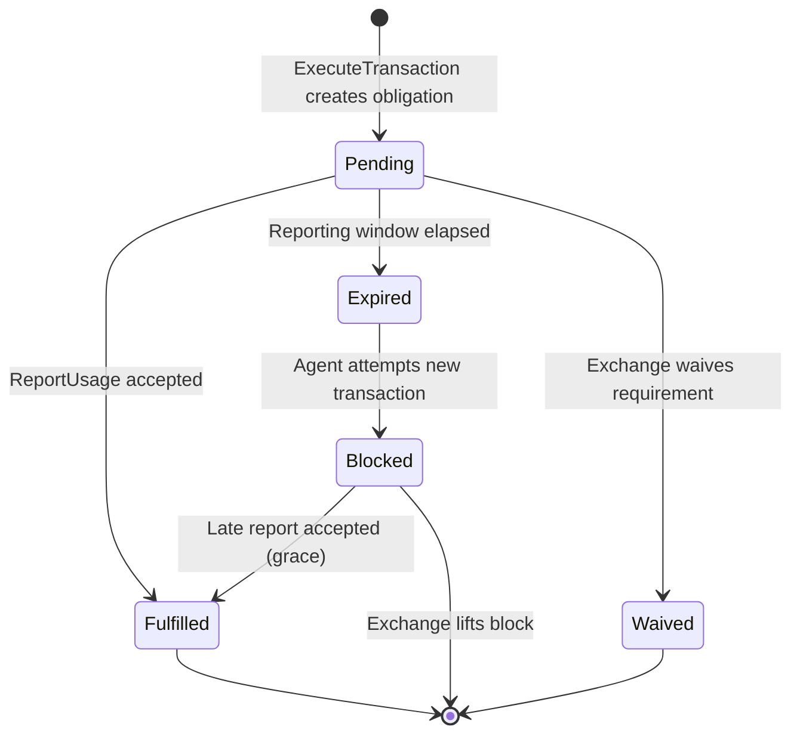

## Content Catalog (In-Memory)

The catalog is the hot data structure. It must support fast lookup by URI (exact match and prefix/glob), with each entry carrying its license terms and per-term restrictions.

**Data structure**: Radix trie (compressed trie) keyed by URI path, per tenant.

```go
// Catalog holds the in-memory resource catalog for all tenants.
// Loaded from pre-built serialized binary produced by the ingestion pipeline.
// Reads are lock-free via atomic pointer swap on reload.
type Catalog struct {
    // Current catalog snapshot. Replaced atomically when new serialized binary is loaded.
    current atomic.Pointer[CatalogSnapshot]
}

// CatalogSnapshot is an immutable point-in-time view of all tenant catalogs.
type CatalogSnapshot struct {
    // Per-tenant catalog. Key is tenant ID.
    Tenants map[string]*TenantCatalog

    // When this snapshot was built.
    BuiltAt time.Time

    // Source hashes used to build this snapshot (for diff detection).
    // Tracks all input sources (rsl.txt, sitemap, robots.txt, etc.), not just RSL.
    SourceHashes map[string]string // tenant ID -> SHA-256 of combined source inputs
}

// TenantCatalog holds a single provider's content offers.
type TenantCatalog struct {
    TenantID string

    // Radix trie for URI-based lookup.
    // Keys are normalized URI paths (e.g., "/premium/ai-infrastructure.html").
    // Values are OfferTemplates.
    //
    // Supports:
    //   - Exact match: "/premium/article-123.html"
    //   - Prefix match: "/premium/*" (glob from RSL)
    //   - Longest prefix wins (radix trie property)
    URIIndex *radixtree.Tree[*OfferTemplate]

    // Glob matchers for pattern-based URI matching (e.g., "/blog/*/comments").
    // Evaluated after trie lookup when no exact/prefix match is found.
    GlobMatchers []GlobMatcher

    // All offer templates for enumeration (e.g., broad DiscoverResources queries).
    AllOffers []*OfferTemplate

    // Default for paths matching no entry: whether the tenant serves them
    // openly or blocks AI access. Tenant-local config, NOT a wire type — a path
    // is "licensed" exactly when it has a catalog entry carrying LicenseTerms.
    BlockUnmatched bool
}

// OfferTemplate is the pre-computed offer skeleton. Pricing and identity
// fields are populated at RSL ingestion time. Per-request fields (offer_id,
// expiry) are filled at query time.
type OfferTemplate struct {
    // Content metadata (from RSL + provider config).
    ContentPath   string
    Package       *compv1.Package
    Pricing       *rampv1.Pricing
    Identity      *rampv1.ResourceIdentity
    // License terms carried on the offer. Each LicenseTerm carries
    // repeated Restriction (kinds: FUNCTION, GEOGRAPHY, USER_TYPE, ...).
    // Surfaced on Offer.terms[] for the agent to self-select; not a
    // server-side filter.
    Terms         []*rampv1.LicenseTerm
    DeliveryMethod rampv1.DeliveryMethod
}
```

**Memory estimate**: Each OfferTemplate is ~500 bytes per entry (Package metadata + pricing + identity). A large provider with 100K articles = ~50 MB per tenant. 100 tenants = 5 GB. Fits in a modern server's RAM. For providers with millions of articles, the trie compresses well because URLs share path prefixes.

**Trie loading**: The ingestion pipeline (background process) builds and serializes the radix trie to a binary file. The Exchange process loads the pre-built binary via atomic pointer swap -- the Exchange NEVER builds the trie itself. See the Content Ingestion Pipeline design doc for the serialization format and pipeline details. Loading a pre-built binary for 100K entries takes &lt;100ms. During loading, the old catalog continues serving.

---

## Transaction Log (Append-Only, Durable)

The transaction log is the most critical data store. Every transaction that produces a billing_id must be durably recorded before the signed URL is returned.

**Write path**: Local WAL (write-ahead log) buffer -> batch flush to durable store.

```go
// TransactionRecord is the durable record written for every ExecuteTransaction.
type TransactionRecord struct {
    // Primary key — ULID, time-ordered.
    TransactionID string `json:"transaction_id"`

    // Billing reference for settlement.
    BillingID string `json:"billing_id"`

    // What was purchased.
    OfferID    string `json:"offer_id"`
    TenantID   string `json:"tenant_id"`
    ContentURI string `json:"content_uri"`

    // Who purchased.
    BillingRef string `json:"billing_ref"` // Last 8 chars only in logs
    AgentName  string `json:"agent_name"`

    // Financials.
    Amount   float64 `json:"amount"`
    Currency string  `json:"currency"`
    UnitCost float64 `json:"unit_cost,omitempty"`

    // Idempotency. Stores the DERIVED per-item key —
    // TransactionRequest.idempotency_key + ":" + offer_id — so each item of a
    // multi-item batch dedupes independently and a replay returns the original
    // record. Derived unconditionally, single-item requests included; the
    // request-level key alone is never stored here. This is the durable dedupe
    // key, NOT the wire correlation id — request/response correlation rides
    // the X-Request-ID HTTP header.
    IdempotencyKey string `json:"idempotency_key"`
    Broker string `json:"broker,omitempty"`

    // Offer snapshot (serialized JSON of the offer at transaction time).
    // Enables audit queries without reconstructing from a potentially changed catalog.
    OfferSnapshotJSON string `json:"offer_snapshot_json"`

    // Agent identity hash (RFC 7638 JWK Thumbprint of the agent's Ed25519 key). Non-optional string, not pointer.
    AgentIdentityHash string `json:"agent_identity_hash"`

    // Delivery metadata.
    DeliveryMethod    string `json:"delivery_method"`
    ReportingRequired bool   `json:"reporting_required"`
    ReportingDeadline time.Time `json:"reporting_deadline,omitempty"`

    // Chain hash for tamper-evident audit log.
    ChainHash string `json:"chain_hash"`

    // Signed URL metadata (for reconciliation with CDN logs). Both are
    // pointers, and the columns behind them are nullable, because a
    // DELIVERY_METHOD_DIRECT transaction mints no signed URL: there is
    // nothing to hash and nothing to expire. A value type cannot tell that
    // apart from a minted URL recorded as "" or as the zero time, and the
    // operator plane states the absence as a fact (both fields are optional
    // on ramp.admin.v1.TransactionState). The two are written together or
    // not at all.
    //
    // SignedURLHash is lowercase hex SHA-256 of the full issued URL, query
    // string included — the encoding the transaction-log contract defines.
    SignedURLHash *string    `json:"signed_url_hash,omitempty"`
    URLExpiresAt  *time.Time `json:"url_expires_at,omitempty"`

    // Timestamps.
    CreatedAt time.Time `json:"created_at"`
}
```

**Local WAL**: A pre-allocated file on local SSD. Writes are fdatasync'd in batches (every 50ms or 100 records, whichever comes first). Each WAL entry is length-prefixed + CRC32 checksummed. This gives sub-millisecond append latency with crash safety.

### Durable Store Options

| Store | Throughput | Latency | Cost at 10K RPS | Notes |
|---|---|---|---|---|
| **S3 + Parquet** (hourly roll) | Unlimited | N/A (batch) | ~$2/day | Best for archival. Queryable via Athena. |
| **Kafka / Redpanda** | 100K+ msg/s | &lt;5ms | ~$20/day | Best for real-time streaming to analytics. |
| **ClickHouse** | 100K+ inserts/s | &lt;10ms | ~$15/day | Best for ad-hoc queries on transaction data. |
| **DynamoDB** | 10K WCU | &lt;10ms | ~$50/day | Simplest. Higher cost. |

**Recommended**: Local WAL + Kafka for streaming + S3/Parquet for archival. The WAL provides crash safety; Kafka provides real-time fanout to billing reconciliation, analytics, and S3 archival consumers.

**Retention**: 13 months minimum per NFR. S3 lifecycle policy moves to Glacier after 3 months.

### Offer Snapshot in Transaction Records

The transaction record includes a full offer snapshot (offer_id, package.id, package.title, pricing details, content identity) serialized as JSON. This is the "fulfilled order receipt" — approximately 500 bytes extra per event, negligible at any tier. The audit chain is: ResourceQuery -> Offers presented -> Transaction authorized -> Signed URL issued (with offer snapshot) -> Usage reported. The snapshot enables audit queries like "what exactly was promised in transaction X?" without reconstructing from the catalog, which may have changed since the transaction occurred.

### Growth Tier: PostgreSQL

For Growth tier (100-1K RPS), PostgreSQL with daily partitions provides sufficient write throughput with strong durability guarantees.

```sql
-- Daily partitioned transaction log (append-only)
CREATE TABLE transactions (
    transaction_id TEXT NOT NULL,
    billing_id     TEXT NOT NULL,
    offer_id       TEXT NOT NULL,
    tenant_id      TEXT NOT NULL,
    content_uri    TEXT NOT NULL,
    billing_ref    TEXT NOT NULL,
    amount         NUMERIC(12,6) NOT NULL,
    currency       TEXT NOT NULL,
    created_at     TIMESTAMPTZ NOT NULL DEFAULT NOW()
) PARTITION BY RANGE (created_at);

-- Daily partitions auto-created by pg_partman or cron
CREATE TABLE transactions_2026_03_15 PARTITION OF transactions
    FOR VALUES FROM ('2026-03-15') TO ('2026-03-16');

-- Append-only enforcement
REVOKE UPDATE, DELETE ON transactions FROM exchange_app;
```

**Dedupe scope of `idempotency_key`**: the protocol requires that a key chosen by one caller can never collide with another caller's cached result, so dedupe happens inside a namespace and never globally. For `ExecuteTransaction` that namespace is the acceptance identity, which means the uniqueness constraint must be **composite** — over `(agent_identity_hash, idempotency_key)`, never over `idempotency_key` alone. `agent_identity_hash` is derived from the key that signed the offer acceptance, not from the transport caller, so the scoping holds even when a Broker relays many agents over one transport key.

The DDL above does not spell the constraint out, because a PostgreSQL UNIQUE on a partitioned table must include the partition key. Enforce it per partition, or in a separate non-partitioned dedupe table keyed on the pair; the requirement is the namespace, not the mechanism.

:::caution[Known divergence]
The reference Exchange currently deploys a **global** UNIQUE on `idempotency_key` alone. A second agent presenting a key the first agent already used is refused by the replay ownership gate rather than deduped in its own namespace, so the observable failure is denial of service across callers, not a leak of another caller's result. Keys are client-chosen UUIDs, so accidental collision is unlikely and squatting requires guessing a key. The composite form described above is the conforming one, and moving the reference Exchange to it is tracked separately.
:::

**Volume estimate at 1K RPS**: ~86M records/day, ~1 KB/record = ~86 GB/day uncompressed, ~30 GB/day with PostgreSQL TOAST compression. Daily partition drop after export keeps disk usage bounded.

**Export to S3 Parquet**: A nightly job exports each day's partition to S3 as Parquet files for long-term analytics. Queryable via Athena or Trino.

**Monitoring**: Grafana dashboards on Prometheus metrics exported by `pg_stat_statements` and custom transaction counters. Key panels: transactions/second, p99 write latency, partition size, WAL lag.

### Scale Tier: ClickHouse

For Scale tier (10K+ RPS), ClickHouse replaces PostgreSQL as the transaction log store. ClickHouse's columnar storage and append-optimized MergeTree engine handle 100K+ inserts/second.

The local WAL + Kafka architecture feeds ClickHouse as a Kafka consumer. ClickHouse is the analytical store; the local WAL remains the durability guarantee for the write-before-sign invariant.

---

## Transaction Evidence (Append-Once, Durable)

The evidence store is a **separate store from the transaction log**, written on the same request path. The transaction log is the settlement and analytics stream; the evidence store holds the offline-verifiable proof of what the two parties agreed to. One row is written per successfully executed transaction, at the service boundary, after both Ed25519 signatures have verified. A denied execute writes no row, so the existence of a row is itself the success statement.

The row is **append-once**: written once during `ExecuteTransaction`, then never updated and never deleted before its retention limit. Enforce that the same way the transaction log does — `REVOKE UPDATE, DELETE` on the table. Its only read path is the operator plane's `GetTransactionEvidence` RPC.

**What the row holds.** Each of the two signatures is stored together with the verbatim canonical bytes it was computed over and the public key it verifies against, so a reader can re-verify the row offline without contacting the Exchange and without re-deriving anything. The row also holds the selector columns (`tenant_id`, `transaction_id`, `offer_id`), the request-level idempotency key the acceptance signed, the requester identity as signed, the directory URL the Exchange states it pinned the agent key from, the correlation pair described below, and the server-clock write time.

The column-by-column listing is `ramp.admin.v1.TransactionEvidence` in [Proto: Admin v1](/reference/proto-admin/). The admin read returns the row **as persisted**, so that message is the column list, and this page deliberately does not restate it — a second hand-maintained copy would drift from the wire contract with nothing to catch it.

One name to read carefully across the two stores: `request_idempotency_key` on the evidence row is the **request-level** key the acceptance signed, while the transaction log stores the **derived per-item** key (`request key + ":" + offer_id`). The two are never byte-equal, so joining the stores on an idempotency key means deriving the per-item form first.

**Storage**: evidence rows share the durable store used for transaction records (PostgreSQL for Growth tier, ClickHouse for Scale tier). They must be indexed on `(tenant_id, transaction_id)` — the pair the admin read selects on. Retention must be at least the transaction log's 13 months, because this row is the proof behind any dispute filed against that transaction.

### The correlation pair

**The evidence store is where the request correlation id is persisted.** Two columns carry it:

| Column | Type | Meaning |
|---|---|---|
| `request_id` | nullable text | The `X-Request-ID` of the execute request, as recorded. |
| `request_id_minted` | nullable boolean | `true` = server-minted, because the header was absent; `false` = propagated verbatim from the caller. |

**The two are present together or absent together.** A row with one column set and the other null is invalid, and the store enforces this with a table constraint rather than leaving it to application code. The provenance flag is load-bearing: a propagated id is caller-influenceable and a minted one is not, and the id value alone cannot tell the two apart.

The pair is written **once**, at the service boundary during `ExecuteTransaction`, from the header the request arrived with. The Exchange records a correlation only when the received value conforms to the shape the admin plane can replay into a rendered ledger (printable ASCII, 1 to 255 characters). A nonconforming header value is recorded as *no correlation* — both columns stay null — instead of being stored and echoed back later.

**The transaction log holds no correlation column.** Its `IdempotencyKey` is a durable dedupe key and nothing else; correlation rides the `X-Request-ID` HTTP header and is persisted only here. That split is exactly what the admin plane encodes by placing `RequestCorrelation` on `TransactionEvidence` and not on `TransactionState`.

**This is not the same key as `query_id`.** The `ResourceQueryReceived` event records a `query_id`, which is the `X-Request-ID` of a *discovery* request. The evidence row's `request_id` is the `X-Request-ID` of an *execute* request. Different legs of the exchange, different requests, different values — they must not be joined against each other or read as one correlation chain. The evidence-plane id joins outward to the edge delivery log and the reconciliation sweep.

---

## Reporting Obligations (State Machine)

Each transaction that carries a ReportingObligation creates an obligation record. The obligation tracks whether the agent fulfilled its reporting duty.



```go
// ObligationState tracks a single reporting obligation.
type ObligationState int

const (
    ObligationPending   ObligationState = iota // Created, awaiting report
    ObligationFulfilled                        // Report received and accepted
    ObligationExpired                          // Window elapsed, no report
    ObligationWaived                           // Exchange waived requirement
    ObligationBlocked                          // Agent blocked for non-reporting
)

// Obligation is the per-transaction reporting obligation record.
type Obligation struct {
    TransactionID  string
    TenantID       string
    BillingRef     string
    State          ObligationState
    RequiredFields []string
    WindowEnd      time.Time       // Deadline for report submission
    CreatedAt      time.Time
    FulfilledAt    *time.Time      // When report was accepted
    ReportID       string          // ID of the accepted report
}
```

**Storage**: Obligations are stored in the same durable store as transactions. The Reporting Tracker loads recent obligations (last 48h) into memory at startup for fast lookup. A background goroutine sweeps expired obligations every minute and transitions them to `Expired`.

**Enforcement**: When ExecuteTransaction resolves the requester's billing reference, it queries the Reporting Tracker for any `Expired` obligations. If found, the transaction is rejected with a `CodePermissionDenied` error indicating outstanding reporting obligations. This is the enforcement mechanism described in the RAMP protocol specification.

### Two Independent Metrics: Compliance Rate vs Token Accuracy

The Reporting Tracker tracks two independent metrics that must not be conflated:

**a) Reporting compliance rate**: The percentage of transactions that received a usage report within the reporting window. This measures whether the agent is fulfilling its reporting obligations at all. Providers set the threshold (e.g., 98% required). The protocol RECOMMENDS 95% minimum compliance.

**b) Consumption accuracy**: The deviation between reported consumption (`UsageReport.usage.consumed_quantity`) and estimated consumption (`Offer.pricing.estimated_quantity`). Per-request tolerance is +/-20%. Cumulative deviation is tracked but thresholds are Exchange implementation, not protocol.

These metrics are INDEPENDENT:
- An agent could have **100% compliance rate** but consistently underreport tokens (high compliance, low accuracy)
- An agent could have **80% compliance rate** but be accurate when it does report (low compliance, high accuracy)
- Enforcement gates on **compliance rate** (blocking transactions for non-reporting). Token accuracy is tracked for analytics and potential contract-level enforcement, but does not trigger protocol-level blocking.

Cumulative benchmarking (same content, different agents, compare reported token counts) is an Exchange implementation concern, not a protocol requirement. The protocol accepts that token accuracy is a known limitation — agents self-report, and the Exchange's token estimate is itself approximate (word_count x 1.32).

### Provider Audit Access

Providers get read-only access to all signed Offers issued for their content. This enables independent verification of Exchange behavior — the provider can confirm that the Exchange is honoring pricing agreements and not under-reporting transactions.

**API endpoint**: `GET /provider/{domain}/transactions?from=...&to=...`

**Returns** (per transaction):
- `transaction_id` — Exchange-assigned transaction identifier
- `billing_id` — billing reference for settlement
- `offer_snapshot` — full Offer at transaction time, including `signature`
- `cost` — actual amount charged (or `0` for subscription transactions)
- `agent_id` — hashed agent identity (`SHA256(agent_key)`)
- `timestamp` — when the transaction was executed

**Verification capabilities**:
- Provider can independently verify every Offer's `signature` using the Exchange's published Ed25519 public key (fetch the Exchange's WBA directory, the JWK Set at `/.well-known/http-message-signatures-directory`, and read its `keys`)
- RSL pricing, when present, serves as the **price ceiling** — Offers exceeding the RSL-declared rate are detectable by comparing `offer_snapshot.pricing.rate` against the RSL terms
- Private floor pricing is contractual between provider and Exchange, not protocol-enforced — the protocol provides the audit data, the contract governs the terms

**Authentication**: Provider authenticates via a separate admin credential (not the RAMP protocol). The Exchange SHOULD enforce domain ownership verification (e.g., DNS TXT record or `ramp.json` presence) before granting audit access.

**Rate limiting**: Audit queries are read-only and hit the archival store (S3/Parquet via Athena or equivalent), not the hot transaction log. Rate limit to prevent abuse but allow bulk export for reconciliation.

---

## Signing Keys (Per-Tenant)

Each provider tenant brings their own CDN signing keys. The Exchange must store these securely and support rotation.

```go
// TenantSigningConfig holds the signing configuration for a single tenant.
type TenantSigningConfig struct {
    TenantID string

    // Active signing key.
    ActiveKey SigningKey

    // Previous key (for grace period during rotation).
    // CDN should accept signatures from both keys during rotation.
    PreviousKey *SigningKey

    // CDN type determines the signing algorithm.
    CDNType CDNType // CloudFront, Akamai, Fastly, GenericHMAC
}

type SigningKey struct {
    KeyID      string    // Key-Pair-Id (CloudFront), token name (Akamai), etc.
    PrivateKey []byte    // PEM-encoded private key or HMAC secret
    ValidFrom  time.Time
    ValidUntil time.Time // 90-day max per NFR
}

type CDNType int

const (
    CDNCloudFront CDNType = iota
    CDNAkamai
    CDNFastly
    CDNGenericHMAC
)
```

**Key storage**: Keys are loaded from an external secrets manager (AWS Secrets Manager, HashiCorp Vault, GCP Secret Manager) at startup and cached in memory. A background goroutine polls for rotations every 60 seconds. Providers who don't operate infrastructure manage keys via the Exchange tenant management API.

**Rotation protocol**:
1. Provider uploads new key to secrets manager and configures it on their CDN.
2. Exchange's background goroutine detects the new key.
3. New key becomes `ActiveKey`; old key moves to `PreviousKey`.
4. After a grace period (configurable, default 1 hour), `PreviousKey` is cleared.
5. CDN must be configured to accept both keys during the grace period.

**Key isolation**: Keys are loaded into per-tenant `SigningKey` structs. There is no shared key material between tenants. A compromised tenant's key does not affect others.

---

## Dispute Records (v1.0)

The storage model includes dispute records linked to transactions via `transaction_id` and `report_id`. Each dispute produces a `DisputeRecord` stored alongside transaction records.

```go
// DisputeRecord tracks a content dispute through its lifecycle.
type DisputeRecord struct {
    DisputeID       string        `json:"dispute_id"`
    TransactionID   string        `json:"transaction_id"`
    ReportID        string        `json:"report_id"`        // Links to the UsageReport
    BillingID       string        `json:"billing_id"`
    BillingRef      string        `json:"billing_ref"`
    TenantID        string        `json:"tenant_id"`
    Reason          DisputeReason `json:"reason"`
    Description     string        `json:"description"`
    Status          DisputeStatus `json:"status"`
    Resolution      ResolutionType `json:"resolution,omitempty"` // RESOLUTION_TYPE_REJECTED when reviewed and denied
    CreditAmount    float64       `json:"credit_amount,omitempty"`
    Currency        string        `json:"currency,omitempty"`
    FiledAt         time.Time     `json:"filed_at"`
    ResolvedAt      *time.Time    `json:"resolved_at,omitempty"`
    EvidenceJSON    string        `json:"evidence_json,omitempty"` // CDN log evidence
}
```

The `report_id` linkage is critical -- it connects the dispute to the agent's prior usage report, establishing the evidence chain: `Offer -> Transaction -> UsageReport -> Dispute`. A dispute filed without a valid `report_id` is refused at filing time — that refusal is a non-OK transport error carrying a typed `ErrorDetail.dispute_failure` (`DISPUTE_FAILURE_REASON_REPORT_NOT_FILED`), and no `DisputeRecord` is created. A `DisputeRecord` exists only for disputes accepted for processing; one that is later reviewed and denied carries `Resolution = RESOLUTION_TYPE_REJECTED`.

**Storage**: Dispute records share the same durable store as transaction records (PostgreSQL for Growth tier, ClickHouse for Scale tier). They are indexed by `dispute_id`, `transaction_id`, and `(billing_ref, filed_at)` for compliance queries.

## Signed URL HMAC Canonicalization

This section applies to **signed URLs only** (content delivery via CDN), not to offer signatures. Signed URLs use HMAC-SHA256 because the Exchange and the CDN edge function share a secret — this is a two-party relationship where symmetric signing is appropriate. Offer signatures use Ed25519 (see the Signing Keys section and the OfferSigner interface).

Both the Exchange (signer) and the edge function (verifier) MUST use the same canonical format for HMAC input. Signed URL fields are concatenated with `\n` delimiters in this fixed order:

```
baseURL\nexpires\nagent_id\ntxn_id
```

Where:
- `baseURL` — the content URL without query parameters (e.g., `https://cdn.example.com/premium/article.html`)
- `expires` — Unix timestamp in seconds (string representation)
- `agent_id` — the agent's RFC 7638 JWK Thumbprint (matches `TransactionResponse.agent_identity_hash`)
- `txn_id` — the transaction ID (ULID)

This format is shared between the Exchange SignURL implementation and the edge function verification logic. See the edge function design doc for the verifier implementation.
