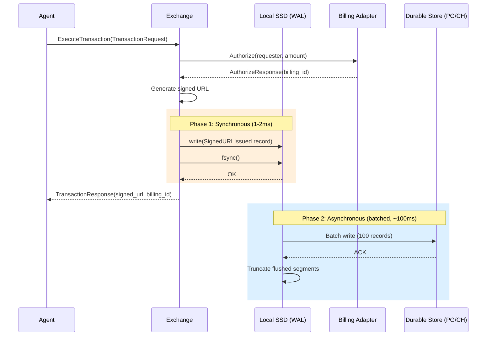
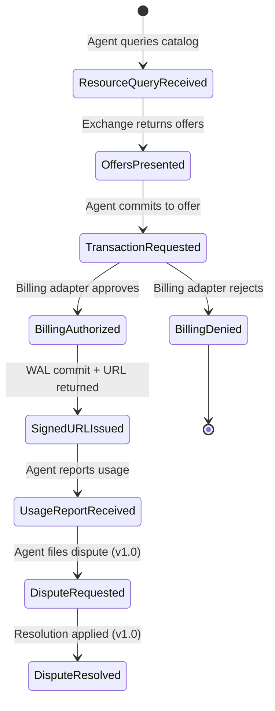
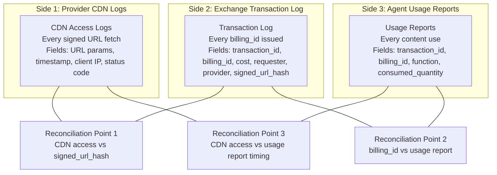

## What the Transaction Log Does

The Transaction Log is the append-only audit trail that enables three-sided reconciliation between CDN access logs (provider-controlled), Exchange transaction records, and agent Usage Reports. It is the financial backbone of the RAMP protocol.

If the log is compromised:
- Billing disputes are unresolvable
- Revenue skimming (T5) is undetectable
- Phantom transactions (T4) cannot be disproven
- Ghost billing (T9 -- systematic caching without payment) cannot be quantified

The system specifies:
- What gets logged and the schema for each event type
- Write-ahead logging to prevent unbillable content access
- Storage backend selection per deployment tier
- Retention, lifecycle, and archival strategy
- Reconciliation query patterns
- Immutability guarantees
- Export formats for billing reconciliation

## Write-Ahead Logging for Crash Safety

The `ExecuteTransaction` flow has a critical ordering dependency. If the Exchange crashes after generating a signed URL but before recording the transaction, the signed URL is live on the CDN -- the agent can fetch content -- but no billing record exists. This is an unbillable content access.

WAL ensures the transaction record is durably written before the signed URL is returned to the agent.

The per-request `fsync` in the synchronous path is to local SSD (~1-2ms), not to the durable store. This is the same pattern as PostgreSQL's own WAL: synchronous local write for durability, asynchronous replication for redundancy.

## Event Sourcing Pattern

Every state transition in the transaction lifecycle produces a log event. There are eight event types, each corresponding to a protocol step. Two are dispute-related: `DisputeRequested` and `DisputeResolved`.

All event types share a universal `TransactionEvent` envelope structure -- a wide table / fat event design. The alternative (per-type tables) was rejected because reconciliation queries span event types and JOIN performance degrades at scale.

## Reconciliation with Billing

The Transaction Log enables three-sided reconciliation:

Core reconciliation queries:
- **Q1**: All transactions for a provider in a time range (billing)
- **Q2**: CDN accesses without billing_id (revenue leakage detection)
- **Q3**: Billing IDs without usage reports (compliance enforcement)
- **Q4**: Requester compliance status (real-time lookup, < 1ms)
- **Q5**: Transaction detail for dispute resolution
- **Q6**: Requester spending summary for a period (invoicing)

## Key Design Decisions

**WAL-first.** No signed URL leaves the Exchange without a durable record on local disk. If the WAL write fails, the signed URL is never returned, even though billing was authorized. A "wasted" authorization is far safer than an "unbillable" delivery.

**Append-only, verifiable.** Three layers of defense: storage-level immutability (S3 Object Lock, PostgreSQL triggers), cryptographic hash chains (SHA-256), and Ed25519-signed records. Three-sided reconciliation is the ultimate arbiter.

**Tiered for cost.** The same WAL code and `DurableStore` interface serve both deployment tiers. Growth operators use PostgreSQL for ~$641/month. Scale operators get sub-second reconciliation queries on ClickHouse for ~$4,700/month. Both stay well under the $0.00005/transaction NFR ceiling.

**Fat events, not normalized tables.** All event types share a single `TransactionEvent` struct. Fields that don't apply to a given event type are zero-valued. This avoids JOINs in reconciliation queries and simplifies the WAL format.

**Backpressure over data loss.** If the durable store is down and WAL segments accumulate past 1GB, the Exchange stops issuing signed URLs (503 Service Unavailable) rather than risk unbillable access.
