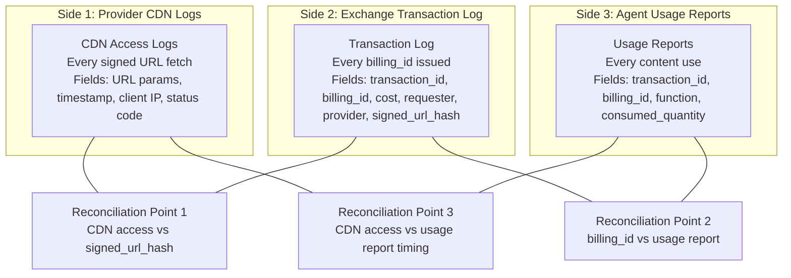

## Three-Sided Reconciliation Model

The Transaction Log enables reconciliation between three independent data sources:



## Billing Reconciliation Queries

### Q1: Provider Revenue for a Period

The primary billing reconciliation query. Run monthly by the Exchange operator to generate invoices.

```sql
SELECT
    transaction_id,
    billing_id,
    buyer_lid,
    buyer_name,
    content_url,
    cost_amount,
    cost_currency,
    event_timestamp,
    signed_url_hash
FROM transaction_events
WHERE event_type = 5  -- EVENT_SIGNED_URL_ISSUED
  AND provider_domain = 'techcrunch.com'
  AND event_timestamp >= '2026-03-01T00:00:00Z'
  AND event_timestamp <  '2026-04-01T00:00:00Z'
ORDER BY event_timestamp;
```

### Q6: Requester Spending Summary

Used by the Exchange operator to generate invoices per AI company.

```sql
SELECT
    buyer_lid,
    buyer_name,
    cost_currency,
    COUNT(*) AS transaction_count,
    SUM(cost_amount) AS total_spend,
    COUNT(DISTINCT provider_domain) AS providers_accessed,
    MIN(event_timestamp) AS first_transaction,
    MAX(event_timestamp) AS last_transaction
FROM transaction_events
WHERE event_type = 5  -- EVENT_SIGNED_URL_ISSUED
  AND event_timestamp >= '2026-03-01'
  AND event_timestamp <  '2026-04-01'
GROUP BY buyer_lid, buyer_name, cost_currency
ORDER BY total_spend DESC;
```

## Provider Settlement

### Q2: Revenue Leakage Detection

Identifies content accesses that appear in CDN logs but have no corresponding transaction. This detects signed URL leakage (T8), billing system failures, and Exchange bugs.

This query is run by the provider, joining their CDN logs against the Exchange transaction log export.

```sql
SELECT
    cdn.access_timestamp,
    cdn.signed_url_params,
    cdn.client_ip,
    cdn.status_code
FROM cdn_access_logs cdn
LEFT JOIN exchange_export mp
    ON cdn.signed_url_hash = mp.signed_url_hash
WHERE mp.signed_url_hash IS NULL
  AND cdn.access_timestamp >= '2026-03-01'
  AND cdn.access_timestamp <  '2026-04-01'
  AND cdn.status_code = 200;
```

For this to work, the `transaction_id` must be embedded in the signed URL parameters. The provider extracts it from their CDN logs and joins against the Exchange export.

## Dispute Detection

### Q3: Missing Usage Reports (Compliance Enforcement)

Identifies transactions where the agent was required to submit a usage report but did not, after the reporting window has elapsed.

```sql
SELECT
    s.transaction_id,
    s.billing_id,
    s.buyer_lid,
    s.buyer_name,
    s.event_timestamp AS url_issued_at,
    s.reporting_deadline
FROM transaction_events s
LEFT JOIN transaction_events u
    ON u.transaction_id = s.transaction_id
    AND u.event_type = 6  -- EVENT_USAGE_REPORT_RECEIVED
WHERE s.event_type = 5    -- EVENT_SIGNED_URL_ISSUED
  AND s.reporting_required = true
  AND u.event_id IS NULL  -- no usage report
  AND s.reporting_deadline < NOW()
ORDER BY s.buyer_lid, s.event_timestamp;
```

### Q4: Requester Compliance Status (Real-Time)

Fast point lookup: "Is this requester blocked for non-compliance?" Called on every `ExecuteTransaction` to enforce reporting obligations. Must return in < 1ms.

The solution is an in-memory cache rebuilt from the transaction log on startup and updated incrementally:

```go
type ComplianceChecker struct {
    mu    sync.RWMutex
    cache map[string]*BuyerCompliance
}

type BuyerCompliance struct {
    BuyerLID          string
    TotalTransactions int64
    MissingReports    int64
    LastTransaction   time.Time
    Blocked           bool
    BlockReason       string
}

func (cc *ComplianceChecker) IsBlocked(buyerLID string) (bool, string) {
    cc.mu.RLock()
    defer cc.mu.RUnlock()

    bc, ok := cc.cache[buyerLID]
    if !ok {
        return false, ""
    }
    return bc.Blocked, bc.BlockReason
}
```

Default compliance policy: block requester if overdue_reports > 10 or overdue_rate > 20%. The 20% threshold is a protocol OPTIONAL default (RFC 2119 MAY). Individual Exchanges decide whether and how to enforce it.

### Q5: Transaction Detail for Dispute Resolution

Full event timeline for a single transaction, used when a billing dispute arises. In v1.0, this query now includes `DisputeRequested` and `DisputeResolved` events linked via `report_id`:

```sql
SELECT
    event_id,
    event_type,
    event_timestamp,
    report_id,
    dispute_id,
    payload
FROM transaction_events
WHERE transaction_id = 'txn-mp-93a7f2'
ORDER BY event_timestamp;
```

### Q7: Dispute Resolution Summary (v1.0)

Summarizes dispute outcomes for a period, used for pattern detection and Tier 3 investigation triggers.

```sql
SELECT
    buyer_lid,
    COUNT(*) AS total_disputes,
    SUM(CASE WHEN resolution = 'CREDIT' THEN 1 ELSE 0 END) AS credits,
    SUM(CASE WHEN resolution = 'REJECTED' THEN 1 ELSE 0 END) AS rejected,
    SUM(credit_amount) AS total_credits,
    cost_currency
FROM transaction_events
WHERE event_type = 8  -- EVENT_DISPUTE_RESOLVED
  AND event_timestamp >= '2026-03-01'
  AND event_timestamp < '2026-04-01'
GROUP BY buyer_lid, cost_currency
ORDER BY total_disputes DESC;
```

## Index Summary (PostgreSQL Growth Tier)

| Index | Columns | Filter | Supports Query |
|---|---|---|---|
| `idx_txn_provider_time` | `(provider_domain, event_timestamp)` | `event_type = 5` | Q1, Q6 |
| `idx_txn_reporting_compliance` | `(buyer_lid, event_timestamp)` | `event_type = 5 AND reporting_required` | Q3, Q4 |
| `idx_txn_transaction_id` | `(transaction_id)` | -- | Q5 |
| `idx_txn_billing_id` | `(billing_id)` | -- | Q2 (join key) |
| `idx_txn_buyer_time` | `(buyer_lid, event_timestamp)` | -- | Q4, Q6 |
| Primary key | `(event_id)` | -- | Deduplication |

## Reporting Endpoints

The open-source Exchange ships these reporting endpoints:

| Endpoint | Consumer | Purpose | Reference Query |
|---|---|---|---|
| `GET /api/v1/reports/provider-revenue` | Provider | "How much am I owed for period X?" | Q1, Q6 |
| `GET /api/v1/reports/buyer-invoice` | Exchange operator | "How much do I bill requester Y for period X?" | Q6 |
| `GET /api/v1/reports/compliance-status` | Exchange admin | Requester reporting obligation status | Q3, Q4 |
| `GET /api/v1/reports/transaction-detail` | Requester, Provider | Full event timeline for a transaction | Q5 |
| `GET /api/v1/reports/leakage-check` | Provider | CDN accesses without billing records | Q2 |

These are reference implementations. A full analytics product (anomaly detection, spending trend visualization, dispute resolution API, automated invoice PDF generation) is outside the scope of the open-source Exchange.

## Immutability Guarantees

Three layers of defense make retroactive alteration detectable, even if the Exchange operator is the adversary.

### Layer 1: Storage-Level Immutability

**S3 Object Lock** (warm/cold archival): Compliance mode prevents any principal (including the root account) from deleting or overwriting objects until the retention period expires.

**PostgreSQL** (Growth tier): Application-level enforcement via permissions and triggers.

```sql
REVOKE UPDATE, DELETE, TRUNCATE ON transaction_events FROM exchange_app;

CREATE OR REPLACE FUNCTION prevent_mutation()
RETURNS TRIGGER AS $$
BEGIN
    RAISE EXCEPTION 'Transaction log is immutable. Mutations are prohibited.';
END;
$$ LANGUAGE plpgsql;

CREATE TRIGGER trg_immutable_txn_events
    BEFORE UPDATE OR DELETE ON transaction_events
    FOR EACH ROW
    EXECUTE FUNCTION prevent_mutation();
```

### Layer 2: Cryptographic Hash Chain

Each event includes the hash of the previous event, forming a chain. Altering any record breaks the chain.

```go
type HashChain struct {
    prevHash [32]byte
    mu       sync.Mutex
}

func (hc *HashChain) Chain(event *TransactionEvent) {
    hc.mu.Lock()
    defer hc.mu.Unlock()

    h := sha256.New()
    h.Write(hc.prevHash[:])
    h.Write([]byte(event.EventId))
    h.Write([]byte(event.EventType.String()))
    ts, _ := event.Timestamp.MarshalBinary()
    h.Write(ts)
    h.Write([]byte(event.TransactionId))
    h.Write([]byte(event.BillingId))
    costBytes := make([]byte, 8)
    binary.BigEndian.PutUint64(costBytes, math.Float64bits(event.CostAmount))
    h.Write(costBytes)

    var hash [32]byte
    h.Sum(hash[:0])
    event.ChainHash = hex.EncodeToString(hash[:])
    hc.prevHash = hash
}
```

Each Exchange instance maintains its own hash chain, identified by an instance GUID. On export, chains from multiple instances are interleaved by timestamp. Providers verify each instance's chain independently, then merge.

### Layer 3: Signed Event Records

Each event record is signed by the Exchange's Ed25519 private key. Providers and agents can independently verify that records were not altered.

```go
func SignEvent(event *TransactionEvent, privateKey ed25519.PrivateKey) {
    chainHashBytes, _ := hex.DecodeString(event.ChainHash)
    sig := ed25519.Sign(privateKey, chainHashBytes)
    event.OfferSignature = base64.StdEncoding.EncodeToString(sig)
}
```

### Defense-in-Depth Summary

| Layer | Prevents | Detects | Limitations |
|---|---|---|---|
| Storage-level immutability | Record deletion/modification | -- | Doesn't prevent false record creation |
| Cryptographic hash chain | -- | Modification, insertion, deletion after the fact | Single-instance chain |
| Signed event records | -- | Modification by any party other than signing Exchange | Compromised key = forged records |
| Three-sided reconciliation | -- | All of the above | Requires provider participation |

## Export Formats

### CSV (for billing teams)

```csv
transaction_id,billing_id,timestamp,buyer_lid,buyer_name,provider_domain,content_url,package_id,cost_amount,cost_currency,cost_unit_cost,delivery_method,reporting_required,report_received,report_within_window
txn-mp-93a7f2,bill-93a7f2-001,2026-03-14T01:43:00Z,LIC-BUYER-001,claude.ai,techcrunch.com,https://techcrunch.com/premium/ai-infrastructure.html,PKG-TC-AI-INFRA,0.05,USD,0.00001515,INSTRUCTIONS,true,true,true
```

### JSON Lines (for programmatic consumers)

```jsonl
{"transaction_id":"txn-mp-93a7f2","billing_id":"bill-93a7f2-001","timestamp":"2026-03-14T01:43:00Z","buyer_lid":"LIC-BUYER-001","buyer_name":"claude.ai","provider_domain":"techcrunch.com","content_url":"https://techcrunch.com/premium/ai-infrastructure.html","package_id":"PKG-TC-AI-INFRA","cost":{"amount":"0.05","currency":"USD","unit_cost":"0.00001515"},"delivery_method":"INSTRUCTIONS","reporting":{"required":true,"received":true,"within_window":true,"consumed_quantity":3150},"chain_hash":"a7f3b2c1...","offer_id":"offer-93a7f2"}
```

### Encoding Strategy

| Context | Format | Rationale |
|---|---|---|
| WAL payload (on disk) | Protobuf | Compact, fast, structured |
| Export format (reconciliation) | JSON Lines | Human-readable, universally parseable |
| Analytics query responses | JSON | Connect-Go handles protobuf/JSON dual format natively |
| Warm/cold archival (S3) | JSON Lines | Same as export |

The export never includes the signed URL itself (security), the raw agent IP (privacy), or the full offer details (irrelevant to billing).

## Protocol vs Admin API Boundary

| Category | Examples | Scope |
|---|---|---|
| **Protocol endpoints** | Transaction history query, reporting obligation status, usage report submission | Part of the RAMP protocol spec |
| **Admin API** | Key rotation, provider reporting API, invoice PDF generation, requester management | Exchange-specific (not standardized) |
| **Outside system boundary** | CDN log analysis, CDN configuration, WAF rule management | Provider infrastructure |
