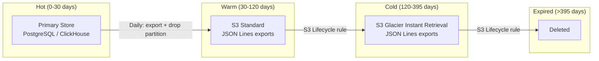

## Requirements

From the non-functional requirements:

| Requirement | Value |
|---|---|
| Write throughput | 10K events/sec (Scale tier) |
| Retention | 13 months minimum |
| Durability | Must survive total node loss |
| Availability | 99.99% for transaction log store |
| Cost per write | < $0.00001 |
| Query pattern (reconciliation) | Batch, offline, range scans by time + provider + requester |
| Query pattern (compliance) | Point lookup by buyer_lid (is this requester blocked?) |

## Backend Analysis

### Option A: Kafka

| Dimension | Assessment |
|---|---|
| **Write throughput** | Excellent. Millions of messages/sec. Far exceeds 10K RPS. |
| **Durability** | Excellent. Replication factor 3 with acks=all. |
| **Append-only** | Native. Kafka is an append-only commit log by design. |
| **Query support** | Poor. Not a query engine. Requires downstream consumer. |
| **Operational complexity** | High. Zookeeper/KRaft, broker management, partition balancing. |
| **Cost** | Moderate. 3-node cluster minimum. Managed Kafka is expensive. |

**Verdict**: Overkill for Growth. Appropriate for Scale tier as the event bus, but still needs a query store downstream.

### Option B: S3 + Local WAL

| Dimension | Assessment |
|---|---|
| **Write throughput** | Excellent (local WAL). S3 PUT is batched, not per-event. |
| **Durability** | Excellent. S3 is 99.999999999% (11 nines) durable. |
| **Append-only** | Enforced by S3 Object Lock (WORM). |
| **Query support** | Good for batch (Athena, DuckDB). Poor for point lookups. |
| **Operational complexity** | Low. No servers to manage. |
| **Cost** | Very low. ~$0.023/GB-month. |

**Verdict**: Used for warm/cold archival at both tiers, not as primary store. Reconciliation queries run against the primary store.

### Option C: ClickHouse

| Dimension | Assessment |
|---|---|
| **Write throughput** | Excellent. Millions of inserts/sec with batching. |
| **Durability** | Good. Replication via ReplicatedMergeTree. |
| **Append-only** | Enforced by application (no UPDATE/DELETE permissions). |
| **Query support** | Excellent. Sub-second analytical queries on billions of rows. |
| **Operational complexity** | Moderate. Managed options reduce this. |
| **Cost** | Moderate. Consumption-based on ClickHouse Cloud. |

**Verdict**: Best option for Scale tier where fast reconciliation queries on massive datasets are needed.

### Option D: PostgreSQL with Partitioning

| Dimension | Assessment |
|---|---|
| **Write throughput** | Moderate. ~5-10K inserts/sec with batching. 20K+ with COPY. |
| **Durability** | Excellent. WAL + synchronous replication. |
| **Append-only** | Enforced by REVOKE UPDATE, DELETE + trigger. |
| **Query support** | Good. Full SQL. Partition pruning for time-range queries. |
| **Operational complexity** | Low. Most teams already operate PostgreSQL. |
| **Cost** | Low-moderate. ~$500/month for Growth tier. |

**Verdict**: Good default for Growth tier. Familiar, ACID, good enough throughput with partitioning.

## Recommended Architecture per Tier

Two production tiers. No SQLite -- even for dev, use Postgres in Docker so the dev environment matches Growth.

| Tier | RPS | Primary Store | Query Layer | WAL | Rationale |
|---|---|---|---|---|---|
| **Dev/Test** | < 10 | PostgreSQL (Docker) | Native SQL | Local file WAL | Same schema as Growth |
| **Growth** (1K RPS) | 1,000 | PostgreSQL (daily partitions, append-only) | Native SQL | Local file WAL | Familiar, ACID, fast point lookups |
| **Scale** (10K RPS) | 10,000 | ClickHouse + Kafka | Native SQL | Local file WAL + Kafka | ClickHouse for hot queries, Kafka for event distribution |

The WAL is always local. The durable store varies. The same WAL code works across all tiers -- only the `DurableStore` interface implementation changes.

```go
type DurableStore interface {
    WriteBatch(events []*TransactionEvent) error
    QueryByTimeRange(ctx context.Context, q TimeRangeQuery) ([]*TransactionEvent, error)
    QueryByBuyer(ctx context.Context, buyerLID string, limit int) ([]*TransactionEvent, error)
    QueryByTransactionID(ctx context.Context, txnID string) ([]*TransactionEvent, error)
}
```

## Schema Design

### PostgreSQL (Growth Tier)

```sql
CREATE TABLE transaction_events (
    event_id        TEXT NOT NULL,
    event_type      SMALLINT NOT NULL,
    event_timestamp TIMESTAMPTZ NOT NULL,
    transaction_id  TEXT,
    billing_id      TEXT,
    buyer_lid       TEXT NOT NULL,
    provider_domain TEXT,
    cost_amount     NUMERIC(10, 6),
    cost_currency   TEXT,
    payload         JSONB NOT NULL
) PARTITION BY RANGE (event_timestamp);

-- Daily partitions, created by pg_partman or a cron job
CREATE TABLE transaction_events_20260315
    PARTITION OF transaction_events
    FOR VALUES FROM ('2026-03-15') TO ('2026-03-16');
```

**Partitioning strategy**: Daily partitions. Reconciliation queries are typically "show me March 2026" (scan 31 daily partitions). Partition pruning eliminates ~97% of data on a typical single-month query. Partition drop is O(1) for retention enforcement.

**Batched inserts via COPY**:

```go
func (ps *PostgresStore) WriteBatch(events []*TransactionEvent) error {
    tx, err := ps.db.Begin()
    if err != nil {
        return err
    }
    defer tx.Rollback()

    stmt, err := tx.Prepare(pq.CopyIn(
        "transaction_events",
        "event_id", "event_type", "event_timestamp",
        "transaction_id", "billing_id", "idempotency_key",
        "buyer_lid", "provider_domain", "exchange_id",
        "cost_amount", "cost_currency",
        "chain_hash", "offer_id",
        "payload",
    ))
    if err != nil {
        return err
    }

    for _, event := range events {
        payload, _ := json.Marshal(event)
        _, err := stmt.Exec(
            event.EventID, event.EventType, event.Timestamp,
            event.TransactionID, event.BillingID, event.IdempotencyKey,
            event.BuyerLID, event.ProviderDomain, event.ExchangeID,
            event.CostAmount, event.CostCurrency,
            event.ChainHash, event.OfferID,
            payload,
        )
        if err != nil {
            return err
        }
    }

    if _, err := stmt.Exec(); err != nil {
        return err
    }
    return tx.Commit()
}
```

### Event Schema (Go Structs)

```go
type EventType int32

const (
    EventUnspecified            EventType = 0
    EventResourceQueryReceived    EventType = 1
    EventOffersPresented        EventType = 2
    EventTransactionRequested   EventType = 3
    EventBillingAuthorization   EventType = 4
    EventSignedURLIssued        EventType = 5
    EventUsageReportReceived    EventType = 6
    EventDisputeRequested       EventType = 7  // v1.0
    EventDisputeResolved        EventType = 8  // v1.0
)

type TransactionEvent struct {
    EventID   string    `json:"event_id"   db:"event_id"`
    EventType EventType `json:"event_type" db:"event_type"`
    Timestamp time.Time `json:"timestamp"  db:"event_timestamp"`

    TransactionID  string `json:"transaction_id,omitempty"  db:"transaction_id"`
    BillingID      string `json:"billing_id,omitempty"      db:"billing_id"`
    // The request's idempotency key (TransactionRequest.idempotency_key /
    // UsageReport.idempotency_key). Durable dedupe key, NOT the wire
    // correlation id — correlation rides the X-Request-ID HTTP header.
    IdempotencyKey string `json:"idempotency_key,omitempty" db:"idempotency_key"`
    OfferID        string `json:"offer_id,omitempty"        db:"offer_id"`
    SubscriptionID string `json:"subscription_id,omitempty" db:"subscription_id"`

    BuyerLID        string `json:"buyer_lid"                db:"buyer_lid"`
    BuyerName       string `json:"buyer_name,omitempty"     db:"buyer_name"`
    ProviderDomain string `json:"provider_domain,omitempty" db:"provider_domain"`
    ExchangeID   string `json:"exchange_id"           db:"exchange_id"`

    CostAmount   float64 `json:"cost_amount,omitempty"   db:"cost_amount"`
    CostCurrency string  `json:"cost_currency,omitempty" db:"cost_currency"`
    CostUnitCost float64 `json:"cost_unit_cost"           db:"cost_unit_cost"`

    ChainHash            string `json:"chain_hash"             db:"chain_hash"`

    // ... additional fields per event type (see Event Types page)
}
```

## Retention and Lifecycle

### Retention Policy

13-month minimum retention for financial data. Matches ad-tech invoice cycles.

| Data Class | Hot (fast query) | Warm (queryable, slower) | Cold (archive) | Total Retention |
|---|---|---|---|---|
| SignedURLIssued, BillingAuthorization, UsageReportReceived | 30 days | 90 days | 10 months | 13 months |
| TransactionRequested | 30 days | 60 days | -- | 3 months |
| ResourceQueryReceived, OffersPresented | 7 days | 23 days | -- | 30 days |

### Lifecycle Transitions



Deletion is performed exclusively by dropping daily partitions or deleting S3 objects whose date prefix exceeds the retention window. Individual record deletion is never performed.

## Write Performance

### Target

At Scale tier (10K RPS), the log must sustain 10K `SignedURLIssued` writes/sec on the synchronous path (WAL), plus ~10K of other event types on the async path. Total: ~20-30K events/sec.

### Local WAL Performance

On modern NVMe SSDs:
- `fdatasync` latency: ~10-50 microseconds
- Sequential write throughput: 1-3 GB/s
- At 300 bytes/event (protobuf): ~3-10M events/sec theoretical
- Measured target: 50K events/sec on a single WAL file (5x Scale requirement)

### WAL to Durable Store Flush

| Tier | WAL Flush Rate | Durable Store Write Rate | Batch Size |
|---|---|---|---|
| Growth (1K RPS) | Every 100ms or 100 events | ~1K events/sec | 500 |
| Scale (10K RPS) | Every 100ms or 1000 events | ~10K events/sec | 1000 |

## Cost Analysis

### Growth Tier (1K RPS, 86M txn/day)

| Component | Service | Monthly Cost |
|---|---|---|
| WAL storage | EBS gp3 50GB | $5 |
| Hot storage (30d) | PostgreSQL (db.r6g.xlarge) | $500 |
| Warm storage (90d) | S3 Standard, ~3.6 TB | $83 |
| Cold storage (10mo) | S3 Glacier IR, ~12 TB | $48 |
| Lifecycle management | Lambda (daily partition export) | $5 |
| **Total** | | **~$641/month ($0.00000025/txn)** |

### Scale Tier (10K RPS, 864M txn/day)

| Component | Service | Monthly Cost |
|---|---|---|
| WAL storage | NVMe instance storage | $0 (included) |
| Hot storage (30d) | ClickHouse Cloud, ~12 TB | $2,500 |
| Kafka (event bus) | MSK (3 brokers) | $900 |
| Warm storage (90d) | S3 Standard, ~36 TB | $828 |
| Cold storage (10mo) | S3 Glacier IR, ~120 TB | $480 |
| **Total** | | **~$4,708/month ($0.0000002/txn)** |

Both tiers stay well under 1% of the $0.00005/transaction NFR budget.
