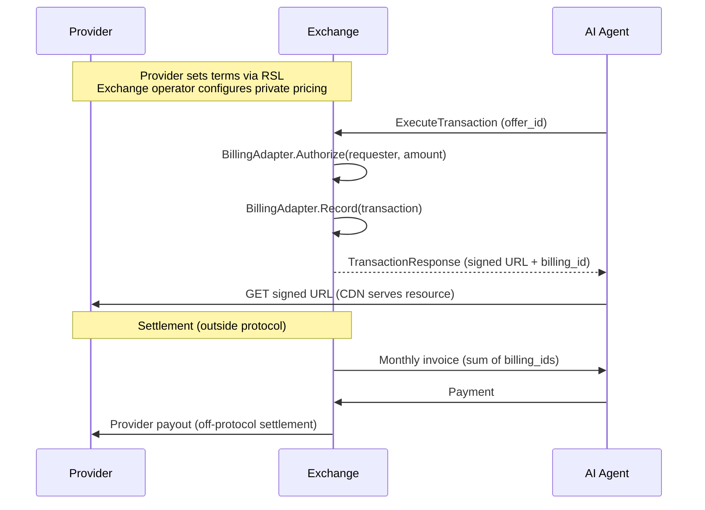

## The Billing Chain

RAMP never touches money. It follows the OpenRTB model: the protocol handles authorization and logging, while actual settlement happens outside the protocol through existing billing infrastructure.

The chain works like this:

```
Provider -> Exchange operator -> AI Company (Agent / Broker)
```

1. The **Exchange** (operated by an Exchange operator, provider, or third party) handles all billing through its pluggable Billing Adapter
2. The Exchange operator **invoices the AI company** via its existing system (monthly invoicing, prepaid balance, etc.)
3. The Exchange operator **pays the provider** via its existing revenue-share agreement

The `billing_id` in a `TransactionResponse` is an invoice line item, not a payment confirmation. Settlement happens offline, same as programmatic advertising.



## Pricing Models

`PricingModel` is the charging **structure** only — a closed set of three. The open-ended metering basis ("per what") lives in `Pricing.unit` as a vocabulary, so per-access / per-token / per-fetch / per-page / per-minute / per-record are all `PER_UNIT` with a different `unit`.

| Model | Description | RSL Equivalent |
|---|---|---|
| `PRICING_MODEL_FREE` | No charge (state explicitly; absent Pricing ≠ free) | free |
| `PRICING_MODEL_PER_UNIT` | Rate per `Pricing.unit` (metering basis: `accesses`, `tokens`, `fetches`, `pages`, `minutes`, `records`, …) | crawl / use / inference / training / metered purchase |
| `PRICING_MODEL_FLAT` | One-time flat fee; `rate` is the total, no unit | one-time purchase |

A **subscription** is `FREE` + a `subscription:*` scope (settled off-protocol). **Attribution** and **contribution** are `Obligation`s, not pricing models. There is no revenue-share model — settlement is off-protocol.

Providers set their preferred pricing model and rate in their RSL file. The Exchange operationalizes these into live Offers. RSL pricing serves as a price ceiling (public declaration); private pricing between provider and Exchange may be lower.

## unit_cost: Normalized Pricing

Different pricing models make direct comparison difficult. An article priced at $0.05 per access is not directly comparable to a resource priced at $0.00002 per token.

**unit_cost** normalizes all pricing to a per-unit basis, analogous to eCPM in advertising. The unit is specified by the `Pricing.unit` field (e.g., "tokens", "pages", "seconds", "records"):

```
unit_cost = total_cost / estimated_quantity
```

For example:
- Article at $0.05, estimated 3,300 tokens: unit_cost = $0.00001515 (unit: "tokens")
- Per-token pricing at $0.00002: unit_cost = $0.00002 (unit: "tokens")
- Per-page at $0.10, estimated 15 pages: unit_cost = $0.10 (unit: "pages")
- Audio at $0.50/minute, estimated 45 minutes (2,700 s): unit_cost = $0.0083 (unit: "seconds")

The Broker uses `unit_cost` to compare offers across Exchanges and pricing models, selecting the most cost-effective option regardless of how the provider originally priced it.

Every `Offer` in a `ResourceResponse` includes both the native pricing and the computed `unit_cost` value:

```json
{
  "pricing": {
    "model": "PRICING_MODEL_PER_UNIT",
    "rate": 0.05,
    "currency": "USD",
    "unit_cost": 0.00001515,
    "estimated_quantity": 3300,
    "unit": "tokens"
  }
}
```

## base_currency

Each Exchange declares a `base_currency` in its manifest (ISO 4217 code, e.g., "USD", "EUR"). All `unit_cost` values in offers from that Exchange are denominated in this currency. This enables cross-exchange price comparison by the Broker without requiring currency conversion at query time.

## Subscription vs. Per-Request Billing

The protocol supports two billing patterns:

### Per-Request Billing

The default model. Each transaction is independently authorized and billed:

1. Agent sends `ExecuteTransaction` with a selected offer
2. Exchange calls `BillingAdapter.Authorize(requester, amount)` -- checks the requester's balance/credit
3. If authorized, Exchange issues a signed URL and records the transaction
4. The AI company is invoiced for the sum of all transactions

### Subscription Billing

When an AI company has a subscription deal with an Exchange:

1. During `DiscoverResources`, the Exchange detects the requester's subscription and includes a subscription offer with `rate=0` and `subscription_id`
2. The Broker prefers subscription offers (zero marginal cost)
3. During `ExecuteTransaction`, the Exchange skips `BillingAdapter.Authorize` (already paid under subscription) but checks quota
4. Usage reporting is still mandatory -- providers need consumption data for subscription renewals

Subscription transactions include a `subscription_unit_value` field that carries the per-unit cost even though `cost.amount` is 0. This enables financial attribution: the AI company can track the value of resources consumed against the subscription's total prepaid amount.

## Overspend Prevention

Two enforcement layers prevent overspend, mirroring how OpenRTB prevents advertiser overspend:

- **Agent/Broker-side**: `RequestConstraints.max_unit_cost` -- the agent will not accept offers above this threshold. The Broker tracks cumulative spend across a session and enforces the agent's budget cap.
- **Exchange-side**: The Exchange operator's Billing Adapter checks the requester's balance or credit before authorizing each transaction. Returns a denial if the requester is over their limit.

Each Exchange independently tracks per-requester balance. The Broker maintains its own cumulative view for budget enforcement, but the Exchange is authoritative for "can this requester afford this transaction."

## Example Transaction: End to End

Here is a concrete transaction with dollar amounts.

**Setup:**
- Provider: TechCrunch (Hearst Media)
- Article: "AI Regulation: What Providers Need to Know" (2,500 words, ~3,300 tokens)
- RSL price ceiling: $0.08 per crawl
- SSP-Alpha private pricing: $0.05 per article (below RSL ceiling)
- Requester: Anthropic (Claude), billing reference `billing_ref` `ANTHROPIC-COST-CENTER-001`
- Anthropic has an annual subscription with Hearst via SSP-Alpha

**What happens:**

| Step | Action | Cost |
|---|---|---|
| 1 | Claude queries SSP-Alpha via `DiscoverResources` | $0 |
| 2 | SSP-Alpha returns two offers: per-request ($0.05) and subscription ($0.00) | -- |
| 3 | Broker selects subscription offer (zero marginal cost) | $0.00 |
| 4 | `ExecuteTransaction` -- subscription quota checked (850,000 tokens remaining), 3,300 deducted | $0.00 |
| 5 | Signed URL issued, Claude fetches article from CDN | -- |
| 6 | Usage report filed: 3,150 actual tokens consumed | -- |

**Financial attribution:**
- `cost.amount`: $0.00 (subscription)
- `subscription_unit_value.amount`: $0.05 (the per-article value for accounting)
- Anthropic tracks: $0.05 drawn against prepaid subscription balance

**Without the subscription**, the per-request path would have charged $0.05 for this article, with a `unit_cost` of $0.00001515 per token.

## Dispute Credits

When an agent files a successful dispute via `DisputeTransaction`, the resolution may include a credit:

| Resolution | When | Effect |
|---|---|---|
| `CREDIT` | CDN delivery failure, content hash mismatch, size anomaly | Full transaction amount credited back to agent's balance |
| `PARTIAL_CREDIT` | Token count discrepancy corroborated by CDN size | Prorated credit based on discrepancy |
| `REDELIVERY` | Transient failure, content still available | New signed URL issued, no credit |
| `REJECTED` | Insufficient evidence, fabricated claims | No credit, dispute pattern logged |

Credits are applied to the agent's balance with the Exchange. They reduce the next invoice -- same as ad-tech billing discrepancy adjustments. The protocol does not prescribe how credits are settled between Exchange operator and provider; that follows the existing revenue-share agreement.

## Pricing Transparency

Two fields provide cost transparency even when the per-request charge is zero:

- **`subscription_unit_value`**: Carried on subscription transactions where `cost.amount` is $0. Shows the per-unit value for financial attribution -- the AI company can track the value of resources consumed against its prepaid subscription balance.
- **`broker_fee`**: When a Broker mediates the transaction, this field shows the Broker's fee separately from the content cost. Agents see exactly what they pay for the resource vs. what they pay for brokerage.

## Reconciliation

Three independent records ensure transaction integrity:

1. **CDN access logs** (provider controls): every signed URL access with transaction ID, agent ID, timestamp
2. **Exchange transaction log** (Exchange operator controls): every `billing_id` issued with cost, requester, offer snapshot (including Ed25519 exchange signature for non-repudiation)
3. **Usage reports** (agent files): what the agent actually did with the resource (token count, function, citation)

All three records must agree. Discrepancies are resolved offline, like ad-tech billing discrepancy resolution (~5-10% tolerance).

## Next Steps

- [Industry Landscape](/getting-started/industry-landscape/) -- how RAMP fits among competing approaches
- [Transaction Flow](/protocol/transaction-flow/) -- detailed protocol messages for each step
- [Scenario Walkthrough](/protocol/scenario-walkthrough/) -- a complete end-to-end scenario with all wire formats
