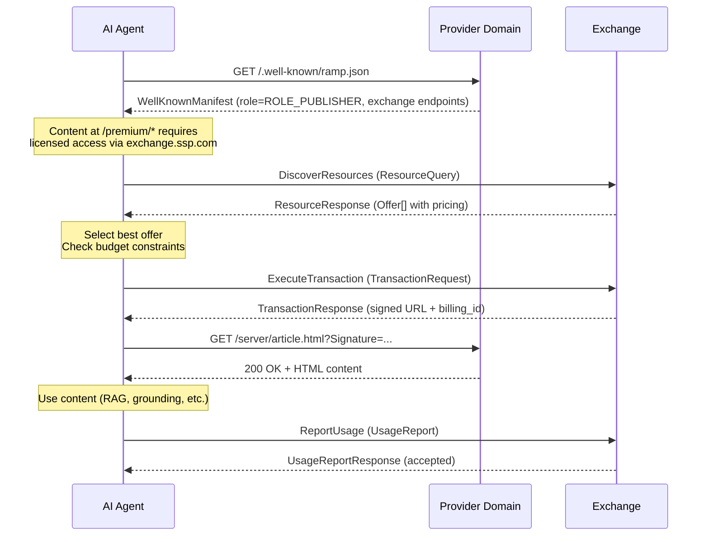
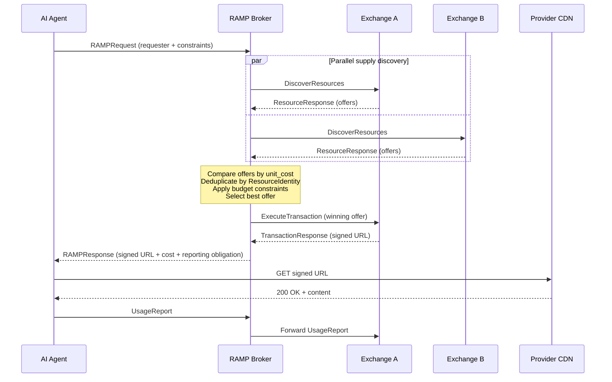
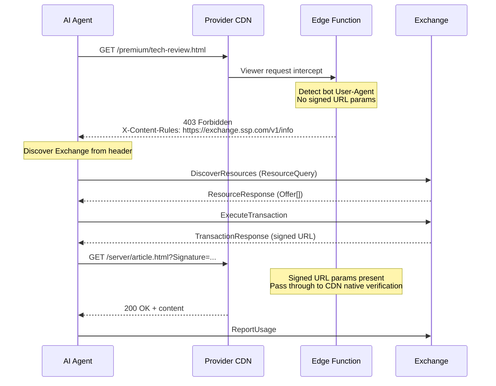
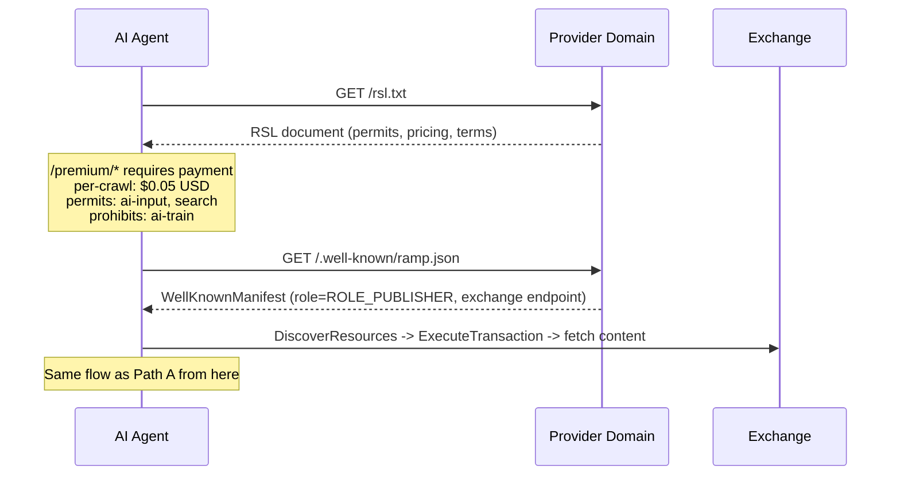
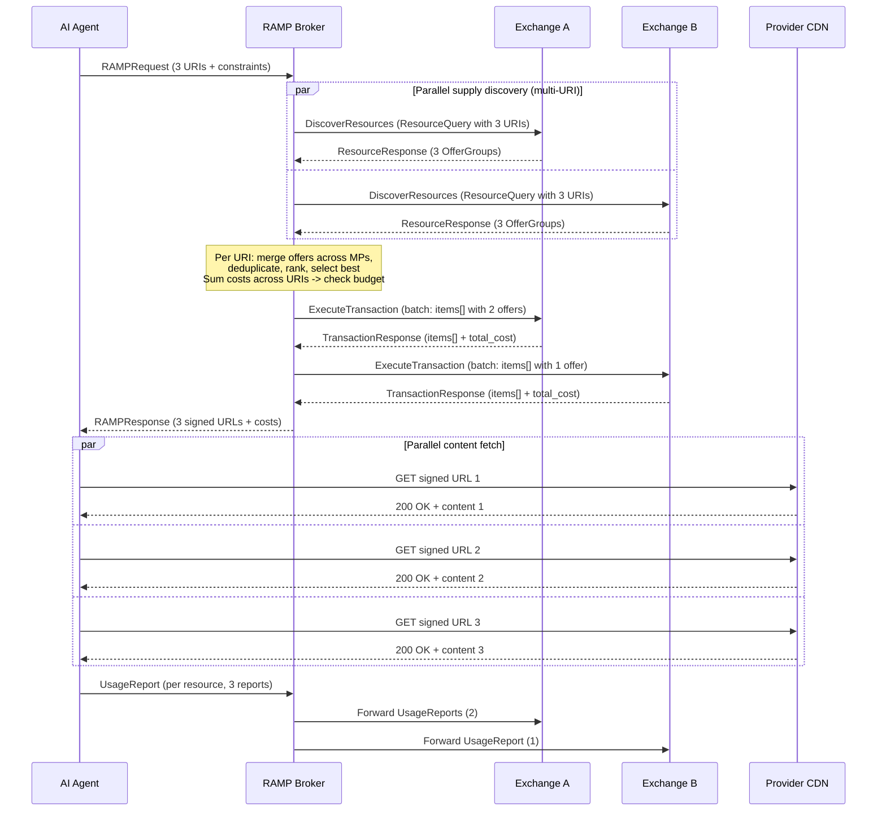
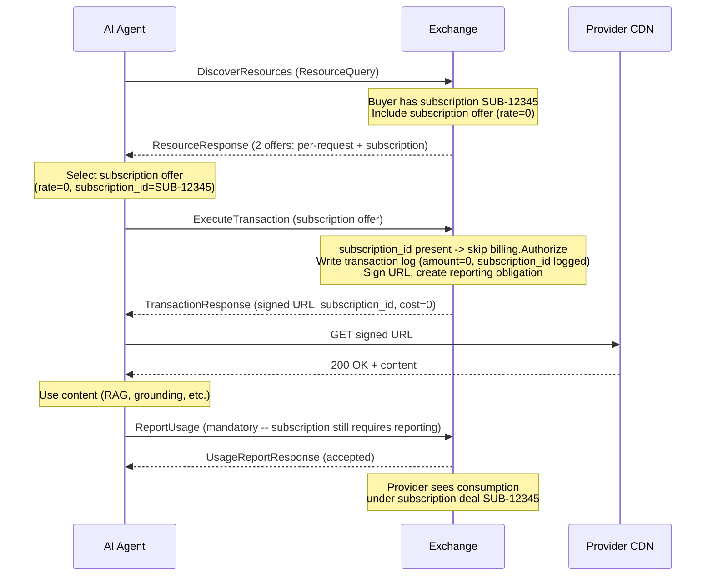

## Overview

An AI agent can enter the RAMP flow through six paths. All paths converge on the same Exchange protocol -- the same `DiscoverResources`, `ExecuteTransaction`, and `ReportUsage` RPCs regardless of how discovery happened.

| Path | Entry Point | Use Case |
|---|---|---|
| [A: Proactive Discovery](#path-a-proactive-discovery-via-rampjson) | `ramp.json` | Agent checks before accessing content |
| [B: Broker-Mediated](#path-b-broker-mediated-multi-exchange) | Broker | Agent delegates to multi-exchange router |
| [C: Accidental Discovery](#path-c-accidental-discovery-via-edge-function-403) | 403 response | Wandering bot hits protected content |
| [D: RSL-First](#path-d-agent-reads-rsl-directly) | `rsl.txt` | Agent reads terms, then finds Exchange |
| [E: Batch Multi-URL](#path-e-batch-multi-url-acquisition) | Broker | Agent needs multiple resources at once |
| [F: Subscription](#path-f-subscription-based-access) | Exchange | Agent has existing subscription deal |

## Path A: Proactive Discovery via ramp.json

The preferred path. The agent checks `/.well-known/ramp.json` before attempting to access content. No 403 needed, no wasted requests.

**Standards mapping:**

| Step | Message | Standard |
|---|---|---|
| Check ramp.json | `WellKnownManifest` (role=ROLE_PUBLISHER) | **RAMP** (exchange routing) |
| Discover supply | `ResourceQuery` / `ResourceResponse` | **RAMP** wrapping **RAMP Requester** |
| Offers returned | `Offer` with `Package` + `Pricing` | **RAMP** Pricing + **CoMP** Package |
| Content attestations | `Offer.attestations` | **RAMP** `ResourceAttestation` (replaces ResourceAttestation) |
| Access restrictions | `Offer.restrictions` | **RAMP** mapping of **RSL** permits/prohibits |
| Execute transaction | `TransactionRequest` / `TransactionResponse` | **RAMP** (billing_id, signed URL) |
| Fetch content | Signed URL on CDN | **RAMP** extension (signed URL delivery) |
| Report usage | `UsageReport` | **RAMP** (mandatory) |

## Path B: Broker-Mediated Multi-Exchange

The agent delegates to a RAMP Broker, which queries multiple Exchanges in parallel, compares offers, and selects the best deal.

**Standards mapping:**

| Step | Message | Standard |
|---|---|---|
| Agent to Broker | `RAMPRequest` with `RequestConstraints` | **RAMP** (budget, authorized exchanges) |
| Broker to Exchanges | `ResourceQuery` (parallel fanout) | **RAMP** wrapping **RAMP Requester** |
| Offer comparison | `Offer.pricing.unit_cost` | **RAMP** unit cost normalization |
| Content dedup | `Offer.identity` (canonical_url, content_hash) | **RAMP** ResourceIdentity extension |
| Content attestations | `Offer.attestations` | **RAMP** v1.0 `ResourceAttestation` |
| Broker to Agent | `RAMPResponse` | **RAMP** |
| Usage reporting | `UsageReport` forwarded to winning Exchange | **RAMP** |

## Path C: Accidental Discovery via Edge Function (403)

A wandering bot hits protected content without knowing about RAMP. The edge function on the provider's CDN blocks it and points to the Exchange.

**Standards mapping:**

| Step | Standard |
|---|---|
| 403 + `X-Content-Rules` header | **RAMP** extension (discovery mechanism -- not in CoMP or RSL) |
| Exchange endpoint in header | Points to Exchange listed in `ramp.json` |
| All subsequent steps | Same as Path A |

The edge function is the "barking dog" -- a fallback for bots that did not check `ramp.json` first.

## Path D: Agent Reads RSL Directly

An agent reads `rsl.txt` to understand terms, then uses `ramp.json` to find the Exchange for transacting. RSL tells the agent *what it costs*; RAMP tells it *where to pay*.

**Standards mapping:**

| Step | Standard |
|---|---|
| Read rsl.txt | **RSL 1.0** -- terms declaration |
| Read ramp.json | **RAMP** -- exchange routing |
| DiscoverResources | Exchange returns Offers with pricing derived from RSL |
| Offer.restrictions | Maps RSL permits/prohibits to RAMP AccessRestrictions |

## Path E: Batch Multi-URL Acquisition

The agent needs multiple resources in a single request (e.g., RAG grounding across several sources). The Broker sends all URIs in one `ResourceQuery` to each Exchange, receives `OfferGroups`, selects the best offer per URI, and commits all selections in a single batch `TransactionRequest`.

**Standards mapping:**

| Step | Message | Standard |
|---|---|---|
| Agent sends multi-URI request | `RAMPRequest` with multiple URIs | **RAMP** |
| Broker fans out | `ResourceQuery` with multiple URIs (one query per Exchange) | **RAMP** wrapping **RAMP Requester** |
| Exchange returns grouped offers | `ResourceResponse.offer_groups[]` with `OfferGroup` per URI | **RAMP** OfferGroup extension |
| Empty OfferGroup diagnostic | `OfferGroup.absence_reason` (`OfferAbsenceReason` enum) | **RAMP** v1.0 -- per-URI diagnostic when no offers available |
| Rate limit signaling | `ResourceResponse.rate_limit` (`RateLimitInfo`) | **RAMP** v1.0 -- proactive throttling for Broker fanout |
| Batch transaction | `TransactionRequest.items[]` with `TransactionItem` per offer | **RAMP** batch extension |
| Per-item results | `TransactionResponse.items[]` with `TransactionResultItem` per offer | **RAMP** batch extension |
| Usage reporting | One `UsageReport` per resource (not per batch) | **RAMP** |

### OfferAbsenceReason (v1.0)

When an `OfferGroup` has no offers, the `absence_reason` field explains why. This enables agents and Brokers to distinguish "content not in catalog" from "content blocked for your use case" without trial-and-error transactions. Nine reasons are defined: `NOT_IN_CATALOG`, `CONTENT_BLOCKED`, `FUNCTION_PROHIBITED`, `GEO_RESTRICTED`, `USER_CATEGORY_PROHIBITED`, `TEMPORARILY_UNAVAILABLE`, `NOT_AUTHORIZED`, `SCOPE_INSUFFICIENT` (requester's scopes do not cover this resource), `UNKNOWN_CRITICAL_EXTENSION` (consumer encountered `ext_critical` keys it does not recognize).

### RateLimitInfo (v1.0)

The `ResourceResponse` carries an optional `rate_limit` field with the caller's current rate limit status: `limit`, `remaining`, `reset_at`, and `window`. This is particularly important for Broker fanout -- when an Broker sends batch queries to multiple Exchanges, mid-batch rate limiting can cause partial results if not signaled early. Modeled after IETF RateLimit header fields.

### DiscoveryMethod (v1.0)

Each `OfferGroup` carries a `discovery_method` field indicating how the offers were sourced. Four methods are defined:

| Value | Number | Description |
|---|---|---|
| `DISCOVERY_METHOD_EXCHANGE` | 1 | Standard exchange catalog lookup |
| `DISCOVERY_METHOD_SEARCH` | 2 | Full-text or semantic search across provider inventories |
| `DISCOVERY_METHOD_RECOMMENDATION` | 3 | Exchange-generated recommendation based on context |
| `DISCOVERY_METHOD_SYNDICATION` | 4 | Content syndicated from a partner exchange or feed |

This allows agents and Brokers to understand the provenance of each offer group and apply method-specific ranking or filtering logic.

Batch transactions are **non-atomic** -- individual items can fail independently. If one URI's offer fails authorization, the others proceed.

## Path F: Subscription-Based Access

The agent has an existing subscription deal with a Exchange. When querying supply, the Exchange includes subscription offers with zero marginal cost. The transaction skips per-request billing but still issues a signed URL and creates a usage reporting obligation.

**Key points:**

- **Subscription detection at query time**: The Exchange checks the buyer's subscription status and includes offers with `subscription_id` and `rate=0`.
- **Reporting is still mandatory**: Subscription offers carry `ReportingObligation.required = true`. Providers need consumption data for subscription renewals and content strategy.
- **Quota enforcement**: The Exchange checks remaining quota before authorizing subscription transactions. If the subscription's token quota is exhausted, the subscription offer is not included.
- **Broker preference**: The Broker's selection engine ranks subscription offers above all per-request offers (zero marginal cost). When `preferred_exchanges` is set and the agent has subscriptions there, those offers get top priority.
- **Financial attribution**: The `subscription_unit_value` field carries the per-unit cost even though `cost.amount` is 0, enabling prepaid drawdown accounting.

## Next Steps

- [Transaction Flow](/protocol/transaction-flow/) -- detailed RPC definitions and wire formats
- [Authentication](/protocol/authentication/) -- Ed25519 signature chain across all paths
- [Scenario Walkthrough](/protocol/scenario-walkthrough/) -- a complete end-to-end scenario demonstrating multiple paths
