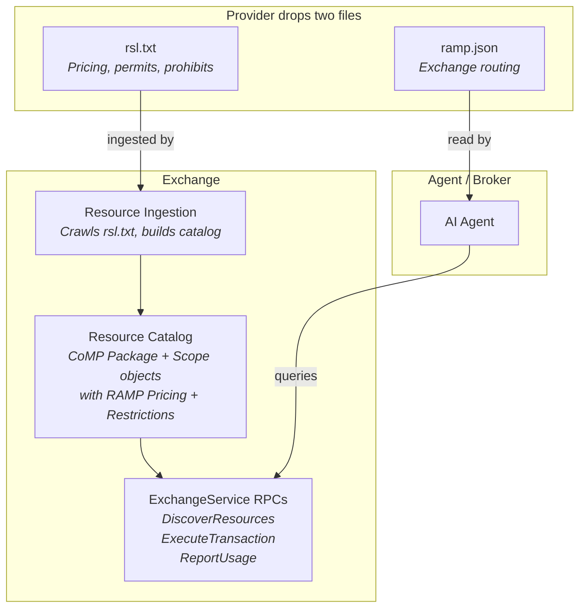
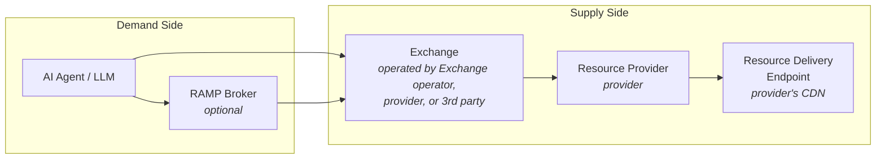

## Three Standards, One Stack

RAMP does not replace RSL or CoMP. The three standards work together, each handling a distinct concern:

| Standard | What It Does | Provider Action | File / Endpoint |
|---|---|---|---|
| **RSL 1.0** | Declares licensing terms and pricing | Drop `rsl.txt` on domain | `rsl.txt` |
| **CoMP v2.0** | Defines content metadata objects | (Used internally by Exchange) | -- |
| **C2PA 2.x** | Content provenance and authenticity | Embed Content Credentials in assets | (In-asset or sidecar manifest) |
| **RAMP** | Transaction protocol + discovery | Drop `ramp.json` on domain | `/.well-known/ramp.json` |
| **Content Attestation** | Cryptographic content verification | Publish keys in `public_keys` at `ramp.json` | `/.well-known/ramp.json` |
| **MCP Interface** | Convenience tool layer for MCP agents | Deploy MCP server | (MCP server binary) |

In plain terms:

```
RSL                 = "Here's what my content costs and what you can do with it"
CoMP                = "Here's how to describe content in a standard way"
C2PA                = "Here's who created this content and its full edit history"
RAMP               = "Here's where and how to buy it"
Content Attestation = "Here's cryptographic proof that the content is what it claims to be"
MCP Interface       = "Here's how to access RAMP from any MCP-capable agent without an SDK"
```

C2PA and RAMP are orthogonal: C2PA proves **what content IS** (provenance, creator identity, transformation history). RAMP manages **what you can DO with it** (commercial access, pricing, transaction, dispute). The [`ramp-c2pa-v1` extension profile](/protocol/ext-c2pa/) bridges them -- C2PA validation results are carried in RAMP attestations, and C2PA training/mining restrictions are enforced through RAMP access controls.

### WebBotAuth Compatibility

The IETF [WebBotAuth working group](https://datatracker.ietf.org/wg/webbotauth/about/) (formed 2025, standards track targeting April 2026) is standardising cryptographic bot identity -- bots sign HTTP requests using RFC 9421 HTTP Message Signatures with Ed25519, and publish keys at a well-known endpoint. Cloudflare is already implementing it.

**RAMP agents are automatically WebBotAuth-compliant.** RAMP uses the identical crypto stack: RFC 9421 HTTP Message Signatures, Ed25519 (EdDSA), and JWK-formatted keys at a well-known endpoint. When WebBotAuth ships as an RFC, RAMP agents will be recognised as authenticated bots by any CDN or origin server that implements it -- without any RAMP-specific integration on the publisher side. WebBotAuth solves identity (Layer 2); RAMP adds the transaction layer (Layer 4) on top of that identity.

## How They Compose



A provider that wants to monetize AI traffic does two things:

1. **Drops `rsl.txt`** -- declares pricing and usage terms. The Exchange reads this file and builds its resource catalog from it.
2. **Drops `ramp.json`** -- declares which Exchanges are authorized to sell this provider's resources. Agents read this file to find where to transact.

Everything else is handled by the Exchange and the protocol.

## Roles



| Role | Description | Standard |
|---|---|---|
| **AI Agent** | The LLM, RAG system, or agentic application that needs content. Authenticates via Ed25519 signatures. Identity is the RFC 9421 request signature and access is scopes + delegation — not the billing reference. | CoMP: "Requesting Party". RAMP v1.0 uses the `Requester` message (not CoMP `AISystem`); CoMP's `lid` maps to `Requester.billing_ref`, an opaque billing reference (account/PO/cost center), not a credential. |
| **RAMP Broker** | Optional demand-side router. Queries multiple Exchanges, compares offers by unit_cost, deduplicates by ResourceIdentity, enforces budget constraints. | RAMP v1.0: "RAMP Broker" |
| **Exchange** | Exposes resource catalog with pricing. Authorizes transactions. Issues delivery instructions (signed URLs). | RAMP v1.0: "Exchange"; implementation of CoMP endpoints |
| **Resource Provider** | The provider. Owns the resources, sets terms via RSL. | CoMP: "Content Owner"; RSL: "Licensor" |
| **Resource Delivery Endpoint** | The CDN that serves resources. Verifies signed URLs natively. | CoMP: "Content Delivery Endpoint" |
| **Edge Function** | Lightweight CDN function. Blocks unauthorized bots with 403 + `X-Content-Rules` header, redirects to Exchange. Passes through signed URL requests. | RAMP extension (not in CoMP or RSL) |

## RSL Integration

The Exchange ingests the provider's `rsl.txt` to build its resource catalog:

1. RSL declares terms (pricing, usage rules, path policies)
2. The Exchange operationalizes those terms into live RAMP Offers
3. Provider manages one file (`rsl.txt`), Exchange does the rest

RSL pricing is a **fallback hint and price ceiling**. The Exchange is the price authority. Private pricing (negotiated between provider and Exchange operator) may be lower than RSL's published rate but cannot exceed it.

```
Provider drops rsl.txt + ramp.json on their domain
  -> Exchange crawls rsl.txt -> builds resource catalog with pricing
  -> Agent checks ramp.json -> finds Exchange -> DiscoverResources
  -> Exchange returns Offers derived from RSL terms
```

RSL permits and prohibits map directly to RAMP `Restriction` entries carried on each `LicenseTerm.restrictions` (on `Offer.terms[]`):

| RSL Term | RAMP Field |
|---|---|
| `<permits type="usage">ai-input</permits>` | `terms[].restrictions: [{ kind: RESTRICTION_KIND_FUNCTION, permitted: ["ai-input"] }]` |
| `<prohibits type="usage">ai-train</prohibits>` | `terms[].restrictions: [{ kind: RESTRICTION_KIND_FUNCTION, prohibited: ["ai-train"] }]` |
| `<payment type="crawl" amount="0.05"/>` | `pricing.model: PRICING_MODEL_PER_UNIT, pricing.unit: "fetches", pricing.rate: 0.05` |

## CoMP Integration

IAB CoMP is **not** nested in RAMP's core messages. It is an **extension profile** (`ramp-comp-v1`) whose objects are carried as flat `comp.*` keys in `Offer.ext`. The RAMP core does not embed CoMP types: the core carries `Offer.title` plus `LicenseTerm` (on `Offer.terms[]`) for licensing, and the requester states `acceptable_restrictions` rather than a CoMP intended-use object.

The `ramp-comp-v1` profile maps CoMP objects to `comp.*` extension keys:

| CoMP Object | Carried as (extension) |
|---|---|
| `Package` | `comp.package.*` keys in `Offer.ext` -- describes the content unit |
| `Scope` | `comp.scope.*` keys in `Offer.ext` -- content type and filtering metadata |
| `Text`, `Video`, `Image`, `Audio` | `comp.scope.<type>.*` keys (CoMP v2.0 adds `Text.authority`/`originality`, `Image.alt`/`caption`, C2PA on media types) |
| `Retrieval` | `comp.retrieval.*` keys -- access method and endpoint (including signed URLs, CoMP v2.0 adds `ratelmt`) |
| `License` | `comp.license.*` keys with `LicenseUse` enum (CoMP v2.0, from CoMP section license.json) |

The requesting AI system is identified by the core `Requester` message (which replaces CoMP `AISystem` in RAMP v1.0). The core `Requester` does **not** nest a CoMP `RequesterUse`/`AISystemUse` or an `intended_use` field; intended use was removed. Instead, the request states `acceptable_restrictions` -- the restriction axes (e.g. `FUNCTION`) the requester is willing to accept.

RAMP adds its own objects on top of CoMP:

| RAMP Object | Purpose |
|---|---|
| `Pricing` | Rate, currency, pricing model, unit_cost normalization |
| `Offer` | Wraps a CoMP Package with pricing, license terms (`terms[]`), identity, attestations, and exchange signature |
| `ResourceIdentity` | Cross-exchange content deduplication (canonical URL, IPTC GUID, SimHash) |
| `ResourceAttestation` | Signed claim envelope for content integrity verification (v1.0, replaces ContentQuality) |
| `LicenseTerm` / `Restriction` | Permitted/prohibited functions (and geography/user-type) mapped from RSL, carried on `Offer.terms[].restrictions` |
| `ReportingObligation` | Usage reporting requirements and deadlines |
| `ResourceMutability` | Signals whether resource is static, dynamic, or live -- drives hash verification behavior (v1.0) |
| `OfferAbsenceReason` | Per-URI diagnostic when no offers available (v1.0) |
| `RateLimitInfo` | Rate limit signaling on discovery responses (v1.0) |

## The Full Stack

```
+----------------------------------------------------------+
|                       FULL STACK                         |
+----------------------------------------------------------+
|                                                          |
|  +----------+   Provider declares terms                 |
|  |  RSL 1.0 |   rsl.txt: pricing, permits, prohibits    |
|  +----+-----+                                            |
|       | ingested by                                      |
|       v                                                  |
|  +----------+   Content metadata objects                 |
|  | CoMP 2.0 |   Package, Scope, Retrieval, License,      |
|  |          |   LicenseUse (RAMP v1.0 uses Requester     |
|  |          |   in place of CoMP AISystem)                |
|  +----+-----+                                            |
|       | used by                                          |
|       v                                                  |
|  +------------------------------------------------------+|
|  |                      RAMP                            ||
|  |                                                       ||
|  |  ramp.json --- Discovery (where to transact)         ||
|  |  Edge function - Fallback discovery (403 redirect)    ||
|  |  DiscoverResources - Browse offers with unit_cost pricing  ||
|  |  ExecuteTransaction - Buy content, get signed URL     ||
|  |  ReportUsage --- Post-usage compliance                ||
|  |  DisputeTransaction - Content dispute signaling (v1.0)||
|  |  ResourceIdentity - Cross-exchange dedup            ||
|  |  ResourceAttestation - Cryptographic verification(v1.0)||
|  |  LicenseTerm.restrictions - RSL permits/prohibits    ||
|  |  DomainVerification - Provider onboarding (v1.0)     ||
|  |  Signed URLs --- CDN-native delivery (implementation) ||
|  |  ramp.json (ROLE_PUBLISHER) - Verifier keys (v1.0)  ||
|  |  ResourceMutability -- Static/Dynamic/Live resources    ||
|  |  Streaming delivery - WebSocket/SSE/HLS (v1.0)       ||
|  |  ramp.json (ROLE_EXCHANGE) - Exchange manifest (v1.0)||
|  |  MCP Server --------- Zero-SDK agent interface  (v1.0)||
|  |                                                       ||
|  +------------------------------------------------------+|
|                                                          |
|  +------------------------------------------------------+|
|  |              Extension Profiles                      ||
|  |                                                       ||
|  |  ramp-news-v1 ---- News, podcasts, broadcasting      ||
|  |  ramp-academic-v1  Scholarly articles, datasets       ||
|  |  ramp-legal-v1 --- Legislation, case law, patents     ||
|  |  ramp-c2pa-v1 ---- C2PA provenance + rights bridge   ||
|  |  (Domain communities publish profile specs)           ||
|  |                                                       ||
|  +------------------------------------------------------+|
|                                                          |
+----------------------------------------------------------+
```

## Extension Profile Governance

RAMP uses a three-layer governance model to prevent fragmentation (the "USB-C problem" where technical compliance does not guarantee interoperability):

| Layer | Scope | Governance | Example |
|---|---|---|---|
| **1. Core Proto** | Fields in `ramp.proto` | Protocol version bump | `resource_mutability`, `data_as_of` |
| **2. Standard Extensions** | `ramp.*` namespace in ext | Defined in RAMP spec | `ramp.compliance.dua_required` |
| **3. Domain Profiles** | Domain namespace in ext | Published by domain communities | `news.iptc_guid`, `academic.doi` |

**Layer 1** inclusion criteria: cross-cutting need across 30%+ of validated use cases, affects fundamental protocol behavior, meaning is consistent across domains.

**Layer 2**: needed by multiple domains but too specialized for proto. Documented in the RAMP specification. Consumers SHOULD support.

**Layer 3**: domain-specific vocabularies. Each profile is a standalone specification defining ext field keys, attestation claim names, and behavioral conventions. Exchanges declare conformance via `supported_profiles` in their manifest.

Three proto fields create a complete declaration chain: `RAMPRequest.supported_profiles` (agent to Broker), `ResourceQuery.supported_profiles` (Broker to Exchange), and `WellKnownManifest.supported_profiles` (Exchange self-description published at `/.well-known/ramp.json` with `role=ROLE_EXCHANGE`).

## Pricing Models and Delivery Methods

RAMP v1.0 supports unit-agnostic pricing via `unit_cost` + `estimated_quantity` + `unit`, replacing the text-specific per-token pricing fields from earlier versions.

**Pricing models** are `PRICING_MODEL_FREE`, `PRICING_MODEL_PER_UNIT`, and `PRICING_MODEL_FLAT`. `PER_UNIT` is unit-agnostic — `Pricing.unit` names what is metered (`articles`, `fetches`, `pages`, `minutes`, `records`, `tokens`, …), so legal documents (pages), video/audio (minutes), and database records (records) are all priced through one model. Subscriptions are modeled as `FREE` + a `subscription:` scope on the `LicenseTerm` (settled off-protocol, access scope-gated); revenue settlement is off-protocol and not a pricing model.

**Delivery methods**: `DELIVERY_METHOD_INSTRUCTIONS` (signed URL for static fetch), `DELIVERY_METHOD_INLINE` (content in response), and `DELIVERY_METHOD_STREAMING` (signed URL to a streaming endpoint -- WebSocket, SSE, HLS, Icecast). Streaming is used for live broadcasts, quote feeds, and monitoring feeds.

## Scope Boundary

RAMP covers metered access to resources that exist before the transaction:

- **In scope**: static resources (articles, papers, patents), dynamic resources (credit reports, drug databases), streaming resources (quote feeds, live broadcasts), database lookups (drug interactions, property records)
- **Out of scope**: job execution where the transaction creates something new from agent input (translation, ML inference, document generation)

**The test**: "Does the resource exist before the transaction?" If yes, RAMP applies. If the transaction creates something new, use a different protocol.

## Discovery: Three Complementary Files

Discovery uses three files that work together. RAMP itself defines one well-known file -- `/.well-known/ramp.json` -- which every participant serves; the `role` field says which participant it is (provider, exchange, agent, publisher). The other two are existing web standards:

```
robots.txt              -> who can crawl (existing standard)
rsl.txt                 -> licensing terms and pricing signals (RSL 1.0)
ramp.json              -> role-tagged WellKnownManifest (RAMP, all participants)
```

`/.well-known/ramp.json` is a static JSON file. When served by a provider it declares:
- Which Exchanges are authorized to sell this provider's content (like `ads.txt`)
- The endpoint for each Exchange
- Which third parties are authorized to push catalog metadata (`catalog_contributors`, v1.0)

A verification vendor serves its `ramp.json` (typically `role=ROLE_PUBLISHER`, or `role=ROLE_EXCHANGE` for a standalone vendor) declaring:
- Ed25519 public keys in `public_keys` (inline RFC 7517 JWKs) for attestation signature verification
- Supported claims schema in `ext["ramp.attestation.claims_schema"]` (what claim fields the verifier attests to)

An Exchange serves its `ramp.json` (`role=ROLE_EXCHANGE`) declaring:
- ExchangeService endpoint URL and its offer-signing keys inline in `public_keys`
- Supported protocol versions, pricing models, and delivery methods
- Accepted verification vendors and hash methods
- See [Exchange Manifest](/protocol/exchange-manifest/) for details

```json
{
  "ver": "1.0",
  "provider": "cdn.ramp-protocol.org",
  "catalog_contributors": [
    { "domain": "gumgum.com", "relationship": "verifier" }
  ],
  "exchanges": [
    {
      "domain": "exchange.ssp-example.com",
      "endpoint": "https://exchange.ssp-example.com/ramp/v1",
      "relationship": "DIRECT"
    }
  ]
}
```

Content policy (what is licensed, what is free, what is blocked) lives in `rsl.txt` only -- no duplication.

## RAMP in the Universal Agent Protocol Stack

RAMP occupies a specific layer in the emerging agent protocol stack:

```
MCP (tool discovery)  →  RAMP (metered access)  →  Payment rails (settlement)
```

| Layer | Protocol | Responsibility |
|---|---|---|
| **Discovery** | MCP | Agents discover RAMP Exchanges as MCP tools/resources. MCP provides the "how do I find available tools?" layer. |
| **Metered Access** | RAMP | Handles supply discovery, pricing, transaction execution, resource delivery, and usage reporting. This is the core metered resource access layer. |
| **Settlement** | x402, MPP, AP2, Stripe, etc. | Handles payment settlement. RAMP is payment-rail agnostic -- it issues transaction records; the settlement mechanism is an implementation choice. |

This makes RAMP **Layer 4** in the emerging agent protocol stack: above transport (HTTP/gRPC), above identity (Ed25519 signatures), above tool discovery (MCP), and below payment settlement. RAMP is the protocol that answers "how does an agent pay for and receive licensed content?" without prescribing how the money moves.

## Coexistence with edge-side ad insertion

RAMP signed-URL verification at the edge is independent of Server-Side Ad Insertion (SSAI), the IAB Tech Lab standard for stitching ad creatives into a publisher's media stream -- see the [SSAI VAST Macros v1.0 specification](https://iabtechlab.com/wp-content/uploads/2020/11/IABTechLab_SSAI_VAST_Macros_v1.0-Nov-2020.pdf). The two run at different stages of the request (signature verification on viewer-request; SSAI on origin-response) and operate on different artefacts (URL query string vs response body). Every major CDN exposes a primitive that lets them run in series on the same distribution. RAMP does not preclude SSAI, and SSAI does not preclude RAMP.

The RAMP edge function itself is also not required for delivery: any surface that verifies the signed URL -- CDN-native (CloudFront trusted key groups), publisher-operated (an LLM-optimised origin serving Markdown), or vendor-operated -- satisfies the protocol. See [Edge Function Composition](/components/edge-function/composition/) for the per-CDN composition primitives, verified per-stage compute budgets, and the SSAI coexistence pattern.

## Next Steps

- [Discovery Paths](/protocol/discovery-paths/) -- all the ways an agent can enter the RAMP flow
- [Transaction Flow](/protocol/transaction-flow/) -- the Exchange protocol in detail
- [Authentication](/protocol/authentication/) -- Ed25519 signature chain and key announcement
- [Role Composition](/protocol/role-composition/) -- how a single operator can run multiple RAMP roles
- [Edge Function Composition](/components/edge-function/composition/) -- RAMP coexistence with SSAI and other edge logic
