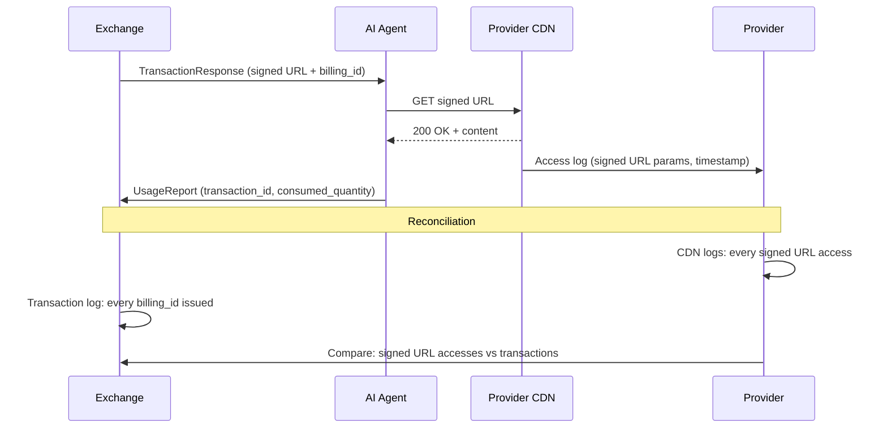

## The Exchange Protocol

The Exchange exposes four RPCs. This is the core protocol -- everything else is built on top of it. Both agents and Brokers are clients of the same Exchange interface. The Exchange does not know or care whether the request came from a Broker or directly from an agent.

```
With Broker (multi-exchange, budget control, reporting):
  Agent -> Broker -> Exchange A, B, C -> select best -> deliver

Without Broker (direct, single exchange):
  Agent -> Exchange -> deliver
```

## Multi-Hop Routing

Multi-hop is the common case, not the exception. A request typically travels `Agent -> Broker -> ... -> Exchange`, and the broker layer may itself be more than one hop. The forwarding chain lives entirely in the HTTP layer as a **stack of [RFC 9421](https://www.rfc-editor.org/rfc/rfc9421) HTTP Message Signatures** — there is no in-message hop list. Each party that originates or forwards the request adds **one** labeled signature (`Signature` / `Signature-Input`, e.g. `ramp-agent`, `ramp-broker-1`). Each forwarder's signature covers the request essentials (`@method`, `@authority`, `@path`, `Content-Digest`) **plus the previous hop's signature**, so the chain is ordered and tamper-evident: no hop can be reordered, dropped, or inserted without invalidating a downstream signature. The `keyid` on each signature names the signer; the Exchange resolves it at `{domain}/.well-known/ramp.json`, verifies **every** signature, and confirms the chain is contiguous. The ordered set of signatures *is* the forwarding chain.

**Chain-depth caps.** Two fields bound how deep a chain may go:

- `RequestConstraints.max_hops` -- the agent caps its own chain depth. A Broker MUST NOT forward a request whose signature count would exceed it.
- `WellKnownManifest.max_intermediary_hops` -- the Exchange publishes the longest inbound chain (signature count) it tolerates; longer chains SHOULD be rejected, and a Broker can prune before forwarding.

**Response path: direct.** Responses do **not** retrace the hop chain. The terminal Exchange returns its `TransactionResponse` (or `ResourceResponse`) directly to the originating agent; the Exchange-facing Broker that holds the agent binding relays it back without re-fanning through every hop. This works because the signed `retrieval_endpoint` is bound to the agent's identity (`agent_identity_hash`), so delivery needs no return-path relay. Intermediaries observe requests, not responses.

## RPC 1: DiscoverResources

The agent or Broker queries the Exchange to discover available content and pricing.

```
POST /ramp.v1.ExchangeService/DiscoverResources
Content-Type: application/json
```

### Request (`ResourceQuery`)

```json
{
  "ver": "1.0",
  "requester": {
    "id": "research-bot",
    "domain": "buyer.example.com",
    "type": "REQUESTER_TYPE_AGENT",
    "billing_ref": "ACCT-BUYER-001",
    "scopes": ["*"]
  },
  "uris": ["https://cdn.ramp-protocol.org/premium/ai-infrastructure.html"],
  "acceptable_restrictions": [{ "axis": "FUNCTION", "values": ["ai-input"] }]
}
```

Key fields:
- `requester.id` + `requester.domain` -- uniquely identifies the agent; the Exchange fetches the Ed25519 public key from `{domain}/.well-known/ramp.json` (`role=ROLE_AGENT`) to verify the request's RFC 9421 HTTP Message Signature
- `ResourceQuery.uris` -- the content URI(s) being requested
- `acceptable_restrictions` -- the restrictions the agent is willing to accept, grouped by axis; axis `FUNCTION` carries the intended use (RAG, training, search, etc.)
- `requester.billing_ref` -- an opaque billing reference (invoicing/cost-attribution handle; not a credential). It links the requester to the Exchange's billing/accounting systems (billing account, PO number, cost center); it is not an entitlement or access-control input
- `requester.scopes` -- entitlement scopes; `["*"]` means unrestricted public access
- request authentication -- an RFC 9421 HTTP Message Signature over the request (the agent's key is published at its `ramp.json`); when the request is forwarded, each hop adds its own labeled HTTP Message Signature, and the ordered stack of these header signatures is the forwarding chain (no in-message hop list)

### Response (`ResourceResponse`)

```json
{
  "ver": "1.0",
  "exchange": "exchange.ssp-example.com",
  "offers": [
    {
      "offer_id": "offer-tc-4921",
      "title": "The Future of AI Infrastructure",
      "ext": {
        "comp.package_id": "PKG-TC-AI-INFRA",
        "comp.seller": "cdn.ramp-protocol.org",
        "comp.citation_required": true,
        "comp.content_types": ["CONTENT_TYPE_TEXT"],
        "comp.retrieval_type": ["RETRIEVAL_TYPE_HTML"]
      },
      "pricing": {
        "model": "PRICING_MODEL_PER_UNIT",
        "rate": "0.05",
        "currency": "USD",
        "unit_cost": "0.00001515",
        "estimated_quantity": 3300,
        "unit": "accesses"
      },
      "delivery_method": "DELIVERY_METHOD_INSTRUCTIONS",
      "reporting": {
        "required": true,
        "window": "86400s",
        "required_fields": ["transaction_id", "function", "consumed_quantity"]
      },
      "identity": {
        "canonical_url": "https://cdn.ramp-protocol.org/premium/ai-infrastructure.html",
        "iptc_guid": "urn:newsml:ap.org:20260310:ai-infra-001"
      },
      "terms": [
        {
          "semantics": "TERM_SEMANTICS_ENUMERATED",
          "restrictions": [
            {
              "kind": "RESTRICTION_KIND_FUNCTION",
              "permitted": ["ai-input", "ai-index", "search"],
              "prohibited": ["ai-train"]
            },
            {
              "kind": "RESTRICTION_KIND_USER_TYPE",
              "permitted": ["commercial", "education"]
            }
          ]
        }
      ],
      "previews": [
        {
          "url": "https://cdn.ramp-protocol.org/preview/ai-infrastructure-snippet.txt",
          "media_type": "text/plain",
          "size": "sample"
        }
      ],
      "signature": "a1b2c3d4e5f6...",
      "signature_algorithm": "EdDSA"
    }
  ]
}
```

Each `Offer` includes:
- `Offer.title` (human-readable) plus optional `ramp-comp-v1` `comp.*` ext fields carrying CoMP package metadata (`comp.package_id`, `comp.seller`, `comp.citation_required`, `comp.content_types`, `comp.retrieval_type`)
- RAMP `Pricing` with the rate, currency, and normalized unit_cost
- `ResourceIdentity` for cross-exchange deduplication
- `LicenseTerm` entries on `terms[]`, each carrying `restrictions` (`repeated Restriction`) derived from the provider's RSL terms
- `ReportingObligation` defining post-usage reporting requirements
- `Preview` URLs for pre-transaction evaluation (see [Resource Previews](#resource-previews))
- An Ed25519 `exchange_signature` that proves the Exchange issued this offer

### Batch Multi-URL Query

When requesting multiple URIs, the response uses `offer_groups` instead of `offers`:

```json
{
  "ver": "1.0",
  "exchange": "exchange.ssp-example.com",
  "offer_groups": [
    {
      "uri": "https://cdn.ramp-protocol.org/premium/ai-infrastructure.html",
      "offers": [
        {
          "offer_id": "offer-tc-4921",
          "pricing": { "model": "PRICING_MODEL_PER_UNIT", "rate": "0.05", "currency": "USD", "unit_cost": "0.00001515", "unit": "accesses" },
          "signature": "a1b2c3...",
          "signature_algorithm": "EdDSA"
        }
      ]
    },
    {
      "uri": "https://cdn.ramp-protocol.org/premium/gpu-shortage-2026.html",
      "offers": [
        {
          "offer_id": "offer-tc-4922",
          "pricing": { "model": "PRICING_MODEL_PER_UNIT", "rate": "0.05", "currency": "USD", "unit_cost": "0.00001200", "unit": "accesses" },
          "signature": "d4e5f6...",
          "signature_algorithm": "EdDSA"
        }
      ]
    },
    {
      "uri": "https://cdn.ramp-protocol.org/premium/openai-funding.html",
      "offers": []
    }
  ]
}
```

An empty `offers` array indicates the content is not available through this Exchange.

### Subscription Offers

When the requester has a subscription, the Exchange includes both per-request and subscription offers:

```json
{
  "offers": [
    {
      "offer_id": "offer-tc-4921",
      "pricing": { "model": "PRICING_MODEL_PER_UNIT", "rate": "0.05", "currency": "USD", "unit_cost": "0.00001515", "unit": "accesses" },
      "signature": "a1b2c3...",
      "signature_algorithm": "EdDSA"
    },
    {
      "offer_id": "sub-offer-tc-4921",
      "pricing": { "model": "PRICING_MODEL_FREE", "rate": "0", "currency": "USD", "unit_cost": "0" },
      "subscription_id": "SUB-12345",
      "terms": [ { "semantics": "TERM_SEMANTICS_ENUMERATED", "scopes": ["subscription:SUB-12345"] } ],
      "reporting": { "required": true, "window": "86400s", "required_fields": ["transaction_id", "function", "consumed_quantity"] },
      "signature": "g7h8i9...",
      "signature_algorithm": "EdDSA"
    }
  ]
}
```

### Subscription Quota Info

When the requester holds a subscription, the Exchange attaches `SubscriptionQuotaInfo` entries so the agent can see remaining allowance *before* committing. After the transaction, the updated quota appears on the response so the agent can track burn-down without a separate API call.

**Where it appears:**

- `Offer.subscription_quota` -- proactive signal at discovery time, letting the agent decide whether to commit or switch to a pay-per-request offer.
- `TransactionResponse.subscription_quota` -- post-transaction snapshot showing remaining quota after the decrement.

**Message fields:**

| Field | Type | Description |
|-------|------|-------------|
| `subscription_id` | string | Subscription this quota applies to |
| `quota_limit` | int32 | Total allowed in the current period |
| `quota_used` | int32 | Used so far in the current period |
| `quota_remaining` | int32 | Remaining in the current period |
| `resets_at` | Timestamp | When the quota counter resets (UTC) |
| `unit` | string | What is metered: `"accesses"`, `"tokens"`, `"spend_cents"`, `"burst"` |

**Multi-dimensional quotas.** A subscription may impose several independent limits -- for example, an access count *and* a spend cap. The `subscription_quota` field is `repeated`, so the Exchange returns one entry per dimension:

```json
{
  "offers": [
    {
      "offer_id": "sub-offer-tc-4921",
      "pricing": { "model": "PRICING_MODEL_FREE", "rate": "0", "currency": "USD" },
      "subscription_id": "SUB-12345",
      "terms": [ { "semantics": "TERM_SEMANTICS_ENUMERATED", "scopes": ["subscription:SUB-12345"] } ],
      "subscription_quota": [
        {
          "subscription_id": "SUB-12345",
          "quota_limit": 5000,
          "quota_used": 1247,
          "quota_remaining": 3753,
          "resets_at": "2026-04-01T00:00:00Z",
          "unit": "accesses"
        },
        {
          "subscription_id": "SUB-12345",
          "quota_limit": 50000,
          "quota_used": 12300,
          "quota_remaining": 37700,
          "resets_at": "2026-04-01T00:00:00Z",
          "unit": "spend_cents"
        }
      ],
      "signature": "g7h8i9...",
      "signature_algorithm": "EdDSA"
    }
  ]
}
```

**Quota decrement timing.** The quota counter increments at `ExecuteTransaction` (optimistic -- the Exchange assumes the content will be consumed). If the agent later files a successful `DisputeTransaction`, the Exchange may reverse the decrement.

## RPC 2: ExecuteTransaction

The agent or Broker commits to a selected offer, receiving a signed URL for content delivery.

```
POST /ramp.v1.ExchangeService/ExecuteTransaction
Content-Type: application/json
```

### Request (`TransactionRequest`)

```json
{
  "ver": "1.0",
  "idempotencyKey": "tx-req-c7d1",
  "offer_id": "offer-tc-4921",
  "requester": {
    "id": "research-bot",
    "domain": "buyer.example.com",
    "type": "REQUESTER_TYPE_AGENT",
    "billing_ref": "ACCT-BUYER-001",
    "scopes": ["*"]
  },
  "offer": {
    "offer_id": "offer-tc-4921",
    "title": "The Future of AI Infrastructure",
    "pricing": {
      "model": "PRICING_MODEL_PER_UNIT",
      "rate": "0.05",
      "currency": "USD",
      "unit_cost": "0.00001515",
      "estimated_quantity": 3300,
      "unit": "accesses"
    },
    "delivery_method": "DELIVERY_METHOD_INSTRUCTIONS",
    "expires_at": "2026-03-14T02:30:00Z",
    "signature": "a1b2c3d4e5f6...",
    "signature_algorithm": "EdDSA"
  }
}
```

The single-mode `offer` is the full signed Offer reflected back exactly as received at discovery; the optional top-level `offer_id` is a non-authoritative correlation key only. The Exchange verifies `offer.signature` over the presented Offer bytes to confirm the offer has not been tampered with. The Exchange is stateless -- it verifies the self-contained signed Offer rather than storing offers.

### Response (`TransactionResponse`)

```json
{
  "ver": "1.0",
  "transaction_id": "txn-mp-93a7f2",
  "billing_id": "bill-93a7f2-001",
  "resource_title": "The Future of AI Infrastructure",
  "retrieval_endpoint": "https://cdn.ramp-protocol.org/server/premium/ai-infrastructure.html?Expires=1773451434&Key-Pair-Id=KXYZ&Signature=abc123...",
  "cost": {
    "amount": "0.05",
    "currency": "USD",
    "unit_cost": "0.00001515"
  },
  "delivery_method": "DELIVERY_METHOD_INSTRUCTIONS",
  "reporting_obligation": {
    "required": true,
    "window": "86400s",
    "required_fields": ["transaction_id", "function", "consumed_quantity"]
  },
  "expires_at": "2026-03-14T02:30:00Z",
  "agent_identity_hash": "e3b0c44298fc1c14..."
}
```

The `retrieval_endpoint` is a CDN signed URL bound to `agent_identity_hash`. A bearer-only CDN serves it on signature + expiry alone (HMAC + short TTL + TLS); a capable edge function additionally requires the agent to present its public key and an RFC 9421 signature, verifying the binding offline. See [Signed URL Verification](/components/edge-function/signed-url-verification).

### What Happens Inside the Exchange

1. Validate request (proto validation)
2. Verify the agent's RFC 9421 HTTP Message Signature (alg=ed25519) in the request headers (and each broker hop signature if present)
3. Check idempotency key (prevent double-charge on retry)
4. Verify offer signature (reconstruct offer from signed token)
5. Authorize billing (`BillingAdapter.Authorize`) -- or skip for subscription offers
6. Write transaction to WAL (must succeed before signing URL)
7. Generate HMAC-SHA256 signed URL (Exchange-CDN shared secret)
8. Create reporting obligation with deadline

### Batch TransactionRequest

For batch transactions, use the `items` array:

```json
{
  "ver": "1.0",
  "idempotencyKey": "tx-batch-01",
  "requester": {
    "id": "research-bot",
    "domain": "buyer.example.com",
    "type": "REQUESTER_TYPE_AGENT",
    "billing_ref": "ACCT-BUYER-001",
    "scopes": ["*"]
  },
  "items": [
    {
      "offer": {
        "offer_id": "offer-tc-4921",
        "pricing": { "model": "PRICING_MODEL_PER_UNIT", "rate": "0.05", "currency": "USD", "unit_cost": "0.00001515", "unit": "accesses" },
        "signature": "a1b2c3...",
        "signature_algorithm": "EdDSA"
      }
    },
    {
      "offer": {
        "offer_id": "offer-tc-4922",
        "pricing": { "model": "PRICING_MODEL_PER_UNIT", "rate": "0.05", "currency": "USD", "unit_cost": "0.00001200", "unit": "accesses" },
        "signature": "d4e5f6...",
        "signature_algorithm": "EdDSA"
      }
    }
  ]
}
```

### Batch TransactionResponse

```json
{
  "ver": "1.0",
  "items": [
    {
      "offer_id": "offer-tc-4921",
      "transaction_id": "txn-mp-batch-001",
      "billing_id": "bill-batch-001",
      "retrieval_endpoint": "https://cdn.ramp-protocol.org/server/premium/ai-infrastructure.html?Signature=...",
      "cost": { "amount": "0.05", "currency": "USD" },
      "expires_at": "2026-03-14T02:30:00Z"
    },
    {
      "offer_id": "offer-tc-4922",
      "transaction_id": "txn-mp-batch-002",
      "billing_id": "bill-batch-002",
      "retrieval_endpoint": "https://cdn.ramp-protocol.org/server/premium/gpu-shortage.html?Signature=...",
      "cost": { "amount": "0.05", "currency": "USD" },
      "expires_at": "2026-03-14T02:30:00Z"
    }
  ],
  "total_cost": { "amount": "0.10", "currency": "USD" },
  "agent_identity_hash": "e3b0c44298fc1c14..."
}
```

Each item gets its own `transaction_id`, `billing_id`, and signed URL. Batch transactions are non-atomic -- individual items can fail independently.

### Subscription TransactionResponse

```json
{
  "ver": "1.0",
  "transaction_id": "txn-sub-001",
  "billing_id": "bill-sub-001",
  "retrieval_endpoint": "https://cdn.ramp-protocol.org/server/premium/ai-infrastructure.html?Signature=...",
  "cost": { "amount": "0", "currency": "USD" },
  "subscription_id": "SUB-12345",
  "subscription_unit_value": { "amount": "0.05", "currency": "USD", "unit_cost": "0.00001515" },
  "agent_identity_hash": "e3b0c44298fc1c14...",
  "reporting_obligation": { "required": true, "window": "86400s", "required_fields": ["transaction_id", "function", "consumed_quantity"] }
}
```

## RPC 3: ReportUsage

After content has been used, the agent submits a usage report. When `ReportingObligation.required` is set on the offer, reporting is mandatory -- failure to report within the window may trigger `DENIAL_REASON_REPORTING_OVERDUE` on subsequent transactions.

```
POST /ramp.v1.ExchangeService/ReportUsage
Content-Type: application/json
```

### Request (`UsageReport`)

```json
{
  "ver": "1.0",
  "idempotencyKey": "ur-e4f2a1",
  "transaction_id": "txn-mp-93a7f2",
  "billing_id": "bill-93a7f2-001",
  "usage": {
    "function": ["ai-input"],
    "subfn": ["rag"],
    "consumed_quantity": 3150,
    "displayed_to_user": true,
    "citation_included": true
  },
  "timestamp": "2026-03-14T01:45:00Z",
  "exchange": "exchange.ssp-example.com",
  "assets": [{
    "uri": "https://cdn.ramp-protocol.org/premium/ai-infrastructure.html",
    "title": "The Future of AI Infrastructure",
    "package_id": "PKG-TC-AI-INFRA"
  }]
}
```

### Response (`UsageReportResponse`)

```json
{
  "ver": "1.0",
  "report_id": "rpt-e4f2a1-001"
}
```

A successful response carries the Exchange-assigned `report_id` (the handle the agent later references in `DisputeRequest`). A rejected report is not a success body -- it travels as a non-OK transport error carrying `ErrorDetail.usage_report_rejection` (e.g. `USAGE_REPORT_REJECTION_REASON_WINDOW_EXPIRED`, `USAGE_REPORT_REJECTION_REASON_MISSING_REQUIRED_FIELDS`).

### What the Exchange Validates

1. Required fields present (as defined by `ReportingObligation.required_fields`)
2. Report received within the reporting window (typically 24 hours)
3. Consumed quantity within tolerance: reported vs. estimated must be within +/-20%
4. Transaction exists and `billing_id` matches

## Content Delivery (Outside Protocol Scope)

The RAMP protocol covers discovery, negotiation, and transaction execution. Content delivery is outside protocol scope -- it is handled by the Exchange implementation and the provider's CDN.

The `TransactionResponse` carries two relevant fields:

- `DeliveryMethod` -- a hint indicating whether the Exchange is providing content directly or providing retrieval instructions
- `retrieval_endpoint` -- the signed URL the agent uses to fetch content

How the agent actually retrieves content (signed URLs, access tokens, inline content) depends on the Exchange and CDN implementation, not the protocol.

### Streaming Delivery

RAMP supports `DELIVERY_METHOD_STREAMING` for real-time resource access (WebSocket, SSE, HLS, Icecast). The signed URL points to a streaming endpoint. Stream mechanics (heartbeat, reconnection, concurrent connection limits) are managed by the provider, not the RAMP protocol.

**Session lifecycle:**

1. `ExecuteTransaction` returns a signed URL with expiry (e.g., 2 hours)
2. Agent connects to the stream endpoint
3. Agent receives data continuously
4. URL expires -- agent re-requests through the same RAMP flow
5. `ReportUsage`: `consumed_quantity` in minutes/hours, `consumed_unit` matching the offer's unit

Streaming applies to live broadcasts, quote feeds, monitoring feeds, and any resource where content is delivered continuously rather than as a single fetch.

### Resource Mutability

`ResourceIdentity.resource_mutability` signals whether a resource's content is stable across time:

| Value | Meaning | Hash Behavior |
|---|---|---|
| `RESOURCE_MUTABILITY_STATIC` | Content does not change (articles, papers, legislation) | Agent SHOULD verify `content_hash`. Mismatch is disputable. |
| `RESOURCE_MUTABILITY_DYNAMIC` | Content updates between offer and fetch (credit reports, drug databases) | Agent MUST NOT auto-dispute hash mismatch. Use `data_as_of` for freshness. |
| `RESOURCE_MUTABILITY_LIVE` | No content exists at offer time (streams, broadcasts) | No `content_hash` applicable. Metering is time-based. |

The Exchange MUST set `resource_mutability` on every `ResourceIdentity`. For `DYNAMIC` resources, the Exchange MUST set `data_as_of` on the Offer. For `LIVE` resources, the Exchange MUST NOT set `content_hash`.

## Reconciliation via Signed URLs



Three independent records -- CDN logs, Exchange transactions, usage reports -- that must agree. This provides stronger reconciliation than ad-tech's two-sided model.

## Consistency Model

RAMP uses **at-most-once with reconciliation**, same as OpenRTB:

- Idempotency keys on every `TransactionRequest` (prevent double-charge on retry)
- "Authorize first, deliver second" ordering (do not issue signed URL until billing succeeds)
- Reconciliation via `UsageReport` -- if content was not actually used, the report says so
- No refunds in the protocol -- handle offline like ad-tech discrepancy resolution (~5-10% tolerance)

## RPC 4: DisputeTransaction

When delivered content does not match what was promised, the agent files a dispute. The agent MUST file a `UsageReport` before disputing -- `DisputeRequest.report_id` is required.

```
POST /ramp.v1.ExchangeService/DisputeTransaction
Content-Type: application/json
```

### Request (`DisputeRequest`)

```json
{
  "ver": "1.0",
  "idempotencyKey": "dsp-20260318-abc123",
  "transaction_id": "txn-mp-93a7f2",
  "billing_id": "bill-93a7f2-001",
  "reason": "DISPUTE_REASON_CONTENT_MISMATCH",
  "description": "Content hash does not match attested hash",
  "received_content_hash": "sha256:e5f6a7b8...",
  "received_hash_method": "sha256",
  "report_id": "rpt-20260318-xyz789"
}
```

### Response (`DisputeResponse`)

```json
{
  "ver": "1.0",
  "dispute_id": "case-20260318-def456",
  "estimated_resolution": "1s",
  "status": "DISPUTE_STATUS_AUTO_RESOLVED",
  "resolution": "RESOLUTION_TYPE_CREDIT"
}
```

A successful response means the dispute was accepted for processing (`dispute_id` + `status` + `resolution`). A refusal to file is not a success body -- it travels as a non-OK transport error carrying `ErrorDetail.dispute_failure` (e.g. `DISPUTE_FAILURE_REASON_REPORT_NOT_FILED`, `DISPUTE_FAILURE_REASON_WINDOW_EXPIRED`). The Exchange resolves most accepted disputes automatically in under 1 second using CDN logs and cryptographic evidence. See [Dispute Resolution](/protocol/dispute-resolution/) for the three-tier resolution system, auto-credit rules, and the complete dispute lifecycle.

## Resource Previews

Offers may include lightweight preview URLs for pre-transaction evaluation. The Exchange holds only the URL (50–200 bytes); the provider's CDN serves the actual bytes. Agents fetch previews only when evaluating offers -- not on every discovery query.

```proto
message Preview {
  string url = 1;            // CDN-hosted preview URL
  string media_type = 2;     // MIME type ("image/jpeg", "audio/mpeg", "text/plain")
  optional int32 width = 3;  // Pixels (images/video)
  optional int32 height = 4;
  optional int32 duration = 5; // Seconds (audio/video clips)
  optional string size = 6;  // "thumbnail", "preview", "sample"
}
```

### Per Content Type

| Content Type | Preview | What the URL Points To |
|---|---|---|
| **Image** | Watermarked thumbnail | Small JPEG, 150–450px, provider-watermarked |
| **Video** | Short clip | 10–30 second MP4/WebM, watermarked |
| **Audio** | Short clip | 15–30 second MP3, low-bitrate or watermarked |
| **Text** | Snippet or abstract | First 200 words or abstract as text/plain |
| **Data / records** | Sample record | 1–3 sample rows as application/json |
| **Stream** | Optional frame capture | Or none -- streams are priced by time, not by content |

### Example: Image Offer with Previews

```json
{
  "offer_id": "offer-reuters-001",
  "title": "Climate Summit Photo - Reuters",
  "pricing": { "model": "PRICING_MODEL_PER_UNIT", "rate": "0.50", "currency": "USD", "unit": "accesses" },
  "previews": [
    {
      "url": "https://cdn.reuters.com/preview/150/climate-summit.jpg",
      "media_type": "image/jpeg",
      "width": 150, "height": 100,
      "size": "thumbnail"
    },
    {
      "url": "https://cdn.reuters.com/preview/450/climate-summit.jpg?sig=abc&exp=300",
      "media_type": "image/jpeg",
      "width": 450, "height": 300,
      "size": "preview"
    }
  ]
}
```

### Design Rationale

This follows the universal content exchange pattern:

- **Shutterstock**: `small_thumb.url` (100px, unwatermarked), `preview.url` (450px, watermarked), `preview_1500.url` (1500px, watermarked)
- **Spotify**: `preview_url` -- URL to a 30-second MP3 clip
- **IIIF**: Parameterized URL template -- client requests any size
- **OpenRTB**: `img.url` + `img.w` + `img.h` per asset

Nobody puts image bytes in offer metadata. The Exchange holds a URL string; the CDN holds the pixels.

## Next Steps

- [Authentication](/protocol/authentication/) -- Ed25519 signature chain details
- [Content Attestation](/protocol/content-attestation/) -- cryptographic content verification
- [Dispute Resolution](/protocol/dispute-resolution/) -- three-tier dispute resolution system
- [Scenario Walkthrough](/protocol/scenario-walkthrough/) -- complete end-to-end scenario with all phases
- [Discovery Paths](/protocol/discovery-paths/) -- all entry points into the protocol
